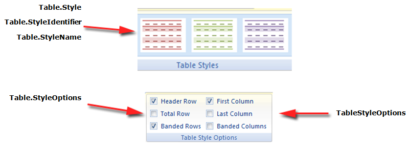

Aspose.Words provides [TableStyle ]https://reference.aspose.com/words/net/aspose.words/tablestyle)inherited from [Style ](https://reference.aspose.com/words/net/aspose.words/style/) class. The TableStyle facilitates user to apply different styling options like as shading, padding, indentation, CellSpacing and Font etc. Aspose.Words also provides ConditionalStyle class which represents special formatting applied to some area of a table with an assigned table style and the ConditionalStyleCollection representing a collection of ConditionalStyle objects. This collection contains a permanent set of items representing one item for each value of the ConditionalStyleType enumeration type. The ConditionalStyleType enumeration defines all possible table areas to which conditional formatting may be defined in a table style.

## Create a Table Style

A table style can be created using the StyleCollection.Add method. The code example given below shows how to create a table style.



## Defining Conditional Formatting

Conditional formatting can be defined for all possible table area defined under ConditionalStyleType enumeration type. The following code example shows how to define conditional formatting for header row of the table.



## Working with Table Styles

A table style defines a set of formatting that can be easily applied to a table. Formatting such as borders, shading, alignment and font can be set in a table style and applied to many tables for a consistent appearance.

Aspose.Words supports applying a table style to a table and also reading properties of any table style. Table styles are preserved during loading and saving in the following ways:

- Table styles in DOCX and WordML formats are preserved when loading and saving to these formats.
- Table styles are preserved when loading and saving in the DOC format (but not to any other format).
- When exporting to other formats, rendering or printing, table styles are expanded to direct formatting on the table so all formatting is preserved.

Currently, you cannot create new table styles. You can only apply in-built table styles or custom table styles which already exist in the document to a table. 

### Applying a Table Style

In Aspose.Words you can apply a table style by using any of the Table.Style, Table.StyleIdentifier and Table.StyleName properties.You can also choose which features of the table style to apply, for example, first column, last column, banded rows. These are listed under the [TableStyleOptions](https://reference.aspose.com/words/net/aspose.words.tables/tablestyleoptions/) enumeration and are applied by using [Table.StyleOptions](https://reference.aspose.com/words/net/aspose.words.tables/table/styleoptions/) property. The [TableStyleOptions](https://reference.aspose.com/words/net/aspose.words.tables/tablestyleoptions/) enumeration allows a bitwise combination of these features. The following code example shows how to build a new table with a table style applied.



Aspose.Words also provides a method to take formatting found on a table style and expands it onto the rows and cells of the table as direct formatting. Test combine formatting with table style and cell style. This method will not override any other formatting that is already applied to the table through a row or cell format.

Below example shows how to expand the formatting from styles onto the rows and cells of the table as direct formatting. You can download the template file of this example from [here](https://github.com/aspose-words/Aspose.Words-for-.NET/blob/master/Examples/Data/Tables.docx).

