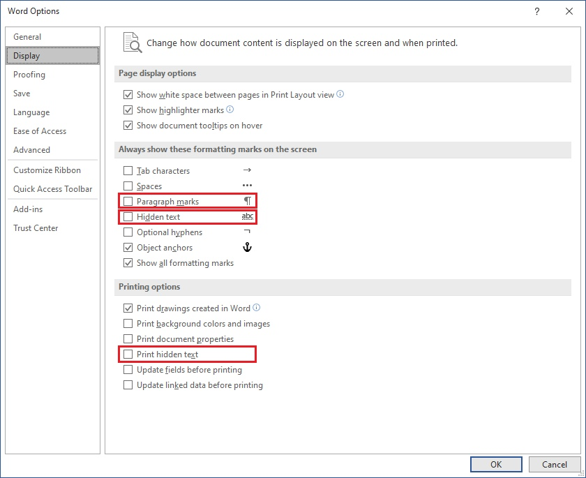

Aspose.Words enables you to create output documents with various layouts, depending on the parameters specified in properties of the [LayoutOptions](https://reference.aspose.com/words/net/aspose.words.layout/layoutoptions/) class. Some of these properties resemble some of the Microsoft Word user interface menu options – they will be described in this article.

For a complete list of parameters such as [ContinuousSectionPageNumberingRestart](https://reference.aspose.com/words/net/aspose.words.layout/layoutoptions/continuoussectionpagenumberingrestart/) to calculate page numbers in a continuous section that restarts page numbering, or [IgnorePrinterMetrics](https://reference.aspose.com/words/net/aspose.words.layout/layoutoptions/ignoreprintermetrics/) to ignore the "Use printer metrics to lay out document" compatibility option, see the [LayoutOptions](https://reference.aspose.com/words/net/aspose.words.layout/layoutoptions/) class page.

## Formatting Marks

Aspose.Words allows to manage formatting marks using the following properties:

- [ShowHiddenText](https://reference.aspose.com/words/net/aspose.words.layout/layoutoptions/showhiddentext/) – a `Boolean` value, which specifies whether the hidden text is rendered.
- [ShowParagraphMarks](https://reference.aspose.com/words/net/aspose.words.layout/layoutoptions/showparagraphmarks/) – a `Boolean` value, which specifies whether paragraph mark characters are rendered.

The page depicted in the example below contains three paragraphs. The second one is hidden. A user can change the **ShowHiddenText** option to display this hidden text on the page. Also, each paragraph has a paragraph mark at the end. The paragraph mark usually is not visible unless the **ShowParagraphMarks** property is set to render it.

In Microsoft Word, these parameters are set using the "File → Options → Display" dialog box as follows:

## Comments and Revisions

With Aspose.Words, you can render document comments that will look the same as in Microsoft Word. To specify whether comments are rendered, use the [CommentDisplayMode](https://reference.aspose.com/words/net/aspose.words.layout/layoutoptions/commentdisplaymode/) property.

In Microsoft Word, this parameter is set using the "Track Changes Options" dialog box, as shown below:

Also, Aspose.Words allows you to display revisions in a document. Use the [RevisionOptions](https://reference.aspose.com/words/net/aspose.words.layout/layoutoptions/revisionoptions/) property of the **LayoutOptions** class to define whether the document revisions are displayed. To control their appearance (revision highlighting color, revision bar color, etc.), use the [RevisonOptions](https://reference.aspose.com/words/net/aspose.words.layout/revisionoptions/) class.

You can also have revisions displayed as comments to the content. For this purpose, use the [CommentDisplayMode](https://reference.aspose.com/words/net/aspose.words.layout/layoutoptions/commentdisplaymode/) property and [ShowInBalloons](https://reference.aspose.com/words/net/aspose.words.layout/commentdisplaymode/) value.

The following code example shows how to customize revisions display:



The image below shows how Aspose.Words renders comments and the Delete revisions:

## Text Shaper for Advanced Typography Rendering

The [TextShaperFactory](https://reference.aspose.com/words/net/aspose.words.layout/layoutoptions/textshaperfactory/) property enables you to set the text shaping functionality, as well as the OpenType features support.

Use text shaping for document processing in the following main cases:

- A document uses Kerning, Numeral Shaping, Numeral Forms, or Ligatures.
- A document uses Complex Scripts, such as Arabic, Khmer, Thai, etc.

{}

Text shaping will be enabled only when exporting a document to PDF or XPS.

{}
