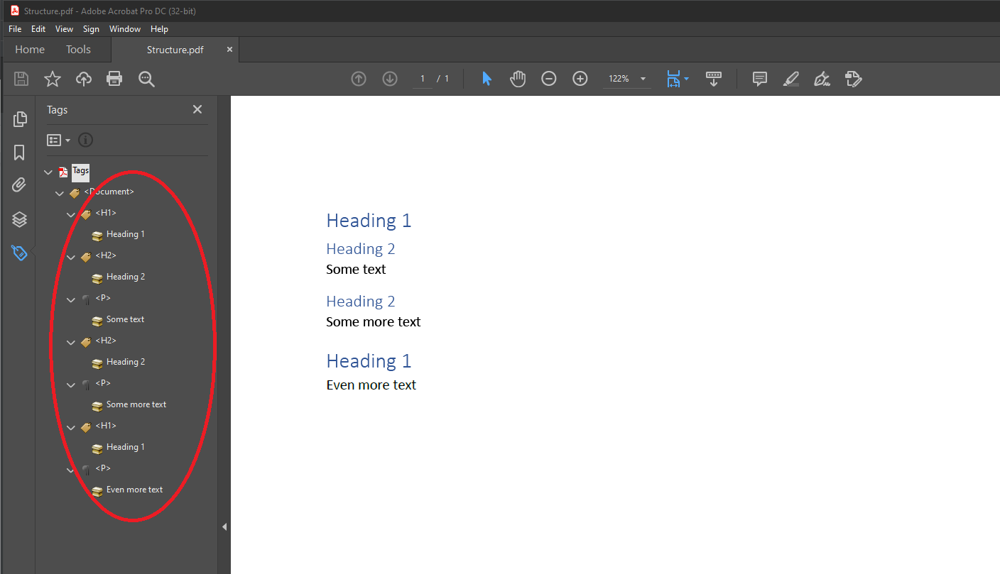
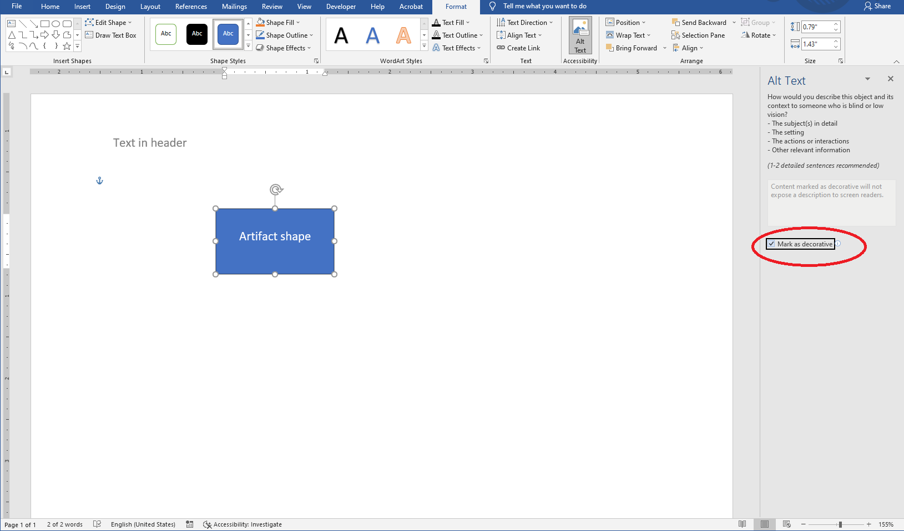
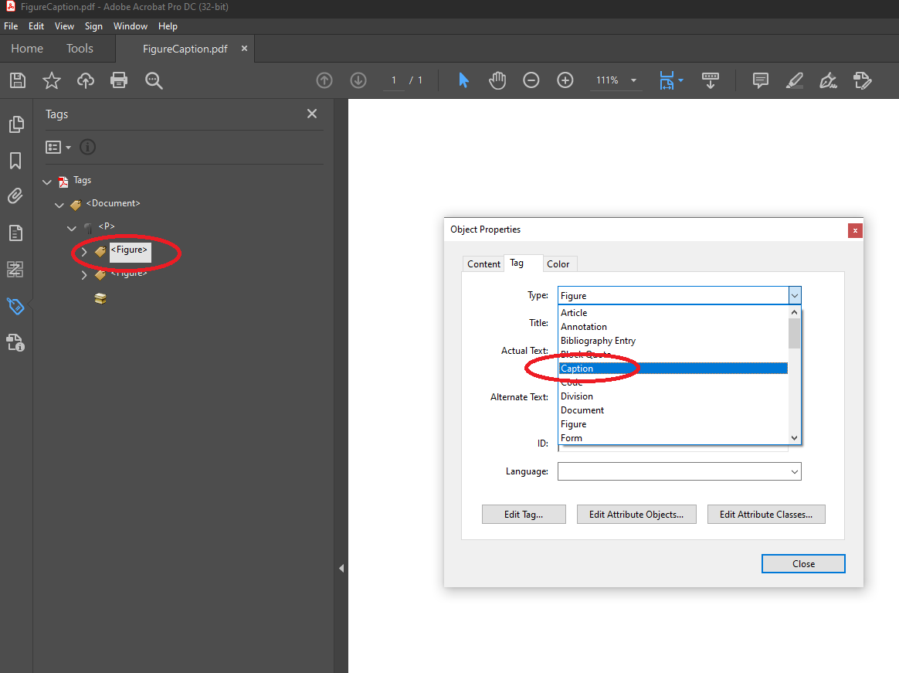
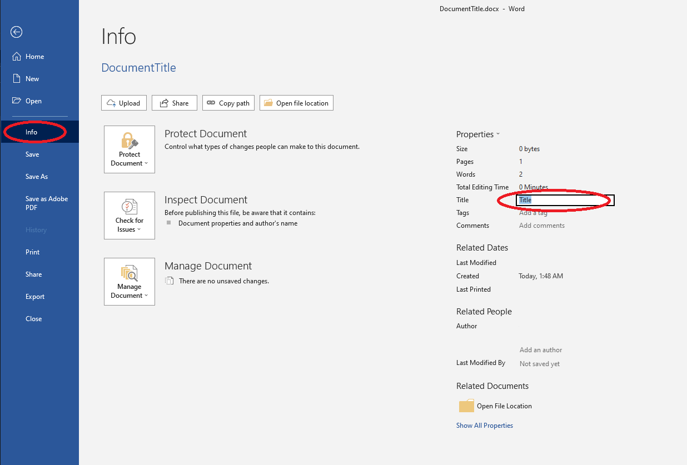
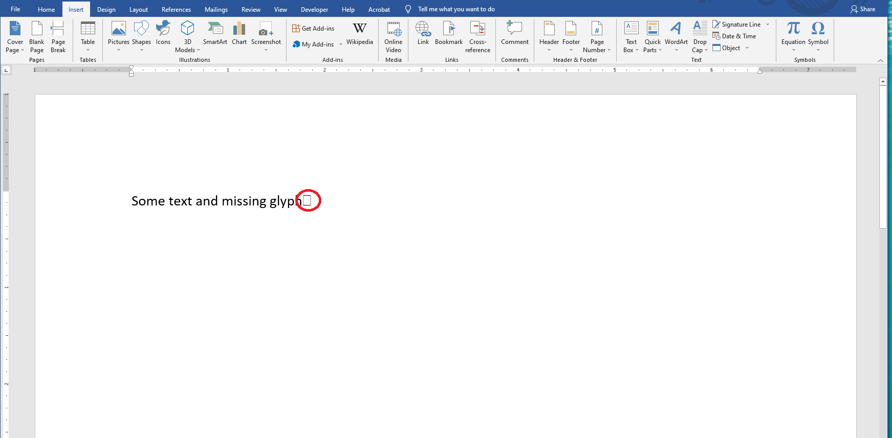

PDF/A and PDF/UA format imposes several requirements related to the document content that cannot be fulfilled during automatic conversion from a document in Word format to PDF. These requirements should be verified and corrected either in a Word document before conversion or in a PDF document after conversion in order to produce a fully PDF/A and PDF/UA compliant document.

Basic requirements are for the structure or fonts of a PDF/A and PDF/UA document, which we will consider in the following sections.

{}

Please note that PDF/UA-1 output will also be WCAG 2.0 and Section 508 compliant.

{}

## Document Structure Requirements

The current requirements are for PDF/A-1a, PDF/A-2a, PDF/A-4, and PDF/UA-1 formats.

There are some nuances of how Aspose.Words works when converting to various PDF format standards. They must be taken into account if you want to get the expected result.

{}

Note that there are no logical structure requirements for PDF/A-4. For this reason, we do not consider the PDF/A-4 version in this "Document Structure Requirements" section.

{}

{}

    
The specification tells us the following (expand to see details):

    

    
It is inadvisable for writers to generate structural or semantic information using automated processes without appropriate verification.

    
ISO 19005-2, 6.7.1

{}

The subsections below describe nuances of how Aspose.Words works when converting to various PDF format standards and options for their solution.

### Structure Type

| PDF standard compliance levels within Aspose.Words | Presence of requirement |
| -------------------------------------------------- | ----------------------- |
| PDF/A-1a                                           |   |
| PDF/A-2a                                           |   |
| PDF/UA-1                                           |   |

A PDF document is a sequence of blocks such as headings, paragraphs, tables, and others. These blocks form a document structure – strongly or weak.

Both strong and weak structures are valid for PDF/A. Microsoft Word documents have a weak structure by design, and Aspose.Words creates PDF with the weak structure respectively and also generates headings according to the outline levels of paragraphs in the source document.

For a PDF/UA-1 document with a weak structure, it is additionally required that the heading numbers go in order without gaps.

{}

    
The specification tells us the following (expand to see details):

    

    
The block-level structure may follow one of two principal paradigms:

    </ol>
      <li>Strongly structured. The grouping elements nest to as many levels as necessary to reflect the organization of the material into articles, sections, subsections, and so on. At each level, the children of the grouping element should consist of a heading (H), one or more paragraphs (P) for content at that level, and perhaps one or more additional grouping elements for nested subsections.</li>
      <li>Weakly structured. The document is relatively flat, having perhaps only one or two levels of grouping elements, with all the headings, paragraphs, and other BLSEs as their immediate children. In this case, the organization of the material is not reflected in the logical structure; however, it may be expressed by the use of headings with specific levels (H1–H6).</li>
    </ol>
    

    
ISO-32000-1, 14.8.4.3.5

{}

{}

    
For PDF/UA-1 documents, the specification contains an addition related to heading levels (expand to see details):

    

    
If document semantics require a descending sequence of headers, such a sequence shall proceed in strict numerical order and shall not skip an intervening heading level. H1 H2 H3 is permissible, while H1 H3 is not.

    
ISO-14289-1, 7.4.2

{}

To ensure correct output, users have to ensure that the source document content is properly organized and outline levels are correctly specified for paragraphs. Otherwise, the user should verify and fix the structure of the output PDF document.

{}

    
In this block, you can see examples: how to set outline levels in Microsoft Word or check and fix the structure of the output PDF document (expand to see details).

    

    
In Microsoft Word default "Heading X" styles could be used to set the outline level:

    
    
In addition, the outline level could be checked or changed in the "Paragraph" window:

    
    
In Acrobat the document structure could be checked or changed in the "Tags" pane:

    

{}

### Marking the Content as an Artifact

| PDF standard compliance levels within Aspose.Words | Presence of requirement |
| -------------------------------------------------- | ----------------------- |
| PDF/A-1a                                           |   |
| PDF/A-2a                                           |   |
| PDF/UA-1                                           |   |

At the moment, Aspose.Words marks page headers and footers, note separators, repeated table header cells, and decorative images as artifacts. Note that this list may be updated in the future.

{}

    
The specification tells us the following (expand to see details):

    

    
The graphics objects in a document can be divided into two classes:

    </ol>
      <li>The real content of a document comprises objects representing material originally introduced by the document’s author.</li>
      <li>Artifacts are graphics objects that are not part of the author’s original content but rather are generated by the conforming writer in the course of pagination, layout, or other strictly mechanical processes.</li>
    </ol>
    

    
 ISO-32000-1, 14.8.2.2.1

{}

If a document contains any other content that should be marked as an artifact, or if any of the artifacted content is a real content, customers should fix that in the output PDF.

{}

    
In this block, you can see examples: how to mark shapes as decorative in Microsoft Word or mark shape as an artifact in the output PDF document (expand to see details).

    

    
For example, shapes could be marked as decorative in Microsoft Word, so they will be exported to PDF as an artifact:

    
    
You can mark shape as an artifact in the output PDF:

   
    
Also, you can switch text in a header from the artifact to real content in the output PDF:

    

{}

### Natural Language Specification

| PDF standard compliance levels within Aspose.Words | Presence of requirement |
| -------------------------------------------------- | ----------------------- |
| PDF/A-1a                                           |   |
| PDF/A-2a                                           |   |
| PDF/UA-1                                           |   |

Text language is specified in Microsoft Word documents. Aspose.Words exports the specified language to an output PDF with the *Lang* attribute attached to a marked-content sequence or a Span tag – it is controlled by the [ExportLanguageToSpanTag](https://reference.aspose.com/words/net/aspose.words.saving/pdfsaveoptions/exportlanguagetospantag/) property. Generally there are no language issues when text is entered by the user via Microsoft Word. But there is a possibility that the language may be inaccurate if the text is generated automatically.

{}

    
The specification tells us the following (expand to see details):

    

    
The default natural language for all text in a file should be specified by the Lang entry in the document’s Catalog dictionary.

    
All textual content within a file which differs from the default language should be indicated by use of a `Lang` property attached to a marked-content sequence, or by a Lang entry in a structure element dictionary ...

    
ISO-19005-2, 6.7.4

{}

{}

    
Additionally for PDF/UA-1, the specification tells us the following (expand to see details):

    

    
Natural language shall be declared… Changes in natural language shall be declared.

    
  ISO-14289-1, 7.2

{}

{}

    
In this block, you can see examples: how to ensure that the language is specified correctly (expand to see details).

    

    
Users should ensure that the language is specified correctly in either the source Word document:

    
    
Or the output PDF document:

    

{}

### Figure Caption

| PDF standard compliance levels within Aspose.Words | Presence of requirement |
| -------------------------------------------------- | ----------------------- |
| PDF/A-1a                                           |                         |
| PDF/A-2a                                           |                         |
| PDF/UA-1                                           |   |

Microsoft Word documents allow users to add figure caption.

{}

    
The specification tells us the following (expand to see details):

    

    
A caption accompanying a figure shall be tagged with a Caption tag.

    
ISO-14289-1, 7.3

{}

Currently Aspose.Words cannot export captions with the Caption tag, so they must be flagged in the output PDF.

{}

    
In this block, you can see examples: how to insert the caption (expand to see details).

    

    
In Microsoft Word, the caption could be inserted through the context menu:

    
    
In Acrobat the caption could be added or changed via the `Object` Properties dialog:

    

{}

### Alternate Descriptions

| PDF standard compliance levels within Aspose.Words | Presence of requirement |
| -------------------------------------------------- | ----------------------- |
| PDF/A-1a                                           |   |
| PDF/A-2a                                           |   |
| PDF/UA-1                                           |   |

Microsoft Word documents allow users to add alternate text to images, shapes, and tables. Aspose.Words exports such an alternate text to the output PDF.

{}

    
The specification tells us the following (expand to see details):

    

    
All structure elements whose content does not have a natural predetermined textual analogue, e.g. images, formulae, etc., should supply an alternate text description using the Alt entry in the structure element dictionary...

    
NOTE Alternate descriptions provide textual descriptions that aid in the proper interpretation of otherwise opaque non-textual content.

    
ISO-19005-2, 6.7.5

{}

{}

    
In this block, you can see examples: how to ensure that all elements have an alternate text (expand to see details).

    

    
Users should ensure that all elements have an alternate text in either the source Word document:

    
    

    
    
Or the output PDF document:

    
    

    

{}

### Alternate Descriptions for Hyperlinks

| PDF standard compliance levels within Aspose.Words | Presence of requirement |
| -------------------------------------------------- | ----------------------- |
| PDF/A-1a                                           |                         |
| PDF/A-2a                                           |                         |
| PDF/UA-1                                           |   |

In addition to the previous point, Microsoft Word documents also allow users to add alternate text to hyperlinks. Aspose.Words exports such an alternate text to the output PDF.

Unfortunately, not every application allows you to set up an alternate description. For example, Adobe Acrobat currently does not enable to set up such a description for hyperlinks. But in Microsoft Word, you can do this as follows:

Sometimes there is a problem that it is not possible to set alt text for autogenerated hyperlinks in the table of contents (TOC) through the Microsoft Word GUI. Aspose.Words could update such fields and generate the links on its own.

Follow the code example to update `TOC` fields using the Aspose.Words Document Object Model (DOM):


Document doc = new Document(fileName);

	var tocHyperLinks = doc.Range.Fields
		.Where(f => f.Type == FieldType.FieldHyperlink)
		.Cast<FieldHyperlink>()
		.Where(f => f.HRef.StartsWith("#_Toc"));
	
	foreach (FieldHyperlink link in tocHyperLinks)
		link.ScreenTip = link.DisplayResult;
	
	PdfSaveOptions opt = new PdfSaveOptions()
	{
		Compliance = PdfCompliance.PdfUa1,
		DisplayDocTitle = true,
		ExportDocumentStructure = true,
	};
	opt.OutlineOptions.HeadingsOutlineLevels = 3;
	opt.OutlineOptions.CreateMissingOutlineLevels = true;
	
	var outFile = Path.ChangeExtension(fileName, "_aw.pdf");
	doc.Save(outFile, opt);


### Table Headers

| PDF standard compliance levels within Aspose.Words | Presence of requirement |
| -------------------------------------------------- | ----------------------- |
| PDF/A-1a                                           |                         |
| PDF/A-2a                                           |                         |
| PDF/UA-1                                           |   |

Tables in PDF/UA-1 documents must have headers – column, row, or both. PDF/A only requires standard table markup, which has no additional restrictions. Note that Aspose.Words generates the standard table markup automatically.

{}

    
The specification tells us the following (expand to see details):

    

    
Tables should include headers… Tables can contain column headers, row headers or both.

    
ISO-14289-1, 7.5

{}

{}

    
In this block, you can see examples: how to set the table header (expand to see details).

    

    
The table header could be set up either the source Microsoft Word document:

    
    
Or the output PDF:

    
    

    
    

    

{}

### Replacement Text

| PDF standard compliance levels within Aspose.Words | Presence of requirement |
| -------------------------------------------------- | ----------------------- |
| PDF/A-1a                                           |   |
| PDF/A-2a                                           |   |
| PDF/UA-1                                           |                         |

{}

    
The specification tells us the following (expand to see details):

    

    
The specification tells us the following:

    
All textual structure elements that are represented in a non-standard manner, e.g., custom characters or inline graphics, should supply replacement text using the ActualText entry in the structure element dictionary...

    
ISO-19005-2, 6.7.7

{}

Microsoft Word document does not allow users to set replacement text. So this needs to be verified and fixed in the output PDF:

### Abbreviations and Acronyms Expansions

| PDF standard compliance levels within Aspose.Words | Presence of requirement |
| -------------------------------------------------- | ----------------------- |
| PDF/A-1a                                           |   |
| PDF/A-2a                                           |   |
| PDF/UA-1                                           |                         |

{}

    
The specification tells us the following (expand to see details):

    

    
All instances of abbreviations and acronyms in textual content should be placed in a marked-content sequence with a Span tag whose E property provides a textual expansion of the abbreviation or acronym...

ISO-19005-2, 6.7.8

{}

Microsoft Word document does not allow users to set abbreviations and acronyms expansions. So this needs to be verified and fixed in the output PDF:

## Document Title

| PDF standard compliance levels within Aspose.Words | Presence of requirement                                      |
| -------------------------------------------------- | ------------------------------------------------------------ |
| PDF/A-1a                                           |                                                              |
| PDF/A-2a                                           |                                                              |
| PDF/A-4                                            |                                                              |
| PDF/UA-1                                           |  Document in PDF/UA-1 should have a title. |

{}

    
The specification tells us the following (expand to see details):

    

    
The specification tells us the following:

    
The Metadata stream in the document’s catalog dictionary shall contain a dc:title entry, where dc is the recommended prefix for the Dublin Core metadata schema…

    
ISO-14289-1, 7.1

{}

{}

    
In this block, you can see examples: how to set the document title (expand to see details).

    

    
The document title could be set up either the source Microsoft Word document:

    
    
Or the output PDF:

    

{}

## Font Requirements

| PDF standard compliance levels within Aspose.Words | Presence of requirement |
| -------------------------------------------------- | ----------------------- |
| PDF/A-1a                                           |   |
| PDF/A-1b                                           |   |
| PDF/A-2a                                           |   |
| PDF/A-2u                                           |   |
| PDF/A-4                                            |   |
| PDF/UA-1                                           |   |

There are also a number of nuances of working with fonts when converting to PDF/A-1, PDF/A-2, PDF/A-4 or PDF/UA-1 formats using Aspose.Words. They must be taken into account if you want to avoid possible problems with the output document.

The sections below describe such nuances and options for their solution.

### Font Legal Requirements

| PDF standard compliance levels within Aspose.Words | Presence of requirement |
| -------------------------------------------------- | ----------------------- |
| PDF/A-1a                                           |   |
| PDF/A-1b                                           |   |
| PDF/A-2a                                           |   |
| PDF/A-2u                                           |   |
| PDF/A-4                                            |   |
| PDF/UA-1                                           |   |

Aspose.Words does not verify the legal restrictions of the used fonts – it is up to users. In other words, a user should not provide inappropriate fonts for PDF conversion using Aspose.Words.

{}

    
The specification tells us the following (expand to see details):

    

    
Only font programs that are legally embeddable in a file for unlimited, universal rendering shall be used.

    
ISO-19005-2, 6.2.11.4.1; ISO-14289-1, 7.21.4.1 (exactly the same quotes in two specs)

{}

### .notdef Glyph

| PDF standard compliance levels within Aspose.Words | Presence of requirement |
| -------------------------------------------------- | ----------------------- |
| PDF/A-1a                                           |                         |
| PDF/A-1b                                           |                         |
| PDF/A-2a                                           |   |
| PDF/A-2u                                           |   |
| PDF/A-4                                            |   |
| PDF/UA-1                                           |   |

The usage of the `.notdef` glyph is prohibited. The `.notdef` glyph will appear if a document contains characters which are not present in the selected font and which also cannot be resolved via the Font Fallback mechanism.

{}

    
The specification tells us the following (expand to see details):

    

    
A conforming document shall not contain a reference to the .notdef glyph from any of the text showing operators, regardless of text rendering mode, in any content stream.

    
ISO-19005-2, 6.2.11.8; ISO-14289-1, 7.21.8 (exactly the same quotes in two specs)

{}

{}

    
In this block, you can see examples: how to remove or replace these characters (expand to see details).

    

    
Users should remove or replace these characters in either the source Word document:

    
    
Or the output PDF document using the "Edit PDF" tool:

    

{}

### Private Use Area (PUA)

| PDF standard compliance levels within Aspose.Words | Presence of requirement |
| -------------------------------------------------- | ----------------------- |
| PDF/A-1a                                           |                         |
| PDF/A-1b                                           |                         |
| PDF/A-2a                                           |   |
| PDF/A-2u                                           |   |
| PDF/A-4                                            |   |
| PDF/UA-1                                           |                         |

Private Use Area (PUA) characters appear mostly for Windows symbolic fonts like "Symbol", "Wingdings", "Webdings", and others. Microsoft Word formats do not provide an option to store actual text for characters.

{}

    
The specification tells us the following (expand to see details):

    

    
For Level A conformance only, for any character ... that is mapped to a code or codes in the Unicode Private Use Area (PUA), an ActualText entry ... shall be present for this character or a sequence of characters of which such a character is a part.

    
ISO-19005-2, 6.2.11.7.3

{}

"Segoe UI Symbol" is a Windows Unicode font which could be used as an alternative to symbolic fonts.

{}

    
In this block, you can see examples: what user should do to solve the problem with symbolic fonts (expand to see details).

    

    
Replace the symbolic font with a Unicode one in the source Word document:

    
    
Or add an ActualText entry to the problematic characters in the output PDF document:

    

{}
