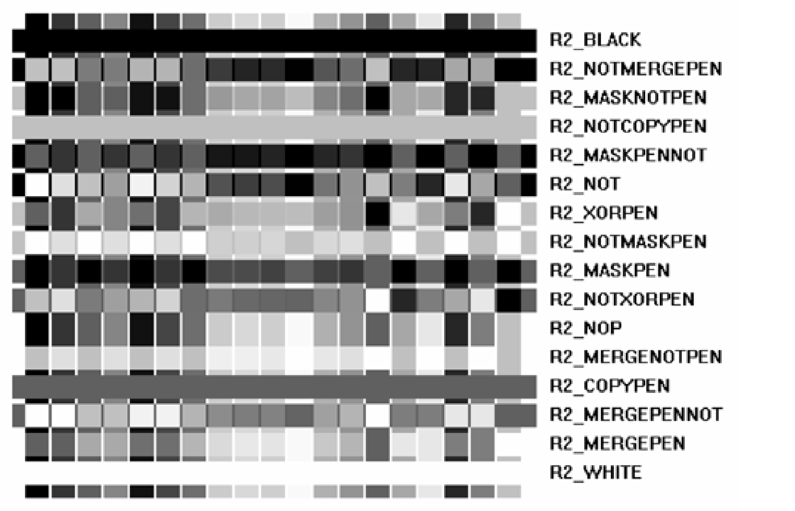
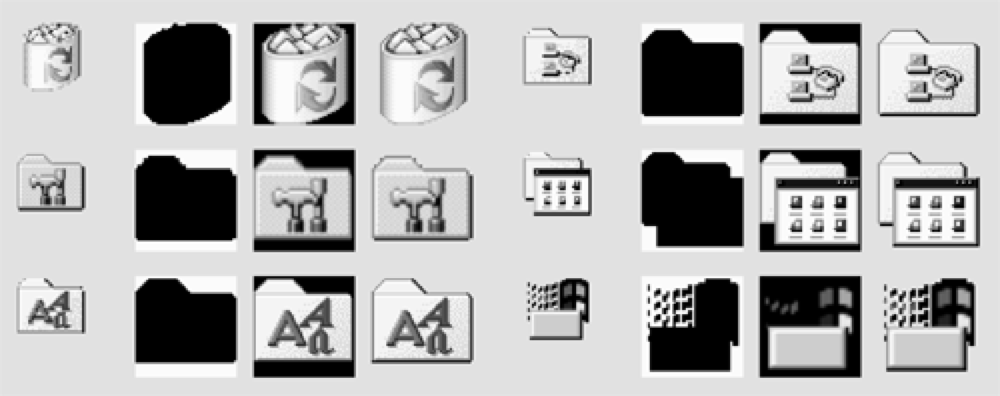

---
title: Handling Windows Metafiles in C#
second_title: Aspose.Words for .NET
articleTitle: Handling Windows Metafiles
linktitle: Handling Windows Metafiles
description: "Aspose.Words for .NET implements its own Windows Metafile player to play Metafile format on all platforms and supports the handling of the basic metafile features and can perform fallback to a different type of metafile player using C#."
type: docs
weight: 30
url: /net/handling-windows-metafiles/
---

Windows Metafile format is an image file format that can contain both vector and raster graphics. This format is used to store graphics data in memory or on-disk files. A metafile stores a list of function calls in the Windows Graphics Device Interface (GDI) that must be executed to display the image on the screen. The system interprets and executes these commands in the display context.

Formerly, Windows Metafile was the only vector image format supported by Microsoft Word. Microsoft Word now also supports SVG format, but the metafile format is still commonly used in Word documents. Also, Metafile could be an interchange format for some other applications, such as Microsoft Visio. Essentially, the main purpose of Metafile is to ensure the exchange of graphical information between Windows applications.

There are 3 versions of Windows Metafile:

- WMF – stores call to 16bit GDI.
- EMF – stores call to Win32/GDI.
- EMF+ Metafile stores call to GDI+. EMF+ Metafile may also be dual, describing the same graphics with both EMF and EMF+ parts.

The existing issue with Windows Metafile is that it is not supported by most non-Word formats, to which documents are usually saved. Therefore, it is required to convert the Metafile format to other raster or vector formats. It is easy to convert Windows Metafile to raster image on .NET by simply passing it to GDI+, but it is not possible on other platforms since even GDI+ does not provide the functionality to extract the vector graphics from Metafile. To solve these issues, Aspose.Words implements its own Windows Metafile player, which is able to play Metafile format both vector and raster graphics on all platforms.

## Controlling the Aspose.Words Metafile Player

The [MetafileRenderingOptions](https://apireference.aspose.com/words/net/aspose.words.saving/metafilerenderingoptions) class enables you to control the metafile player. For example, you can determine how metafile images should be rendered using the [RenderingMode](https://apireference.aspose.com/words/net/aspose.words.saving/metafilerenderingoptions/properties/renderingmode) property, which has a special meaning when converting to bitmaps (see also the [MetafileRenderingOptions](https://apireference.aspose.com/words/net/aspose.words.saving/imagesaveoptions/properties/metafilerenderingoptions) property).

Saving to a bitmap works differently on platforms other than .NET. While .NET GDI+ rendering is a reference that works almost perfect even for the most complex metafile format, on other platforms it may cause issues or not be supported at all.

## Supporting Raster Operations

Raster operations is a complex metafile feature, that currently has limited support. Raster operations are available in WMF and EMF metafile formats. The EMF+ metafile format does not use raster operations directly but can contain EMF parts, embedded WMF or EMF metafiles.

There are binary and ternary raster operations:

- Binary raster operations are applied to pen drawing commands, such as drawing lines and curves. When drawing a line, the pen color is combined with the destination bitmap color (the color of the corresponding pixel on the device surface) by using specified bitwise logical operations with hex color values. The image example below illustrates the effect of all 16 binary raster operations applied to 20 different color bars. The vertical color bars are drawn first, the horizontal bars are drawn after each binary raster operation is applied. For the simple cases, R2_BLACK draws black, R2_NOT inverses the color, R2_NOP does not change the background, and R2_WHITE draws white.

- Ternary raster operations are applied when drawing bitmap images. They combine colors of corresponding bitmap image pixels, the brush, and the destination bitmap by using bitwise logical operations with specified hex color values. One of the most common purposes of using ternary raster operations is the emulation of transparency. The image provided in the example below demonstrates how icon transparency can be emulated. There are two types of bitmaps: the b/w mask bitmap and the color bitmap. First, the mask bitmap is drawn with the SRCAND raster operation. It changes the opaque icon region to black and white, leaving the transparent region unchanged. Then the second bitmap is drawn with the SRCINVERT raster operation. It displays the color pixels on the black region, leaving the transparent region unchanged.

Raster operations can not be converted to vector graphics directly. Aspose.Words emulates raster operations by partially rasterizing the device surface affected by raster operations. For this purpose, the [EmulateRasterOperations](https://apireference.aspose.com/words/net/aspose.words.saving/metafilerenderingoptions/properties/emulaterasteroperations) property is used.

{}

While binary raster operations are not currently supported and the limited number of ternary raster operations are supported by Aspose.Words, it can handle the basic cases of conversion to vector graphics directly, for example, R2_BLACK, R2_WHITE, R2_NOP. Also, rasterizing of the device surface significantly affects performance, especially when the significant number of raster operation records are involved.

{}

The example shown below demonstrates how Aspose.Words renders a metafile to a bitmap when it is not possible to correctly render some of metafile records to vector graphics:



## Metafile Fallback Settings

Aspose.Words does not support a number of metafile features that are most complex or rare. Users can implement the [IWarningCallBack](https://apireference.aspose.com/words/net/aspose.words/iwarningcallback) interface and receive warning messages. If Aspose.Words encounters unsupported features in a metafile, it issues a warning message with [WarningSource](https://apireference.aspose.com/words/net/aspose.words/warningsource).**Metafile**. In this case Aspose.Words may perform fallback to a different type of metafile player. The warning message regarding fallback is also issued.

Firstly, Aspose.Words performs fallback from the vector metafile player to raster, which It is controlled by the [RenderingMode](https://apireference.aspose.com/words/net/aspose.words.saving/metafilerenderingoptions/properties/renderingmode) property. If the fallback feature is disabled, Aspose.Words tries to render some substitution graphics instead of the features that are not supported.

Aspose.Words successfully plays metafile to raster using GDI+ on .NET, which makes this callback option safe.

Secondly, there is an option for EMF+ Dual metafile to fallback from playing the EMF+ part to the EMF part. It is controlled by [EmfPlusDualRenderingMode](https://apireference.aspose.com/words/net/aspose.words.saving/metafilerenderingoptions/properties/emfplusdualrenderingmode). If there are some issues occur when playing the EMF part, then fallback to raster may be performed as well.

As for raster operations, if the [EmulateRasterOperations](https://apireference.aspose.com/words/net/aspose.words.saving/metafilerenderingoptions/properties/emulaterasteroperations) is disabled, then raster operations are considered as not supported, which triggers fallback to bitmap metafile player if it is enabled. Therefore, if you have a metafile with raster operations, but you do not want to use raster operations emulation and yet want to get the vector output with substitution graphics, then select the [MetafileRenderingMode](https://apireference.aspose.com/words/net/aspose.words.saving/metafilerenderingmode).**Vector**.
