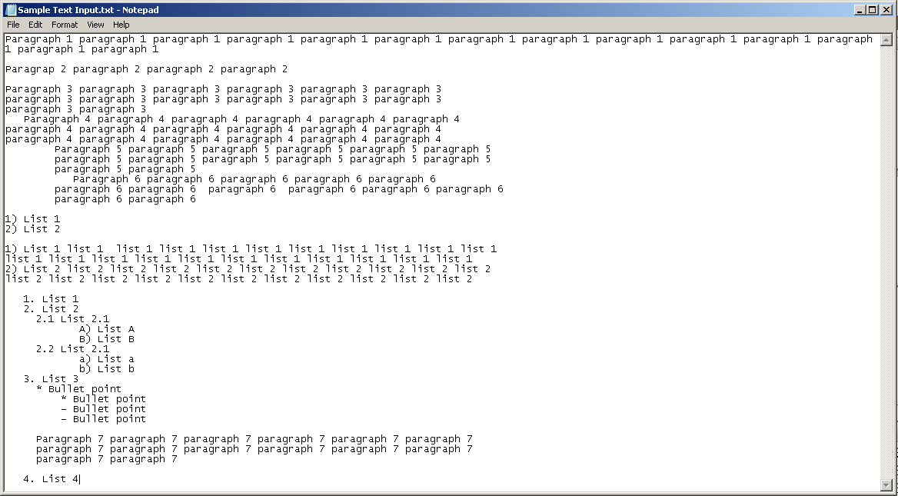
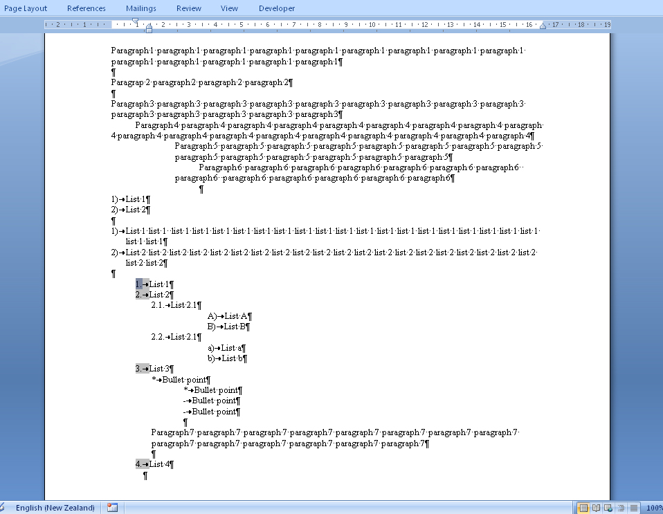

[Please review this article:

1. Check the information for relevance.
1. Make corrections: add comments or edit the text of the article.
1. Extend the article with additional information on the topic, if necessary.

Please feel free to ask me any questions:

1. rocketchat: mary.gerasimova
1. e-mail: [mary.gerasimova@aspose.com](/words/net/mailto-mary-gerasimova@aspose-com/)

How to add a comment: use the highlighting in orange and place it in square brackets (text text [comment] text) or angle brackets (text text <comment> text).]

{} 

For the time being you can load a text file into Aspose.Words by inserting the contents of the text file into a blank document using the [DocumentBuilder](http://www.aspose.com/documentation/.net-components/aspose.words-for-.net/aspose.words.documentbuilder.html) object. For more details, see the how-to on how to [Load Plain TXT Files](/pages/createpage.action?spaceKey=wordsnet&title=How+To+Load+Plain+Text+TXT+Files&linkCreation=true&fromPageId=94637142).

Since a text file normally contains only text, it cannot provide any of the complex Word document features that the other formats support during import. Normally the plain text is inserted as is into the document body. However, Aspose.Words is versatile and you can fully customize import based on your requirements. For example, you can use the [Range.Replace](http://www.aspose.com/documentation/.net-components/aspose.words-for-.net/aspose.words.range.replace overloads.html) method to replace pre-determined place holders in the text file with different formatting or insert a node at that location.

{} 

## **From "Load a Document"**
Aspose.Words allows to import plain text data the same way as other document formats using the [Document](https://apireference.aspose.com/net/words/aspose.words/document) constructor.

A plain text format is a basic format that does not require an advanced text processor to view or edit. However, some plain text files try to demonstrate more complex formats, such as lists and indentation. For example, a list might be represented as a series of lines, each starting with the same character. Aspose.Words tries to detect and load such features into a new document as their equivalent Microsoft Word feature instead of plain text. The table below shows the key features of the text import engine:

|**Feature**|**Details**|
| :- | :- |
|Text encoding|
The following encodings are supported:

- Latin1.

- BigEndianUnicode.

- UTF-16.

- UTF-7.

- UTF-8.
|
|Import of ordered lists|
- Arabic number with a dot or right parenthesis e.g **1.** or **2)**. The multilevel list is supported only supported when using a dot.

- Uppercase or lowercase Latin letter with a dot or right parenthesis e.g **a.** or **b)**.
|
|Import of unordered lists|Unordered lists are imported from consecutive lines which start with any of the following characters: *****,**--**,  **o**, **•**.|
|Paragraph indentation|Left indent and first-line indent are detected and imported for paragraphs using an appropriate number of space characters at the beginning of the paragraph.|
|Paragraph detection|
Rules for detecting a new paragraph start:

- If the next line left indent isn’t equal with the current paragraph’s left indent.

- An empty line starts a new paragraph.

- Any list detected starts a new paragraph.
|
The following code example loads a plain text file into an Aspose.Words.Document object:



You can download the template file of this example from [Aspose.Words GitHub](https://github.com/aspose-words/Aspose.Words-for-.NET/blob/master/Examples/Data/Loading-and-Saving/LoadTxt.txt).

Load a plain text file as shown below (simple text file):

The result of the text file loaded in Aspose.Words is saved as a DOCX document is below. Notice that the previous space is interpreted as indentation, and lists are loaded as the proper list feature:

