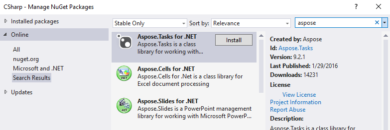
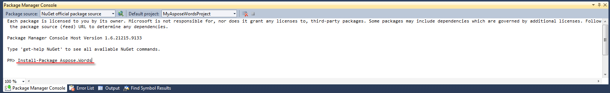
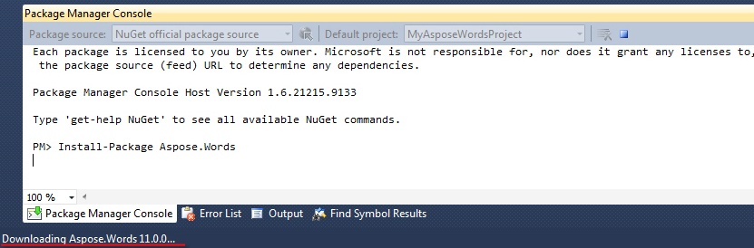
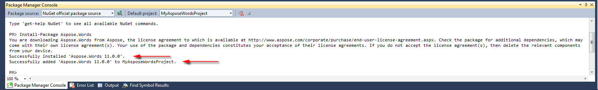
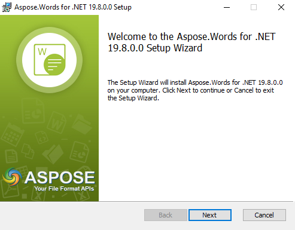
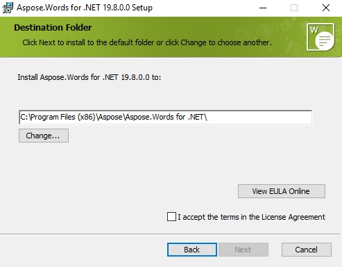
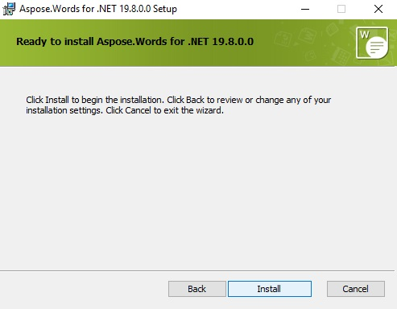
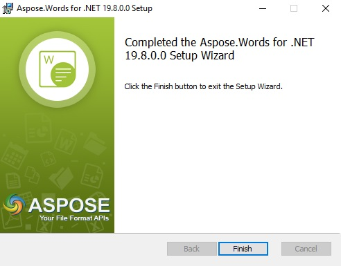
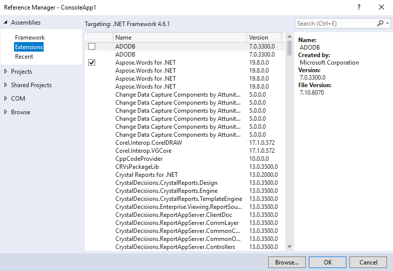

## **Installing Aspose.Words for .NET through NuGet**
NuGet is the easiest way to download and install [Aspose APIs for .NET](https://www.nuget.org/profiles/Aspose). Open Microsoft Visual Studio and NuGet package manager. Search "aspose" to find the desired Aspose API. Click on "Install", the selected API will be downloaded and referenced in your project.

### **Install or Update Aspose.Words using the Package Manager Console**
You can follow the steps below to reference the [Aspose.Words API](https://www.nuget.org/packages/Aspose.Words/) using the package manager console:

1. Open your solution/project in Visual Studio.
1. Select Tools -> Library Package Manager -> Package Manager Console from the menu to open package manager console.

Type the command “**Install-Package Aspose.Words**” and press enter to install the latest full release into your application. Alternatively, you can add the "**-prerelease**" suffix to the command in order to specify that the latest release including hotfixes is to be installed as well.

You will see the "Downloading Aspose.Words..." tip appears down the bottom left of the window indicating that the download processes. 

Once downloaded you will see the following confirmation messages. If you are not familiar with the [Aspose EULA](http://www.aspose.com/corporate/purchase/end-user-license-agreement.aspx) then it is a good idea to read the license referenced in the URL. 

You should now find that Aspose.Words has successfully been added and referenced in your application for you.

In the package manager console, you can also use the command “**Update-Package Aspose.Words**” and press enter to check for any updates to the Aspose.Words package and install them if present. You can also add the "-prerelease" suffix to update the latest release.
## **Installing Aspose.Words for .NET through Installer**
Aspose.Words for .NET can be installed by direct downloading the MSI installer from the [downloads section](https://downloads.aspose.com/words/net). You must be logged in to download the installer. If you are not already registered then you may signup for free.

Please follow the steps below:

1. Download **Aspose.Words_{LatestVersion}.msi** from the [downloads section](https://downloads.aspose.com/words/net).
1. Doble-click the downloaded file. The setup wizard shall start. Follow the setup wizard instructions. When the setup wizard shall finish the installation, the required files shall be available in the folder at the provided folder path.

1. Open your solution/project in Visual Studio.
1. Right-click on your project in solution explorer and add the reference to the installed assemblies.
1. Aspose.Words for .NET installed assemblies shall appear in extensions under Assemblies section. Select your required DLL component.

1. Finally, click OK.

## **Considerations When Running on a Shared Server Environment**
All Aspose .NET components are recommended to run with Full Trust permission set. This is because Aspose .NET component sometimes needs to access registry settings and files located in places other than the virtual directory e.g. for reading fonts etc. Furthermore, Aspose.NET components are based on core .NET system classes, some of which also require Full Trust permission to run in some cases.

Internet Service Providers hosting multiple applications from different companies mostly enforce Medium Trust security level. In the case of .NET 2.0, such a security level may set the following constraints which could affect the ability of Aspose.Words to perform properly.

- **RegistryPermission** is not available. This means you cannot access the registry, which is required to enumerate installed fonts when rendering documents.
- **FileIOPermission** is restricted. This means you can only access files in your application’s virtual directory hierarchy. This potentially means fonts cannot be read during export.

For these reasons specified above, it is recommended that Aspose.Words is run on Full Trust permissions. You may find that some features of the library will work when performing different tasks in Medium trust while some won't (rendering for example) which may due to calls to GDI+ image processing.
