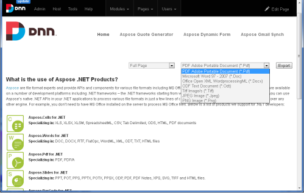

---
title: DNN Content Exporter Module – Aspose.Words for .NET
articleTitle: DNN Content Exporter Module
linktitle: DNN Content Exporter Module
description: "Export online contents into a Word Document using Aspose.Words DNN Content Exporter Module."
type: docs
weight: 20
url: /net/dnn-content-exporter-module/
---

Advance DNN Content Exporter Module using [Aspose.Words for .NET](https://www.aspose.com/word-component-suite.aspx) allow users to export online contents into a Word Document, OpenDocument, PDF and Image formats (Jpeg, Png, Tiff) from selected DNN Skin Pane or Full Page using Aspose.Words and send output file to browser for Open/Download to local system.

Based on customer feedback we have added much requested Selected Content Pane and other export types features in this release. This new release of the module comes with the following exciting features:

## Module Features

- Allow Full Page Contents Export
- Option to select DNN Pane before exporting the content allows you to export only relevant area instead of exporting the whole page.
- Option to select Output formats provided by Aspose.Words for .NET API.
- Custom CSS classes for Buttons and Dropdown to give the module look and feel of your skin via module settings.
- Option to preselect selection area via module settings.
- Option to hide selection Dropdown via module settings
- Get an offline copy of your favorite online content for editing, sharing and printing in the popular DOC, DOCX, ODT, PDF, JPEG, PNG and TIFF formats.
- The generated output file can be Opened/Downloaded from browser.
- In case the export contains more than one image, it automatically converts the exported images to a single ZIP file.
- A copy of the exported file is also saved in PortalSettings.HomeDirectory\AsposeExport folder for later use.

## System Requirements and Supported Platforms

In order to setup Aspose.Words .NET for DNN modules you need to have the following requirements met:

- DNN 7.0 +
- [Aspose.Words for .NET](https://www.aspose.com/.NET/word-component.aspx)

Please feel free to contact us if you wish to install these modules on other versions of DNN.

## Downloading

You can download Quote Generator modules from [Github](https://github.com/aspose-words/Aspose.Words-for-.NET/releases/tag/AdvanceDNNContentExporter).

## Installing

Once downloaded, please follow these steps to install the module into your DNN website:

1. Log into your site as either Host or another super-user level account.
1. Navigate to the **Host** menu and select **Extensions**.
1. Click **Install Extension Wizard**.
1. As directed browse to the location of the downloaded zip file, select it then click **Open**.
1. Click **Next**, accept the license, continue through the install. When finished click the **Return** button.

Please check [this module installation video](https://www.dnnsoftware.com/community/learn/video-library/view-video/video/542/view/details/how-to-install-a-module-in-dotnetnuke-7) from DNN for more details.

## Using

After you have installed the Aspose .NET Advance DNN Content Exporter, it is really simple to start using it on your website. Please follow these simple steps to get started:

1. Make sure you are logged-in to DNN with a Host or Admin level account.
1. Navigate to the page where you want to add the Export module.
1. Select **Modules** followed by **Add New Module** from the top ribbon.
1. From the list, select ‘Aspose .NET Advance DNN Content Exporter Module’ and drag it into position.

You have successfully added Aspose .NET Advance DNN Content Exporter module to your page. 

### Export Contents

1. Select **Exportable Area** "Full Page" OR DNN Skin Panels.
1. Select **Export Format** provided by Aspose.Words for .NET API.
1. Click **Export** Button.
1. Open/Download exported file in browser.

### Apply CSS Class Name

This module allow to apply CSS Class name for DropDowns and Export Button.

1. Make sure you are logged-in with Admin/host account.
1. Click **Settings** wheel icon in module.
1. Click **Aspose .NET Advance Content Exporter** tab.
1. Input CSS class name for Dropdowns and Export Button.
1. Click **Update** Button.

### How to apply Aspose License?

This Plugin uses an evaluation version of Aspose.Words. Once you are happy with your evaluation, you can purchase a license at the [Aspose website](https://www.aspose.com/purchase/default.aspx).
To remove evaluation message and feature limitations, product license should be applied. You will receive a license file after you have purchased the product. Please follow the steps below to apply the license

- Make sure the license file is named as **Aspose.Words.lic**
- Place **Aspose.Words.lic** file in **App_Data** folder of your DNN website e.g. "DNN Root Folder/App_Data/Aspose.Words.lic"

## Video Demo

Please check [the video](https://www.youtube.com/watch?v=tvKB5BgSozQ) below to see the module in action.

## Support, Extend and Contribute

### Support

From the very first days of Aspose, we knew that just giving our customers good products would not be enough. We also needed to deliver good service. We are developers ourselves and understand how frustrating it is when a technical issue or a quirk in the software stops you from doing what you need to do. We're here to solve problems, not create them.

This is why we offer free support. Anyone who uses our product, whether they have bought them or are using an evaluation, deserves our full attention and respect.

You can log any issues or suggestions related to Aspose.Words .NET for DNN Modules using any of the following platforms

- [Github](https://github.com/aspose-words/Aspose.Words-for-.NET/issues)

### Extend and Contribute

Aspose .NET Advance DNN Content Exporter module is open source and their source code is available on the major social coding websites listed below. Developers are encouraged to download the source code and extend the functionality as per their own requirements.

#### Source Code

You can get the latest source code from one of the following locations

- [Github](https://github.com/aspose-words/Aspose.Words-for-.NET)

#### How to configure the source code

You need to have the following installed in order to open and extend the source code

- Visual Studio 2010 or higher
- [DNN Development Template](https://www.aspose.com/docs/display/totalnet/Aspose+DNN+Module+Development+Template)

Please follow these simple steps to get started

1. Download/Clone the source code.
1. Open Visual Studio 2010 and Choose **File** > **Open Project**
1. Browse to the latest source code that you have downloaded and open **AsposeDotNetNukeContentExport.sln**
