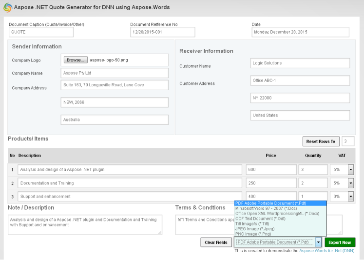

---
title: DNN Quote Generator Module
type: docs
weight: 10
url: /net/dnn-quote-generator-module/
---

Aspose .NET Quote Generator for DNN is an open source module from Aspose that enable users to generate Quotations in your DNN website without requiring any other software. It uses the powerful features of Aspose.Words for .NET to allow you to easily generate quotations.

This initial version of the module is enriched with the following features to make the quote generating process effective, simple and easy to use.

## Module Features

- Generate quotations with MailMerged template
- Allow to edit quotation document title, reference #, generating date
- Allow to upload and use company logo image
- Allow to enter company name and complete address
- Allow to display company name OR logo image OR both
- Allow to enter customer/client name and complete address
- Allow to dynamically create products/items rows between 0-99
- Calculates total amount for each product/items
- Allow to apply VAT percent for each item between 0-20 with each decimal points
- Calculates VAT and total amount for each product
- Calculates grand amount for all product/items, including VAT applied
- Allow to enter quotation description/note details
- Allow to enter quotation T&C (Terms & Conditions)
- Mail Merge Template is already created and placed in template folder in the package and will be used to export the quotation in a pre-defined MailMerge template.
- Allow to export quotation to PDF (**.Pdf), MS Word 2003-2007 (**.Doc), Office Open XML WordprocessingML (**.Docx), ODF Text Document (**.Odt), Tiff Image/s (**.Tiff), JPEG Image (**.Jpeg), PNG Image (*.Png).

## Aspose.Words Features

- Simple MailMerge
- Data Table MailMerge
- Compressed Image Embed
- Region & Shapes Find and Update
- Remove Empty Regions
- Save document to *.Pdf, *.Doc, *.Docx, *.Odt, *.Tiff, *.Jpeg, *.Png File Format
- License Verification & Embed     

## System Requirements and Supported Platforms

In order to setup Aspose.Words .NET for DNN modules you need to have the following requirements met:

- DNN 7.0 +
- [Aspose.Words for .NET](http://www.aspose.com/.NET/word-component.aspx)

Please feel free to contact us if you wish to install these modules on other versions of DNN.

## Downloading

You can download Quote Generator modules from one of the following locations

- [Github](https://github.com/aspose-words/Aspose.Words-for-.NET/releases/tag/DNNQuoteGeneratorModule)
- [DNN Store](http://store.dnnsoftware.com/home/product-details/aspose-net-dnn-quote-generator-module-using-aspose-words-for-net)

## Installing

Once downloaded, please follow these steps to install the module into your DNN website:

1. Log into your site as either **Host** or another Supersuser level account.
1. Navigate to the Host menu and select **Extensions**.
1. Click on **Install Extension Wizard**.
1. As directed browse to the location of the downloaded zip file, select it then click **Open**.
1. Click **Next**, accept the license, continue through the install. When finished click on the **Return** button.

**Note:** If you get an error while uploading the module this is due to the maxRequestLength limit in your DNN installation’s web.config. Open web.config and update maxRequestLength to 20MB by setting **maxRequestLength=”20480″** and try to upload the module again.

## Using

After you have installed Aspose .NET Quote Generator Module for DNN Module it is really simple to start using it on your website. Please follow these simple steps to get started

1. Make sure you are logged-in to DNN as Host or Admin level account
1. Navigate to the page where you want to add the Import module
1. Select **Modules** -> **Add New Module** from the top Ribbon
1. From the list select **Aspose Quote Generator** and drag it to a place of your choice on the page

You have successfully added Aspose .NET Quote Generator module to your page. You will be presented with input form to get started

1. Enter (Document Caption, Refference #, Generating Date)
1. Enter ‘Quotation From’ fields such as (Company Logo, Name, State-Zip, Country)
1. Enter ‘Quotation To’ fields such as (Customer/Client Name, State-Zip, Country)
1. You can generate product rows to 99
1. Enter products details such as (Description, Unit Price, Quantity, VAT percentage selection if applicable )
1. Enter Quotation description/details And Terms & Conditions to display
1. Option either to ‘Clear Form Fields’ OR Select Export File Format’ from List

### How to apply Aspose License?

This Plugin uses an evaluation version of Aspose.Words. Once you are happy with your evaluation, you can purchase a license at the [Aspose website](http://www.aspose.com/purchase/default.aspx).
To remove evaluation message and feature limitations, product license should be applied. You will receive a license file after you have purchased the product. Please follow the steps below to apply the license

- Make sure the license file is named as **Aspose.Words.lic**
- Place **Aspose.Words.lic** file in **App_Data** folder of your DNN website e.g. "DNN Root Folder/App_Data/Aspose.Words.lic"

## Video Demo

Please check [the video](https://www.youtube.com/watch?v=rY2LVNJewbM) below to see the module in action.

## Support, Extend and Contribute

### Support

From the very first days of Aspose, we knew that just giving our customers good products would not be enough. We also needed to deliver good service. We are developers ourselves and understand how frustrating it is when a technical issue or a quirk in the software stops you from doing what you need to do. We're here to solve problems, not create them.

This is why we offer free support. Anyone who uses our product, whether they have bought them or are using an evaluation, deserves our full attention and respect.

You can log any issues or suggestions related to Aspose.Words .NET for DNN Modules using any of the following platforms

- [Github ](https://github.com/aspose-words/Aspose.Words-for-.NET/issues)
- [Microsoft Developer Network](https://code.msdn.microsoft.com/Aspose-NET-DNN-Quote-110ad750/view/Discussions#content)

### Extend and Contribute

Aspose .NET Quote Generator for DNN module is an open source and their source code is available on the major social coding websites listed below. Developers are encouraged to download the source code and extend the functionality as per their own requirements.

#### Source Code

You can get the latest source code from one of the following locations

- [Github ](https://github.com/aspose-words/Aspose.Words-for-.NET)
- [Microsoft Developer Network](https://code.msdn.microsoft.com/Aspose-NET-DNN-Quote-110ad750)

#### How to configure the source code

You need to have the following installed in order to open and extend the source code

- Visual Studio 2010 or higher
- [DNN Development Template](http://www.aspose.com/docs/display/totalnet/1.2.1+Downloading)

Please follow these simple steps to get started

1. Download/Clone the source code.
1. Open Visual Studio 2010 and Choose **File** > **Open Project**
1. Browse to the latest source code that you have downloaded and open **AsposeDNNQuoteGenerator.sln**
