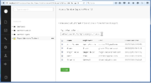

Export Members to Word is an Add-on for Umbraco which allows you to export members from your Umbraco CMS to a Word Document, OpenDocument, PDF and Image formats using [Aspose.Words](https://releases.aspose.com/words/net/). A new node titled **Export Members To Word** appears under Members tree in Umbraco backend after installation where you can simply select members to export and output format to get members in selected output document format.

## Module Features

This initial version of the Add-on have the following features:

- Export members to Microsoft Word Documents (.doc, .docx, dot, dotx, docm, and dotm)
- Export members to Portable Document Format (*.pdf)
- Export members to OpenDocument Format (*.odt)
- Export members to Tiff Image/s (*.Tiff)
- Export members to JPEG Image (*.Jpeg)
- Export members to PNG Image (*.Png)
- Option to select desired output format before exporting
- Option to export all or selected members to selected output document format.
- Works with all .NET versions starting from .NET 4.0.
- Exported document is automatically sent to browser for downloading
- If selected a copy of the exported document is saved in App_Data folder on the server for later use.
- Compatible with a wide range of Umbraco versions 7.x+

## System Requirements and Supported Platforms

### System Requirements

In order to setup this module you need to have the following requirements met:

- Umbraco 7.0 +

Please feel free to contact us if you wish to install this module on other versions of Umbraco.

### Supported Platforms

The module is supported on all versions of

- Umbraco running on ASP.NET 4.0

## Downloading

You can download Export Members to Word Add-on from one of the following locations

- [Github](https://github.com/aspose-words/Aspose.Words-for-.NET/releases)
- [Umbraco Projects](https://our.umbraco.com/search?q=Aspose.Words&cat=project)

## Installing

Once downloaded, please follow these steps to install this package into your Umbraco website:

1. Log in to the Umbraco **Developer** section, see `https://umbraco.com/umbraco-for-developers/` for details
1. From the tree, expand the **Packages** folder.
1. From here there are two ways to install a package: select **Install local package** or browse the **Umbraco Package Respository.**
1. If you install **local package**, do not unzip the package but load the zip into Umbraco.
1. Follow the instructions on screen.

**Note:** You may get a ‘Maximum request length exceeded’ error when installing. You can easily fix this issue by updating the ‘maxRequestLength’ value in your Umbraco web.config file.


 <httpRuntime requestValidationMode="2.0" enableVersionHeader="false" maxRequestLength="25000" /> 


## Using

After you have installed the macro it is really simple to start using it on your website:

1. Make sure you are logged in to the Umbraco **Developer** section, see `https://umbraco.com/umbraco-for-developers/` for details
1. Click **Members** in the list of sections at the bottom left of the screen.
1. At the end of the tree, you will see a node titled **Export Members To Word** click on it to launch the Export to Word add-on.
1. Select your desired output document format and select Members to export. If you wish you Export all members leave member selection or click the check-box in header row.
1. Click **Export** button at the bottom and you will be prompted to download the exported file.

### How to apply Aspose License?

This Plugin uses an evaluation version of Aspose.Words. Once you are happy with your evaluation, you can purchase a license at the [Aspose website](https://releases.aspose.com/words/net/).
To remove evaluation message and feature limitations, product license should be applied. You will receive a license file after you have purchased the product. Please follow the steps below to apply the license

- Make sure the license file is named as **Aspose.Words.lic**
- Place **Aspose.Words.lic** file in **App_Data** folder of your Umbraco website e.g. "Umbraco Root Folder/App_Data/Aspose.Words.lic"

## Video Demo

Please check [the video](https://www.youtube.com/watch?v=BoUwTc2bnEI) below to see the module in action.

## Support, Extend and Contribute

### Support

From the very first days of Aspose, we knew that just giving our customers good products would not be enough. We also needed to deliver good service. We are developers ourselves and understand how frustrating it is when a technical issue or a quirk in the software stops you from doing what you need to do. We're here to solve problems, not create them.

This is why we offer free support. Anyone who uses our product, whether they have bought them or are using an evaluation, deserves our full attention and respect.

You can log any issues or suggestions related to Aspose.Words .NET for Umbraco Modules using any of the following platforms

- [Github](https://github.com/aspose-words/Aspose.Words-for-.NET/issues)

### Extend and Contribute

Export Members to Word is an open source Add-on and its source code is available on the major social coding websites listed below. Developers are encouraged to download the source code and extend the functionality as per their own requirements.

#### Source Code

You can get the latest source code from one of the following locations

- [Github](https://github.com/aspose-words/Aspose.Words-for-.NET/tree/master/Plugins/Umbraco)

#### How to configure the source code

You need to have the following installed in order to open and extend the source code

- Visual Studio 2010 or higher

Please follow these simple steps to get started

1. Download/Clone the source code.
1. Open Visual Studio 2010 and Choose **File** > **Open Project**
1. Browse to the latest source code that you have downloaded and open **e.g Aspose.UmbracoMemberExportToWord.sln**
