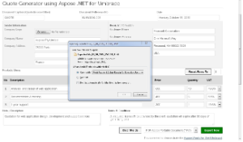

Aspose .NET Quote Generator for Umbraco is an open source module from Aspose that enable users to generate Quotes in your Umbraco site without requiring any other software. It uses the powerful features of Aspose.Words for .NET to allow you to easily generate quotations.

## Module Features

This initial version of the module is enriched with the following features to make the quote generating process effective, simple and easy to use.

- Generate quotations with MailMerged template
- Allow to edit quotation document title, reference #, generating date
- Allow to upload and use company logo image
- Allow to enter company name and complete address
- Allow to display company name OR logo image OR both
- Allow to enter customer/client name and complete address
- Allow to dynamically create products/items rows between 0-99
- Calculates total amount for each product/items
- Allow to apply VAT percent for each item between 0-20 with each decimal points
- Calculates VAT and total amount for each product
- Calculates grand amount for all product/items, including VAT applied
- Allow to enter quotation description/note details
- Allow to enter quotation T&C (Terms & Conditions)
- Mail Merge Template is already created and placed in template folder in the package and will be used to export the quotation in a pre-defined MailMerge template.
- Allow to export quotation to PDF (**.Pdf), MS Word 2003-2007 (**.Doc), Office Open XML WordprocessingML (**.Docx), ODF Text Document (**.Odt), Tiff Image/s (**.Tiff), JPEG Image (**.Jpeg), PNG Image (*.Png).

## Aspose.Words Features

- Simple MailMerge
- Data Table MailMerge
- Compressed Image Embed
- Region & Shapes Find and Update
- Remove Empty Regions
- Save document to *.Pdf, *.Doc, *.Docx, *.Odt, *.Tiff, *.Jpeg, *.Png File Format
- License Verification & Embed

## System Requirements and Supported Platforms

### System Requirements

In order to setup Aspose .NET Quote Generator for Umbraco module you need to have the following requirements met:

- Umbraco 6.2.5 & Umbraco 6 versions
- Microsoft .NET Framework 4.0

**Note:** Umbraco 7 and above are not supported in this release. We look forward to hear your feedback and add support for Umbraco 7 in next version.

Please feel free to contact us if you wish to install this module on an older version of Umbraco.

### Supported Platforms

The module is supported on all versions of

- Umbraco running on ASP.NET 4.0

## Downloading

You can download Quote Generator modules from one of the following locations

- [Github](https://github.com/aspose-words/Aspose.Words-for-.NET/releases/tag/AsposeNETQuoteGeneratorUmbraco)
- [Umbraco Projects](https://our.umbraco.com/search?q=Aspose.Words&cat=project)

## Installing

Once downloaded, please follow these steps to install this package into your Umbraco website:

1. Log in to the Umbraco **Developer** section, see `https://umbraco.com/umbraco-for-developers/` for details
1. From the tree, expand the **Packages** folder.
1. From here there are two ways to install a package: select **Install local package** or browse the **Umbraco Package Repository.**
1. If you install **local package**, do not unzip the package but load the zip into Umbraco.
1. Follow the instructions on screen.

**Note:** You may get a ‘Maximum request length exceeded’ error when installing. You can easily fix this issue by updating the ‘maxRequestLength’ value in your Umbraco web.config file.
&lt;httpRuntime requestValidationMode="2.0" enableVersionHeader="false" maxRequestLength="25000" /&gt; 

## Using

- [Using Umbraco Quote Generator ](/words/net/how-to-use-umbraco-quote-generator/)

## Video Demo

- [Video Demo Umbraco Quote Generator ](/words/net/how-to-use-umbraco-quote-generator/)

## Support, Extend and Contribute

### Support

From the very first days of Aspose, we knew that just giving our customers good products would not be enough. We also needed to deliver good service. We are developers ourselves and understand how frustrating it is when a technical issue or a quirk in the software stops you from doing what you need to do. We're here to solve problems, not create them.

This is why we offer free support. Anyone who uses our product, whether they have bought them or are using an evaluation, deserves our full attention and respect.

You can log any issues or suggestions related to Aspose.Words .NET for Umbraco Modules using any of the following platforms

- [Github](https://github.com/aspose-words/Aspose.Words-for-.NET/releases/tag/AsposeNETQuoteGeneratorUmbraco)
- [Umbraco Projects](https://our.umbraco.com/search?q=Aspose.Words&cat=project)

### Extend and Contribute

Umbraco quote generator module is an open source and their source code is available on the major social coding websites listed below. Developers are encouraged to download the source code and extend the functionality as per their own requirements.

#### Source Code

- [Github](https://github.com/aspose-words/Aspose.Words-for-.NET/releases/tag/AsposeNETQuoteGeneratorUmbraco)
- [Umbraco Projects](https://our.umbraco.com/search?q=Aspose.Words&cat=project)

#### How to configure the source code

You need to have the following installed in order to open and extend the source code

- Visual Studio 2010 or higher

Please follow these simple steps to get started

1. Download/Clone the source code.
1. Open Visual Studio 2010 and Choose **File** > **Open Project**
1. Browse to the latest source code that you have downloaded and open **UmbracoQuoteGenerator.sln**
