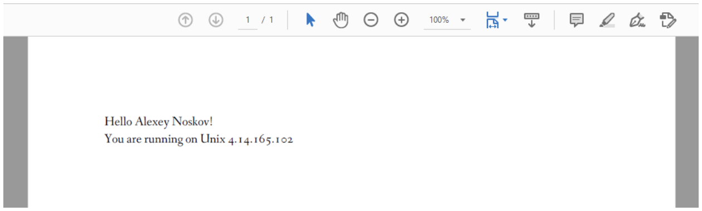
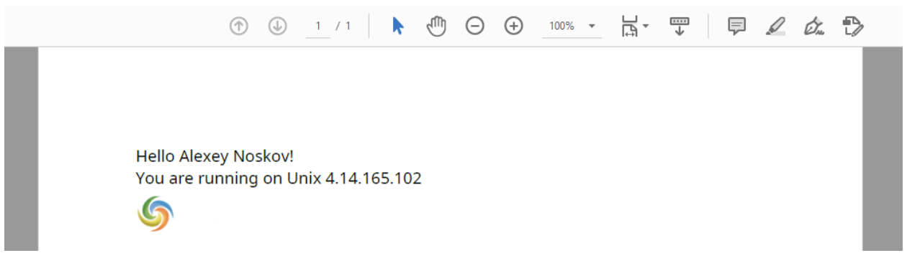

In case you are targeting to create an application in the cloud, and you need Aspose.Words functionality and probably integration with other Amazon services, you may be interested in using Aspose.Words in AWS Lambda.

This article describes possible scenarios for using Aspose.Words for .NET when building applications for  Amazon Web Services.

## Prerequisites

1. Active AWS account for using Lambda. If you don’t have one, create a new account before you begin.
2. Visual Studio 2019 or Visual Studio 2017 with installed AWS Toolkit for Visual Studio.

## How to Run Aspose.Words Application in AWS Lambda

To see how Aspose.Words works in AWS Lambda, follow the steps below:

1. In Visual Studio, create an AWS Lambda Project (.NET Core – C#). From the proposed blueprints, select an Empty Function. The created project contains a simple function that transforms input string to upper case.

2. Add a [NuGet reference to Aspose.Words](https://www.nuget.org/packages/Aspose.Words/) and AWSSDK.S3 to work with S3 storage.

3. Create a simple document using Aspose.Words and save it in PDF format into S3 storage using the following snippet: 

   /// 

   /// A simple function that creates a document and saves it as PDF to S3 storage.
   /// 

   public async Task<string> FunctionHandler(string input, ILambdaContext context)
   {
       // Create a simple hello world document using Aspose.Words.
       Document doc = new Document();
       DocumentBuilder builder = new DocumentBuilder(doc);
       // Insert some text in the document.
       builder.Writeln(string.Format("Hello {0}!", input));
       builder.Writeln("You are running on " + System.Environment.OSVersion.VersionString);
       // Inset an image.
       builder.InsertImage(@"https://cms.admin.containerize.com/templates/aspose/App_Themes/V3/images/aspose-logo.png");

   ​	using (MemoryStream ms = new MemoryStream())
   ​	{
      	 doc.Save(ms, SaveFormat.Pdf);
   ​    	ms.Position = 0;

   ​    	bool putResult = await PutS3Object(BucketName, "AW_out.pdf", ms);
   ​    	return putResult ? "OK" : "FAILED";
   ​	}
   } 
   

4. Deploy the created function and run it either from Visual Studio or from Amazon Console. The following screenshot shows the output PDF document.
   

You might notice two strange things:

* There is no image in the output. It disappears because Aspose.Words for .NET Standard uses SkiaSharp to deal with graphics. From the output, you can see that the Lambda function is running under Unix, and since there are no SkiaSharp native assets for Unix, it does not work. The solution to this problem is simple – add a NuGet reference to [SkiaSharp.NativeAssets.Linux.NoDependencies](https://www.nuget.org/packages/SkiaSharp.NativeAssets.Linux.NoDependencies/).
* The font used in the PDF is Fanwood. Fanwood is the last resort font which is stored in Aspose.Words DLL as an embedded resource. It is used when Aspose.Words cannot find other alternatives.

## How to Use Fonts Stored in S3 storage in AWS Lambda

Often documents contain more than one font, and for conversion fidelity it is required to have these fonts available for Aspose.Words. Aspose.Words can use [fonts from different sources](https://docs.aspose.com/display/wordsnet/Specifying+TrueType+Fonts+Location), such as folder, stream, or system fonts. This section shows you how to use fonts stored in S3 storage, that is the most convenient way to provide custom fonts in the cloud.

{}

For demonstration purposes, the Noto Sans fonts set is used.

{}

To use fonts from the S3 storage, follow the steps below:

1. Create a “Fonts” folder in your S3 bucket and upload the fonts there. The following code shows a [StreamFontSource](https://apireference.aspose.com/words/net/aspose.words.fonts/streamfontsource) implementation used to read one font from S3 storage: 
   internal class S3FontSource : StreamFontSource
   {
       public S3FontSource(IAmazonS3 client, string bucketName, string key)
       {
           mClient = client;
           mBucketName = bucketName;
           mKey = key;
       }

   ​	public override Stream OpenFontDataStream()
   ​	{
   ​    	GetObjectRequest request = new GetObjectRequest
   ​    	{
   ​            BucketName = mBucketName,
   ​            Key = mKey
      	 };

   ​    	MemoryStream fontStream = new MemoryStream();
   ​    	Task<GetObjectResponse> task = Task.Run(async () => await mClient.GetObjectAsync(request));
   ​    	using (GetObjectResponse response = task.Result)
   ​    	{
   ​        	response.ResponseStream.CopyTo(fontStream);
   ​        	fontStream.Position = 0;
   ​    	}

   ​    	return fontStream;
   ​	}

   ​	private readonly IAmazonS3 mClient;
   ​	private readonly string mBucketName;
   ​	private readonly string mKey;

    }

   

2. For each of the fonts stored in the “Fonts” folder, create a separate instance of the above class. The array of the created instances will be used as the font source for Aspose.Words. The following code is the full listing of our AWS lambda function: using System;
   using System.Collections.Generic;
   using System.IO;
   using System.Threading.Tasks;
   using Amazon.Lambda.Core;
   using Amazon.S3;
   using Amazon.S3.Model;
   using Aspose.Words;
   using Aspose.Words.Fonts;

   // Assembly attribute to enable the Lambda function's JSON input to be converted into a .NET class.
   [assembly: LambdaSerializer(typeof(Amazon.Lambda.Serialization.SystemTextJson.DefaultLambdaJsonSerializer))]
   namespace TestAsposeWordsLambda
   {
       public class Function
       {
           /// 

           /// Default constructor. This constructor is used by Lambda to construct the instance. When invoked in a Lambda environment
           /// the AWS credentials will come from the IAM role associated with the function and the AWS region will be set to the
           /// region the Lambda function is executed in.
           /// 

           public Function()
           {
               S3Client = new AmazonS3Client();
           }

   ​    	/// 

   ​    	/// A simple function that creates document and saves it as PDF to S3 storage.
   ​    	/// 

   ​    	public async Task<string> FunctionHandler(string input, ILambdaContext context)
   ​    	{
   ​        	// Create a simple hello world document using Aspose.Words.
   ​        	Document doc = new Document();
   ​        	DocumentBuilder builder = new DocumentBuilder(doc);
   ​        	// Set font.
   ​        	builder.Font.Name = "Noto Sans";
   ​        	// Insert some text in the document.
   ​        	builder.Writeln(string.Format("Hello {0}!", input));
   ​        	builder.Writeln("You are running on " + System.Environment.OSVersion.VersionString);
   ​        	// Inset an image.
   ​        	builder.InsertImage(@"https://cms.admin.containerize.com/templates/aspose/App_Themes/V3/images/aspose-logo.png");

   ​        	// Specify font settings for the document.
   ​        	doc.FontSettings = S3FontSettings;

   ​        	using (MemoryStream ms = new MemoryStream())
   ​        	{
   ​            	doc.Save(ms, SaveFormat.Pdf);
   ​            	ms.Position = 0;

   ​            	bool putResult = await PutS3Object(BucketName, "AW_out.pdf", ms);
   ​            	return putResult ? "OK" : "FAILED";
   ​        	}

   ​    	}

   ​    	private async Task<bool> PutS3Object(string bucket, string key, Stream content)
   ​    	{
   ​        	try
   ​        	{
   ​            	PutObjectRequest request = new PutObjectRequest
   ​            	{
   ​                	BucketName = bucket,
   ​                	Key = key,
   ​                	InputStream = content
   ​            	};
   ​            	var response = await S3Client.PutObjectAsync(request);

   ​            	return true;
   ​        	}
   ​        	catch (Exception ex)
   ​        	{
   ​            	Console.WriteLine(ex.Message);
   ​            	return false;
   ​        	}
   ​    	}

   ​    	/// 

      	 /// Lists fonts in the S3 folder and creates S3FontSource for each of them.
   ​    	/// 

   ​    	private static async Task<S3FontSource[]> GetS3FontSources(IAmazonS3 client, string bucketName, string fontsFolderKey)
   ​    	{
   ​        	ListObjectsV2Request request = new ListObjectsV2Request()
   ​        	{
   ​            	BucketName = bucketName,
   ​            	Prefix = fontsFolderKey
   ​        	};

   ​        	List<S3FontSource> fontList = new List<S3FontSource>();
   ​        	ListObjectsV2Response response;
   ​        	do
   ​        	{
   ​            	// Note to perform this operation you need to have permission to perform the s3:Listbucket.
   ​            	response = await client.ListObjectsV2Async(request);

   ​            	// Process the response.
   ​            	foreach (S3Object entry in response.S3Objects)
   ​            	{
   ​                	// Skip folder.
   ​                	if (entry.Key.EndsWith("/"))
   ​                    	continue;

   ​                	fontList.Add(new S3FontSource(client, bucketName, entry.Key));
   ​            	}

   ​            	request.ContinuationToken = response.NextContinuationToken;
   ​        	} while (response.IsTruncated);

   ​        	return fontList.ToArray();
   ​    	}

   ​    	static Function()
   ​    	{
   ​        	// Uncomment this code and embed your license file as a resource in this project and this code
   ​        	// will find and activate the license. Aspose.Wods licensing needs to execute only once
   ​        	// before any Document instance is created and a static ctor is a good place.
   ​        	// Aspose.Words.License lic = new Aspose.Words.License();
   ​        	// lic.SetLicense("Aspose.Words.lic");
   ​    	}

   ​    	private IAmazonS3 S3Client { get; set; }

   ​    	private FontSettings S3FontSettings
   ​    	{
   ​        	get
   ​        	{
   ​            	// Init font settings.
   ​            	if (mFontSettings == null)
   ​            	{
   ​                	mFontSettings = new FontSettings();
   ​                	mFontSettings.SetFontsSources(Task.Run(async () => await GetS3FontSources(S3Client, BucketName, "Fonts")).Result);

   ​				}
   ​                return mFontSettings;
   ​            }
   ​        }

      	 private FontSettings mFontSettings;
       	private const string BucketName = "testbucketaw001";
   	}

   }

   

3. As a result, you will receive the output PDF document created by the function, as shown in the screenshot below. Notice the image is displayed properly and the correct font is used.
   

## See Also

- [AWS Toolkit for Visual Studio](https://marketplace.visualstudio.com/items?itemName=AmazonWebServices.AWSToolkitforVisualStudio2017)

- [AWS Free Tier](https://aws.amazon.com/free/?all-free-tier.sort-by=item.additionalFields.SortRank&all-free-tier.sort-order=asc)

- [Noto Fonts](https://www.google.com/get/noto/)

