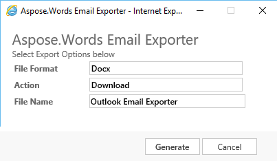
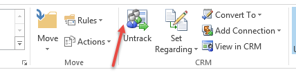
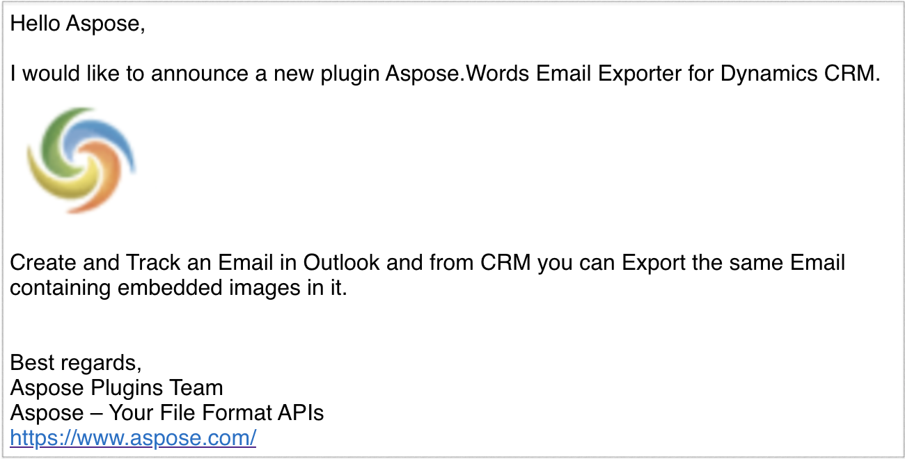

---
title: Email Exporter for Dynamics CRM
type: docs
weight: 50
url: /net/email-exporter-for-dynamics-crm/
---

The Aspose.Words Email Exporter is an open source add-on for Dynamics CRM. It is capable of exporting email body (in HTML) to a word document. It also provides feature to retrieve embedded images inside the emails tracked from Outlook. You can download the generated file instantly and you can choose to attach the generated file with the same email under notes. In addition, it allows you to save the document in multiple formats like DOC, DOCX, BMP, HTML, JPEG, PDF, PNG, RTF and TXT. Aspose.Words Email Exporter can be used with all versions of CRM 2013 on-premises, CRM 2015 on-premises and CRM Online.

Major features of this Addon are:

- Ribbon Button on Email Entity.
- A Popup where you can select multiple options.
- This plugin can download the exported document.
- This plugin allows to attach the generated document with the same email.
- Support a number of formats like: DOC, DOCX, BMP, HTML, JPEG, PDF, PNG, RTF and TXT.
- Allows you to enter the name of generated output file.

## System Requirements and Supported Platforms

In order to install and use Aspose.Words Email Exporter for Microsoft Dynamics CRM you need to have one of the following CRM version installed.

- Microsoft Dynamics CRM 2013.
- Microsoft Dynamics CRM 2015.
- Microsoft Dynamics CRM Online.

Please feel free to contact us if you find any issues in installing or using this Add-on.

## Downloading

You can download the latest solution at:

- [Github](https://goo.gl/2rGmgd)
- [Code.MSDN](https://goo.gl/ZTW336)

## Installing or Uninstalling

### How to Install

**Importing the Solution**

- Download the Solution File. (Managed if you intent to uninstall it)
- Open CRM and go to Import Solution.
- Click Browse and select the downloaded solution file and click next.
- Click Next and wait for the solution to import.
- Click close when the solution is imported successfully.

**Configuring Web Page**

- Download the source code for website.
- Copy on server. (Recommended under inetpub)
- Open IIS. (On server where you intent to deploy website, accessible from CRM server)
- Create a new Website.
- Choose physical path and configure website.
- Browse to check if it is accessible.
- Open CRM and add a new record under Aspose>> Aspose Configuration Entity and specify the Name and URL of the deployed Web Page.

### How to Uninstall

- Delete Website from IIS.
- Go to solution and select "Aspose.Words Email Exporter".
- Press the Delete button. Press OK for confirmation.

## Using

Easily configure and Use Aspose.Words Email Exporter for Dynamics CRM by following the instructions here:

### Create Email and Track in CRM

- Open Outlook and Create an Email.
- Track email in CRM using the top Ribbon Button. 

### Export Email and download

- Open email and Click on "Export Email" from the top. 

- Select the Options from the Popup, and Provide filename to be generated.
- Filename is default to Email Subject.
- Click Generate button below and view the results.
- The output file contains all embedded images in the document. 

## Video Demo

Please check [the video](https://youtu.be/HATaDzOMgo4) below to see the plugin in action.

## Support

We offer free support. Anyone who uses our product, whether they have bought them or are using an evaluation, deserves our full attention and respect.

You can log any issues or suggestions related to Aspose.Words Email Exporter using any of the following platforms:

- [Github](https://github.com/aspose-words/Aspose.Words-for-.NET/issues)
- [Code.MSDN](https://code.msdn.microsoft.com/AsposeWords-Email-Exporter-26eb623e/view/Discussions#content)

## Extend and Contribute

### Source Code

You can download the latest source code at:

- [CodePlex](http://asposewordsmscrm.codeplex.com/SourceControl/latest#Aspose.Words%20Email%20Exporter/).
- [GitHub](https://github.com/aspose-words/Aspose.Words-for-.NET/tree/master/Plugins/Dynamics%20CRM/Aspose.Words%20Email%20Exporter).
- [Code.MSDN](https://code.msdn.microsoft.com/AsposeWords-Email-Exporter-26eb623e/view/SourceCode#content).

### How to configure source code

You need to have the following installed in order to open and extend the source code

- Visual Studio 2010 or higher
- Microsoft Office Outlook 2010 or higher

Please follow these simple steps to get started

- Download/Clone the source code.
- Open Visual Studio 2010 and Open the project from source code.
- Make sure to download the latest version of [Aspose.Words for .NET](http://www.aspose.com/.net/word-component.aspx) and add its reference in the project.

**Please Note:** This Add-on is Open source. The Scenario we have created and resolved the issue may differ from the end user. You can download the latest source code and update it according to your business needs.

{} 

For more details, visit [Loading, Saving and Converting](/words/net/loading-saving-and-converting/)

{}
