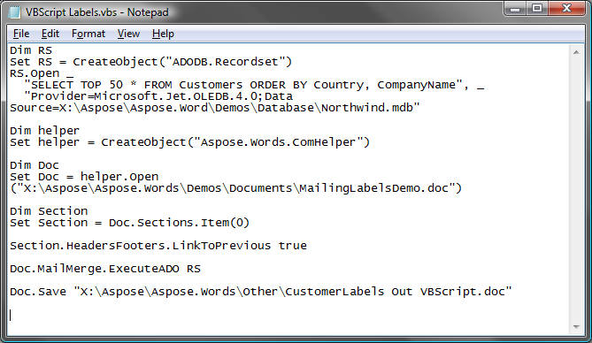
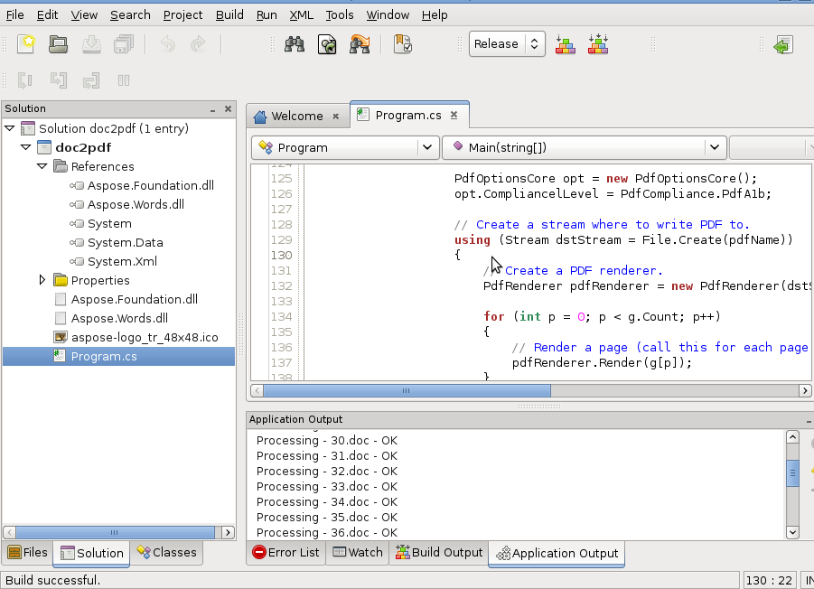

---
title: Supported Platforms
description: "Aspose.Words for .NET supports a wide range of platforms to work with documents."
type: docs
weight: 5
url: /net/supported-platforms/
---

## .NET Framework

You can confidently use Aspose.Words for .NET to build any type of x86 or x64 (32-bit or 64-bit) .NET application including ASP.NET, Web Services and WinForms. Aspose.Words for .NET is easy to deploy because it consists of just a single assembly without any dependencies (except on the .NET Framework itself). Aspose.Words.dll is CLS compliant, written entirely in C# and contains only safe managed code. Aspose.Words for .NET supports all versions of the Microsoft .NET Framework from 2.0 to 4.0. A single MSI installer is provided that caters both for 32-bit and 64-bit environments. The installer contains the following items:

- Aspose.Words.dll assemblies for different .NET Framework versions
- Demo projects for ASP.NET and WinForms in C# and VB.NET
- Aspose.Words Documentation in Microsoft Help format

## .NET Standard 2.0

The [.NET Standard](https://docs.microsoft.com/en-us/dotnet/standard/net-standard) is a formal specification of .NET APIs that are intended to be available on all .NET implementations. The motivation behind the .NET Standard is establishing greater uniformity in the .NET ecosystem. The 'netstandard2.0' and 'netstandard2.0_AuthenticodeSigned' folders contain Aspose.Words' assemblies to use with frameworks that implement .NET Standard 2.0 such as .NET Core 2.0/2.1/2.2/3.0/3.1. The latest version of Aspose.Words API also supports .NET 5.0 and .NET 6.0.

## Xamarin.Android

Xamarin.Android makes it possible to do native Android development in C#, with either Visual Studio or Xamarin Studio. You can use Aspose.Words API to perform a wide range of Word document processing tasks directly within your native Android applications.

## Xamarin.iOS

Xamarin.iOS makes it possible to do native iOS development in C#, with either Visual Studio or Xamarin Studio. You can use Aspose.Words API to perform a wide range of Word document processing tasks directly within your native iOS applications.

## Xamarin.Mac

Xamarin.Mac gives C# developers the ability to build fully native Cocoa apps for Mac OS X and allows for native apps that can be put into the Mac App Store. You can use Aspose.Words API to perform a wide range of Word document processing tasks directly within your native Mac applications.

## COM

Aspose.Words for .NET can be used as a COM object to develop applications in pre- .NET development environments such as PHP, ASP, VBScript, JScript, Delphi, C++ and so on. Although using Aspose.Words for .NET from COM is possible, some classes and methods (that rely on constructors with parameters or static methods for example) are not available to COM applications.

**Developing an ASP or VBScript application with Aspose.Words for .NET** 

## Mono

How about creating an application that generates DOC files, or maybe converts DOC and DOCX to PDF and much more, all on openSUSE or Ubuntu? Yes, you can run Aspose.Words for .NET with Mono. [Mono](https://www.mono-project.com/Main_Page/) is a project led by Novell (formerly by Ximian) to create an ECMA standard compliant .NET compatible set of tools, including among others a C# compiler and a Common Language Runtime. Mono can be run on Linux, FreeBSD, UNIX, Mac OS X, Solaris and Windows operating systems (for more info see [https://en.wikipedia.org/wiki/Mono(software)](https://en.wikipedia.org/wiki/Mono_\(software\)). Aspose.Words for .NET can be used with Mono 2.4 and higher.

**Developing an application with Aspose.Words on Mono** 

## Windows Azure

The Windows Azure Platform (Azure) is an internet-scale cloud services platform hosted in Microsoft data centers. Azure enables developers to quickly and easily create applications running in the cloud using their skills with the .NET Framework. Applications running in Windows Azure essentially run inside 64-bit virtual machines running Microsoft Server 2008. Each virtual machine provides .NET Framework 3.5 and can provide an ASP.NET environment.

**Why Aspose.Words in Azure?**

Azure provides services to run applications and store data. A great number of Internet-connected web and corporate applications will be built to run in Azure. These applications will require capabilities to generate, transform and store various types of documents. The documents could be contracts, reports, policies, resumes, invoices and so on. Aspose.Words for .NET is a class library that can be used on a server for generating, converting and processing documents in a variety of formats. It makes a perfect sense to use Aspose.Words for .NET to solve document programming tasks when you develop an application to run in Windows Azure. Here are just some ideas how you can use Aspose.Words for .NET in Azure:

- Convert documents uploaded by users in various formats into a standard, for example DOCX format and store in the Windows Azure Storage.
- Load a document template from the Windows Azure Storage and populate it with data from SQL Azure to generate a report, contract or another document.
- Generate a document (for example, invoice) and convert it to the PDF or XPS format and send to the client browser.
- Convert a document to PDF/A or TIFF for long-term archiving in the Windows Azure Storage.
- Accept requests from the clients in a WebRole application via ASP.NET pages or WCF calls and perform actual document processing in load balanced WorkerRole applications.

You can use all of the Aspose.Words for .NET features from Windows Azure applications. Aspose.Words for .NET does not depend on Azure.
