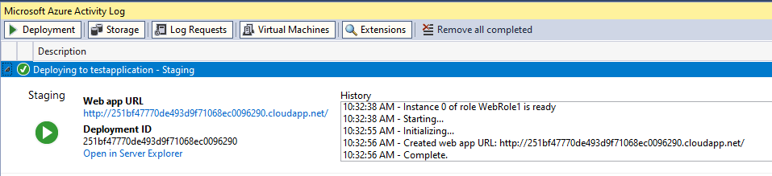
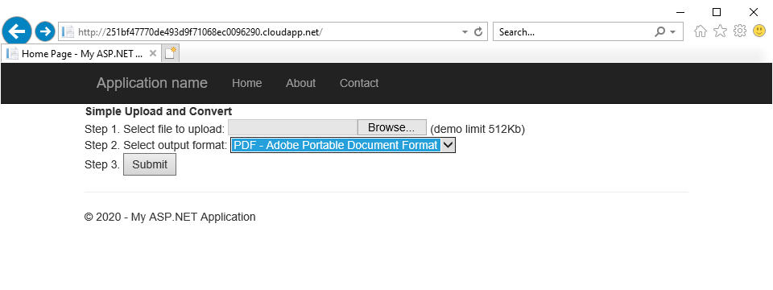

Aspose.Words on Windows Azure provides an ability to load, convert, and save documents. For this purpose, you can create an application that:

1. Implements a simple ASP.NET form, enabling the user to load a document and specify the desired output format.
1. Invokes Aspose.Words to convert the document and send it back to the browser.

The application described in this article is implemented as WebRole and can be run in the Development Fabric (on the developer’s machine) or deployed to Windows Azure. This application is one of the possible examples of how Aspose.Words works in the cloud.

## Prerequisites

- Active Microsoft Azure subscription. If you don’t have one, create a free account before you begin.
- Visual Studio 2019 or Visual Studio 2017 with installed Azure development.

## Convert Document Application

This section discusses a basic project that does not use advanced Aspose.Words features or sophisticated services of the Windows Azure platform.

The project demonstrates how Aspose.Words can be easily used to build applications running in the cloud.

### Creating a Web Role Project

To create the application, you need to perform the following steps:

1. Create a new Cloud Service project in Visual Studio.
1. Select the Cloud Service to have one WebRole project.
1. Add the NuGet reference to [Aspose.Words](https://www.nuget.org/packages/Aspose.Words/).
1. Add the File Upload control to the Default.aspx form enabling the user to select a file to be uploaded.
1. Add the Drop Down List control to the Default.aspx form enabling the user to select the output format.
1. Add the Submit button and the Click event handler for it.
1. Modify the ServiceDefinition.csdef configuration file so that the application can run in Windows Azure under Full Trust. It is recommended that you have *enableNativeCodeExecution = "true"* to avoid any permission issues that may arise when using Aspose.Words to convert documents to PDF or XPS.

The actual code to convert a document using Aspose.Words consists of only two lines, which create a new [Document](https://reference.aspose.com/words/net/aspose.words/document/) object to load the document, and then call the [Save](https://reference.aspose.com/words/net/aspose.words/document//methods/save/index) method with the desired format. The following code example shows how to convert a document in Windows Azure:

**.NET**


using Aspose.Words;
using Aspose.Words.Saving;
using System.Web;
using System;
using System.IO;
namespace WebRole
{
    /// 

    /// This demo shows how to use Aspose.Words for .NET inside a WebRole in a simple
    /// Windows Azure application. There is just one ASP.NET page that provides a user
    /// interface to convert a document from one format to another.
    /// 

    public partial class _Default : System.Web.UI.Page
    {
        protected void SubmitButton_Click(object sender, EventArgs e)
        {
            HttpPostedFile postedFile = SrcFileUpload.PostedFile;
            if (postedFile.ContentLength == 0)
                throw new Exception("There was no document uploaded.");
            if (postedFile.ContentLength > 512 * 1024)
                throw new Exception("The uploaded document is too big. This demo limits the file size to 512Kb.");

            // Create a suitable file name for the converted document.
            string dstExtension = DstFormatDropDownList.SelectedValue;
            string dstFileName = Path.GetFileName(postedFile.FileName) + "_Converted." + dstExtension;
            SaveFormat dstFormat = FileFormatUtil.ExtensionToSaveFormat(dstExtension);
    
            // Convert the document and send to the browser.
            Document doc = new Document(postedFile.InputStream);
            doc.Save(Response, dstFileName, ContentDisposition.Inline, SaveOptions.CreateSaveOptions(dstFormat));
    
            // Required. Otherwise DOCX cannot be opened on the client (probably not all data sent
            // or some extra data sent in the response).
            Response.End();
        }
        static _Default()
        {
            // Uncomment this code and embed your license file as a resource in this project and this code
            // will find and activate the license. Aspose.Wods licensing needs to execute only once
            // before any Document instance is created and a static ctor is a good place.
            //
    
            // Aspose.Words.License l = new Aspose.Words.License();
            // l.SetLicense("Aspose.Words.lic");
        }
    }
}


### Testing and Running the Web Role Project

To test and run the example project, perform the following steps:

1. First, check the example project running as a simple ASP.NET application. Make the WebRole project the Start Up project in the solution and run. Visual Studio will open a browser window and load the form into it. You can upload a sample document and verify that the conversion is working.
1. Then, you should test that the project runs well in the Development Fabric on your computer. Development Fabric is a local simulation of the Windows Azure compute and storage services. Select the CloudService project and make it the Start Up project for the solution and run. This time, it may take a bit longer to build the application because Visual Studio starts up the Development Fabric and deploys your project into it. The browser window will open with the form again, and you will be able to test the application.
1. Finally, you can deploy and test your project in Windows Azure. To do this, you need to have an active Microsoft Azure subscription.
   In Visual Studio, right-click on your CloudService project and select Publish. If necessary, log in with your Microsoft Azure account and select a subscription.
   To test, select the Staging Environment and click Publish. After that, in the Azure Activity Log, you will receive a URL to the deployed application.

The following picture shows the Web Role project running in the Microsoft Azure cloud:

## See Also

- Active [Microsoft Azure subscription](https://docs.microsoft.com/en-us/azure/guides/developer/azure-developer-guide#understanding-accounts-subscriptions-and-billing)
- Create a [free account](https://azure.microsoft.com/en-us/free/?ref=microsoft.com&utm_source=microsoft.com&utm_medium=docs&utm_campaign=visualstudio) in Microsoft Azure
- Modify the [ServiceDefinition.csdef](https://docs.microsoft.com/en-us/azure/cloud-services/schema-csdef-webrole#WebRole) configuration file
