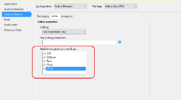
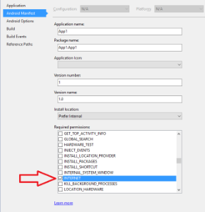
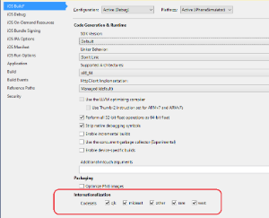
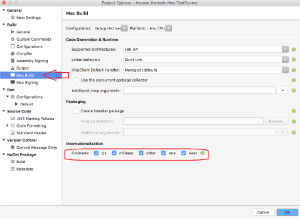

---
title: Xamarin and .NET Standard 2.0 Limitations and API Differences
description: "Aspose.Words for .NET Standard 2.0 API differences comparing to regular .NET version."
type: docs
weight: 130
url: /net/xamarin-and-net-standard-2-0-limitations-and-api-differences/
---

Xamarin DLLs are always built using the latest stable versions of Xamarin.Android, Xamarin.iOS and Xamarin.Mac respectively. If you face problems with using Aspose.Words in your Xamarin application, please make sure you have the latest Xamarin versions installed. Sometimes Aspose.Words' Xamarin DLLs built with the latest Xamarin version do not work with older versions of Xamarin.

## Limitations and Restrictions

Limitations of .NET Standard 2.0, Xamarin.Android, Xamarin.iOS, And Xamarin.Mac API compared to .NET API:

1. **Document.Print** method is not available in .NET Standard 2.0, Xamarin.Android, Xamarin.iOS and Xamarin.Mac API.
1. Saving to user browser is not provided, i.e. **Document.Save(HttpResponse,string,ContentDescription,SaveOptions)** overload is not available.
1. Because of lack of Windows fonts in target OS (Android, MacOS, Linux etc), fonts used in documents are substituted with available fonts, this might lead into inaccurate document layout, when render document to fixed page formats (like Images, PDF, XPS etc.)
1. If Aspose.Words for .NET Standard is intended to be used in Linux environment, an additional NuGet package should be referenced to make it work correctly with graphics: SkiaSharp.NativeAssets.Linux for Ubuntu (it also should work on most Debian-based Linux distributions) or Goelze.SkiaSharp.NativeAssets.AlpineLinux for Alpine Linux.

## Public API Differences

In **Aspose.Words for** **.NET Standard 2.0, Xamarin.Android, Xamarin.iOS and Xamarin.Mac** *SkiaSharp.SKBitmap* object is used instead of *System.Drawing.Bitmap* in .NET API. The list of affected API:
1. Aspose.Words.DocumentBuilder.InsertImage
1. Aspose.Words.DocumentBuilder.InsertOleObject
1. Aspose.Words.Drawing.ImageData.SetImage
1. Aspose.Words.Drawing.ImageData.ToImage
1. Aspose.Words.Fields.IBarcodeGenerator.GetBarcodeImage
1. Aspose.Words.Fields.IBarcodeGenerator.GetOldBarcodeImage
1. Aspose.Words.MailMerging.ImageFieldMergingArgs.Image

**.NET**


// Use System.Drawing.Bitmap.
using (System.Drawing.Bitmap image = new System.Drawing.Bitmap(gTestImagePath))
{
    builder.InsertImage(image);
}


**.NET Standard 2.0, Xamarin.Android, Xamarin.iOS and Xamarin.Mac**


// Insert image into the document from SkiaSharp.SKBitmap object.
using (SkiaSharp.SKBitmap bitmap = SkiaSharp.SKBitmap.Decode(gTestImagePath))
{
    builder.InsertImage(bitmap);
}


In **Aspose.Words for** **.NET Standard 2.0, Xamarin.Android, Xamarin.iOS and Xamarin.Mac** *SkiaSharp.SKCanvas* object is used instead of *System.Drawing.Graphics* object used in .NET API. The list of affected API:
1. Aspose.Words.Document.RenderToSize
1. Aspose.Words.Document.RenderToScale
1. Aspose.Words.Rendering.NodeRendererBase.RenderToSize
1. Aspose.Words.Rendering.NodeRendererBase.RenderToScale

**.NET**


Document doc = new Document(gTestDocumentPath);

// Render the first page to System.Drawing.Graphics
using (System.Drawing.Bitmap bitmap = new System.Drawing.Bitmap(1000, 1000))
{
    using (System.Drawing.Graphics gr = System.Drawing.Graphics.FromImage(bitmap))
    {
        // Apply required transformations to the graphics, rotation for example.
        gr.RotateTransform(45);
        doc.RenderToSize(0, gr, 0, 0, bitmap.Width, bitmap.Height);
    }

    // Save output to file.
    bitmap.Save(@"C:\Temp\out.png", System.Drawing.Imaging.ImageFormat.Png);
}


**.NET Standard 2.0, Xamarin.Android, Xamarin.iOS and Xamarin.Mac**


Document doc = new Document(gTestDocumentPath);

// Render the first page to SkiaSharp.SKCanvas
using (SkiaSharp.SKBitmap bitmap = new SkiaSharp.SKBitmap(1000, 1000))
{
    using (SkiaSharp.SKCanvas canvas = new SkiaSharp.SKCanvas(bitmap))
    {
        // Apply required transformations to the canvas, rotation for example.
        canvas.RotateDegrees(45);
        doc.RotateDegrees(0, canvas, 0, 0, bitmap.Width, bitmap.Height);
    }

    // Save output to file.
    using (SkiaSharp.SKFileWStream fs = new SkiaSharp.SKFileWStream(gOutPath+ "RenderToSize_Out.png"))
    {
        bitmap.Encode(fs, SkiaSharp.SKEncodedImageFormat.Png, 100);
    }
}


## Xamarin.Android Additional Requirements

1. To work properly Aspose.Words' Xamarin.Android API requires Encodings support. When you run your Xamarin.Android application in 'Release' mode, it is required to add additional supported Encodings. Note that in 'Debug' mode everything will work without these options. 

1. If you would like to use Metered license, you need to allow your application internet access. 

## Xamarin.iOS Additional Requirements

To work properly Aspose.Words' Xamarin.iOS API requires Encodings support. When you run your Xamarin.iOS application it is required to add additional supported Encodings.

## Xamarin.Mac Additional Requirements

To work properly Aspose.Words' Xamarin.Mac API requires Encodings support. When you run your Xamarin.Mac application it is required to add additional supported Encodings.

