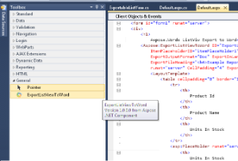
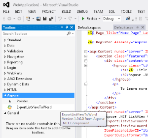

## **Introduction**
Export ListView To Word Control is an ASP.NET server control which allows exporting contents of ListView into Word Processing document using [Aspose.Words](http://www.aspose.com/word-component-suite.aspx). It adds **Export to Word** button on top of the ListView control. Clicking the button dynamically exports the content of the ListView control to a Word Processing document and then automatically downloads the exported file to the disk location selected by the user in just couple of seconds.
### **Module Features**
This initial version of the control provides the following features:

- Get an offline copy of your favorite online ListView content for editing, sharing and printing in your desired Word processing document.
- Inherited from default ASP.NET ListView control and hence have all its features and properties.
- Export ListView To Doc, Dot, Docx, Docm, Dotx, Dotm, Rtf, Odt, Ott and Txt formats.
- Works with all .NET versions starting from .NET 3.5.
- Ability to customize/localize Export button text.
- Option to Export in Landscape mode in case ListView content is wider and does not fit in default Portrait mode.
- Apply look and feel of your own theme on Export button using css.
- Option to add custom heading on top of the exported document.
- Option to save each exported document on server at configurable disk path.
- Option to export current page or all pages when paging is enabled using DataPager.
- Option to limit maximum exportable records while exporting all data in ListView.

This control allows you to export ListView in the following different file formats.

1. Export ListView to Word Document.
1. Export ListView to Doc
1. Export ListView to Dot
1. Export ListView to Docx
1. Export ListView to Docm
1. Export ListView to Dotx
1. Export ListView to Dotm
1. Export ListView to Rtf
1. Export ListView to Odt
1. Export ListView to Ott
1. Export ListView to Txt
## **System Requirements and Supported Platforms**
### **System Requirements**
Export ListView To Word Control for Visual Studio can be used on any system that have IIS and .NET framework 3.5 or greater installed.
### **Supported Platforms**
Export ListView To Word Control for Visual Studio is supported of all version of ASP.NET running on .NET framework 3.5 or greater. You can use any of the following Visual Studio versions to use this control in your ASP.NET applications

- Visual Studio 2008
- Visual Studio 2010
- Visual Studio 2012
- Visual Studio 2013
## **Downloading**
You can download Export ListView To Word Control from one of the following locations

- [CodePlex ](https://aspose-wordsvs.codeplex.com/releases/view/618504)
- [Visual Studio Gallery ](https://visualstudiogallery.msdn.microsoft.com/3b2ccacc-7e5d-4952-b76b-37c5a84cf308)
- [Github ](https://github.com/aspose-words/Aspose.Words-for-.NET/releases/tag/AsposeWordsListViewExport)
## **Installing**
It is very simple and easy to install Export ListView To Word Control, please follow these simple steps
### **For Visual Studio 2010, 2012 and 2013**
1. Extract the downloaded zip file
1. Double click the VSIX file Aspose.Words.ListViewExport.vsix
1. A dialog will appear showing you the available and supported Visual Studio versions installed on your machine
1. Select the ones you want to add the Export ListView To Word Control to.
1. Click Install

You will get a success dialog once the installation is completed.

**Note:** Please make sure to restart Visual Studio for the changes to take effect.
### **For Visual Studio 2008 and Express editions**
Please follow these steps to integrate Export ListView To Word Control in Visual studio for easy drag and drop just like other ASP.NET controls

1. Extract the downloaded zip file
1. Make sure to run Visual Studio as Administrator

On the Tools menu, click Choose Toolbox Items.

1. Click Browse. 
   The Open dialog box appears.
1. Browse to the extracted folder and select Aspose.Words.ListViewExport.dll
1. Click OK.

When you open an aspx or ascx control in the left side Toolbox you will see ExportListViewToWord under General Tab.

## **Using**
Once installed, it is very easy to start using this control in your ASP.NET applications

|**For .NET framework 4.0 and above** |**For .NET framework 3.5** |** |
| :- | :- | :- |
|For applications running in .NET framework 4.0 and above in Visual Studio 2010 and above, you should see **ExportListViewToWord** control in **Aspose** Tab in Toolbar as shown below. You can simply drag drop this control onto your ASP.NET page, control or master page just like any other .NET control and get started. |In order you use this control in applications running in .NET 3.5 in any visual studio version make sure that you have added ExportListViewToWord to your toolbox as per instructions on 8.3.2.1 Downloading and Installing under heading **For Visual Studio 2008 and Express editions**  You should see **ExportListViewToWord** control in **General** Tab in Toolbar as shown below. You can simply drag drop this control onto your ASP.NET page, control or master page just like any other .NET control and get started. | |
|

|

| |
### **Manually adding ExportListViewToWord control**
If you have any issues using the above methods which uses Visual Studio Toolbox, you can manually add this control to your ASP.NET application running on any .NET framework greater than 3.5

1. If you are using Visual Studio make sure to Run it as Administrator
1. Add reference to **Aspose.Words.ListViewExport.dll** available in extracted download package in your ASP.NET project or web application. Make sure your web application/Visual Studio have full access to this folder otherwise you might get Access is denied exception.
1. Add this line to the top of the page, control or MasterPage 


<%@ Register assembly="Aspose.Words.ListViewExport" namespace="Aspose.Words.ListViewExport" tagprefix="aspose" %>


1. Add page property to false EnableEventValidation="false"
1. Override method in aspx.cs file "public override void VerifyRenderingInServerForm(Control control) { }"
1. Add the following to a place on your ASP.NET page, control or masterpage where you want the control to be added 


<aspose:ExportListViewToWord ID="ExportListViewToWord1" runat="server"></aspose:ExportListViewToWord>

### **FAQs**
Common questions and issues you might face while using this Control

|**#** |**Question** |**Answer** |
| :- | :- | :- |
|1 |I cannot see ExportListViewToWord control in Toolbox |
**Visual Studio 2010 and higher** 

1. Make sure that you have installed this control using VSIX extension file found in downloaded package. To verify go to Tools -> Extension and Updates. Unders Installed you should see 'Aspose Export Export ListView To Word Control'. If don't see it please try re-installing it

2. Make sure your web application is running in .NET framework 4.0 or higher, for lower versions of .NET framework please check the above alternate method.     **Older Versions of Visual Studio**

3. Make sure that you have manually added this control to your Toolbox as per above instructions.
|
|2 |I am getting 'Access is denied' error when running the application |
1. If you are experiencing this problem on production then make sure that you copy both Aspose.Words.dll and Aspose.Words.ListViewExport.dll to your bin folder.

2. If you are using Visual Studio make sure to run it as Administrator even if you are already logged-in as administrator.
|
### **Aspose .NET Export ListView To Word Control Properties**
The following properties are exposed to configure and use cool features provided by this control

|**Property Name** |**Type** |**Example/Possible values** |**Description** |
| :- | :- | :- | :- |
|ExportButtonText |string |Export to Word |You can use this property to override existing default text |
|ExportButtonCssClass |string |btn btn-primary |Css Class that is applied to the outer div of the export button. To apply css on button you can use .yourClass input |
|ExportInLandscape |bool |true or false |If true it changes the orientation of the output document to landscape. Default is Portrait |
| | | | |
|ExportFileHeading |string |<h4>ListView Export Example Report</h4> |You can use html tags to add style to your heading |
|ExportOutputFormat |enum |Doc, Dot, Docx, Docm, Dotx, Dotm, Rtf, Odt, Ott, Txt |Output format of the exported document. Supported formats are Doc, Dot, Docx, Docm, Dotx, Dotm, Rtf, Odt, Ott, Txt |
|ExportOutputPathOnServer |string |c:  temp |Local output Disk path on server where a copy of the export is automatically saved. Application must have write access to this path. |
|ExportDataSource |object |allRowsDataTable |Sets the object from which this data-bind control retrieves its list of data items. The object must have all the data that need to be exported. This property is used in addition to normal DataSource property and is useful when custom paging is enabled and current page only fetches rows to be displayed on screen. |
|LicenseFilePath |string | |Local path on server to the license file. For example c:  inetpub  Aspose.Words.lic |
An example of Export ListView to Word control with all properties used is shown below


<Aspose:ExportListViewToWord ID="ExportListViewToWord1" GroupPlaceholderID="groupPlaceHolder1"
            ItemPlaceholderID="itemPlaceHolder1" ExportButtonText="Export to Word" ExportButtonCssClass="myClass"
            ExportOutputFormat="Doc" ExportInLandscape="true" ExportOutputPathOnServer="c:\\temp"
            ExportFileHeading="<h4>Example Report</h4>" LicenseFilePath="c:\\inetpub\\Aspose.Words.lic"
            runat="server" CellPadding="4" ExportMaximumRecords="100" OnPagePropertiesChanging="ExportListViewToWord1_PagePropertiesChanging">
            <LayoutTemplate>
                <table cellpadding="0" border="1" width="800px" cellspacing="0">
                    <tr>
                        <th>
                            Product Id
                        </th>
                        <th>
                            Product Name
                        </th>
                        <th>
                            Units In Stock
                        </th>
                    </tr>
                    <asp:PlaceHolder runat="server" ID="groupPlaceHolder1"></asp:PlaceHolder>
                    <tr>
                        <td colspan="3">
                            <asp:DataPager ID="DataPager1" runat="server" PagedControlID="ExportListViewToWord1"
                                PageSize="10">
                                <Fields>
                                    <asp:NextPreviousPagerField ButtonType="Link" ShowFirstPageButton="false" ShowPreviousPageButton="true"
                                        ShowNextPageButton="false" />
                                    <asp:NumericPagerField ButtonType="Link" />
                                    <asp:NextPreviousPagerField ButtonType="Link" ShowNextPageButton="true" ShowLastPageButton="false"
                                        ShowPreviousPageButton="false" />
                                </Fields>
                            </asp:DataPager>
                        </td>
                    </tr>
                </table>
            </LayoutTemplate>
            <GroupTemplate>
                <tr>
                    <asp:PlaceHolder runat="server" ID="itemPlaceHolder1"></asp:PlaceHolder>
                </tr>
            </GroupTemplate>
            <ItemTemplate>
                <td>
                    <%# Eval("Product Id")%>
                </td>
                <td>
                    <%# Eval("Product Name")%>
                </td>
                <td>
                    <%# Eval("Units In Stock")%>
                </td>
            </ItemTemplate>
        </Aspose:ExportListViewToWord>

## **Video Demo**
Please check [the video](https://www.youtube.com/watch?v=xtjLrQ2mG4Q) below to see the module in action.
## **Support, Extend and Contribute**
### **Support**
From the very first days of Aspose, we knew that just giving our customers good products would not be enough. We also needed to deliver good service. We are developers ourselves and understand how frustrating it is when a technical issue or a quirk in the software stops you from doing what you need to do. We're here to solve problems, not create them.

This is why we offer free support. Anyone who uses our product, whether they have bought them or are using an evaluation, deserves our full attention and respect.

You can log any issues or suggestions related to this control using any of the following platforms

- [CodePlex ](https://aspose-wordsvs.codeplex.com/workitem/list/basic)
- [Visual Studio Gallery - Q and A](https://visualstudiogallery.msdn.microsoft.com/3b2ccacc-7e5d-4952-b76b-37c5a84cf308)
- [Github ](https://github.com/aspose-words/Aspose.Words-for-.NET/issues)
- [Microsoft Developer Network - Q and A ](https://code.msdn.microsoft.com/Aspose-NET-Export-ListView-90f2229f/view/Discussions#content)
### **Extend and Contribute**
Aspose .NET Export ListView To Word Control for Visual Studio is open source and its source code is available on the major social coding websites listed below. Developers are encouraged to download the source code and extend the functionality as per their own requirements.
#### **Source Code**
You can get the latest source code from one of the following locations

- [CodePlex ](https://aspose-wordsvs.codeplex.com/SourceControl/latest#Aspose.Words.ListViewExport)
- [Code.MSDN ](https://code.msdn.microsoft.com/Aspose-NET-Export-ListView-90f2229f)
- [Github ](https://github.com/aspose-words/Aspose.Words-for-.NET/tree/master/Plugins/Visual%20Studio/Aspose.Words.ListViewExport)
#### **How to configure the source code**
You need to have the following installed in order to open and extend the source code

- Visual Studio 2010

Please follow these simple steps to get started

1. Download/Clone the source code.
1. Open Visual Studio 2010 and Choose **File** > **Open Project**
1. Browse to the latest source code that you have downloaded and open **Aspose.Words.ListViewExport.sln**
#### **Source code overview**
There are two projects in the solution

- Aspose.Words.ListViewExport - Contains VSIX package and Server control for .NET 4.0.
- Aspose.Words.ListViewExport.Website - Web project for testing the Word Exportable ListView control
