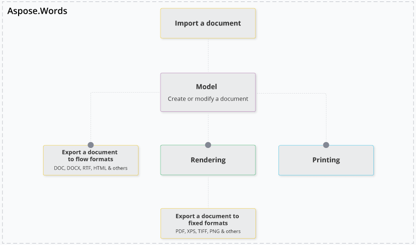

---
title: Product Overview
description: "With Aspose.Words for .NET you can create, modify, convert, render, and print documents without relying on third-party applications. Aspose.Words is a cross-platform class library."
type: docs
weight: 15
url: /net/product-overview/
---

Welcome to Aspose.Words for .NET!

Aspose.Words is a cross-platform class library that enables your applications to perform a wide variety of document processing tasks.

Using Aspose.Words, you can convert a document from any supported load format to any supported save format, for example, Word formats to PDF, HTML, or Markdown, PDF to DOCX, and so on. Read more about converting documents in the ["Convert a Document"](/words/net/convert-a-document/) section.

It is worth noting that with Aspose.Words you can create, modify, convert, render, and print documents without relying on third-party applications, such as Microsoft Word, or Office Automation.

## Benefits of Using Aspose.Words

Using Aspose.Words for .NET in your project gives you the following benefits:

- Rich feature set
- Platform independence
- Independence from third-party applications
- Performance and scalability
- Minimal learning curve

The following diagram shows the main features of Aspose.Words for .NET and how they relate to each other.

### Rich Set of Features

Aspose.Words for .NET features can be divided into four main areas.

#### Conversion

The ability to easily and reliably convert documents is one of the main features of Aspose.Words.

Comprehensive [document import and export](/words/net/loading-saving-and-converting/) with [over 35 supported file formats](/words/net/supported-document-formats/) enables users to convert documents from [one popular format](https://apireference.aspose.com/words/net/aspose.words/loadformat) to [another](https://apireference.aspose.com/words/net/aspose.words/saveformat), for example, from DOCX to PDF, JPEG, or Markdown, or from PDF to various Word formats.

#### Document Object Model (DOM)

Programmatic access through a rich API to all document elements and formatting enables to create, modify, extract, copy, split, join, and replace document content. Find out more in the ["Aspose.Words Document Object Model (DOM)"](/words/net/aspose-words-document-object-model/) section.

#### Rendering

We use the term [“rendering” in Aspose.Words](/words/net/rendering/) to describe the process of converting a document into a file format or a medium, paginated or that has the concept of pages.

You can convert whole documents or particular pages to PDF or XPS to generate server-side documents, print them, or render pages using .NET Graphics. And all this with high fidelity – exactly like Microsoft Word would have done it.

#### Reporting

Generate documents or reports from scratch or by filling templates with data from data sources or business objects. For more information on reporting and fetching data from databases, see the ["Mail Merge and Reporting"](/words/net/mail-merge-and-reporting/) and ["LINQ Reporting Engine"](/words/net/linq-reporting-engine/) sections.

### Platform Independence

Aspose.Words for .NET covers most of the popular development environments and deployment platforms. Its API can be used to develop applications for a wide range of operating systems, such as Windows, Linux, and Mac OS, and various platforms.

You can use Aspose.Words for .NET to build any type of 32-bit or 64-bit .NET application, including ASP.NET, WCF, WinForms, etc. In addition, you can utilize Aspose.Words for .NET via COM Interop from ASP, Perl, PHP, and Python.

You can also use Aspose.Words for .NET to build applications with Mono, as well as on Windows Azure, Microsoft SharePoint, Microsoft Silverlight, Xamarin.Android, Xamarin.iOS, and Xamarin.Mac.

### Independence from Other Applications

Aspose.Words does not require third-party applications, for example, Microsoft Office, to be installed on the machine in order to work. All Aspose components are completely independent. This makes Aspose.Words a great alternative to automation in terms of security, stability, scalability/speed, price, and features for working with documents and related tasks.

### Performance and Scalability

Aspose.Words is designed to perform greatly on both a server or client. Aspose.Words is a single .NET assembly that can be deployed with any .NET application by simply copying it. You do not need to worry about any other services or modules.

With Aspose.Words, you can literally generate thousands of documents in minutes, which involves opening a document, modifying content and formatting or populating it with data, and saving it. Even most complex documents are opened and saved on a P4 2.4Ghz 1Gb RAM machine in fractions of a second.

Aspose.Words is multithread safe as long as only one thread works on a document at a time. This is a typical scenario to have one thread working on one document. Different threads can safely work on different documents at the same time.

### Minimal Learning Curve

Although there are over 150 public classes and enumerations in Aspose.Words, the learning curve is minimal because the Aspose.Words API has been carefully designed with the following goals in mind:

- Borrow best practices from other well-known APIs such as Microsoft Word Automation
- Borrow best practices from the .NET Framework Design Guidelines
- Provide a balance of ease of use and detailed manipulation of document elements

Developers who have previously used Microsoft Word Automation in their projects will find the names and behavior of numerous classes, methods, and properties familiar.

[Document](https://apireference.aspose.com/words/net/aspose.words/document), [Paragraph](https://apireference.aspose.com/words/net/aspose.words/paragraph), [Bookmark](https://apireference.aspose.com/words/net/aspose.words/bookmark), [Range](https://apireference.aspose.com/words/net/aspose.words/range), [Section.PageSetup](https://apireference.aspose.com/words/net/aspose.words/section/properties/pagesetup) and [Paragraph.ParagraphFormat](https://apireference.aspose.com/words/net/aspose.words/paragraphformat) are some of the Aspose.Words classes. At the same time, Aspose.Words is quite different from the Microsoft Word Object Model in that it represents a document as a tree of objects, more like an XML DOM tree. If you have worked with any XML DOM library, you will find it is easy to understand and work with Aspose.Words.

## Pricing and Policies

Please visit the ["Licensing"](/words/net/licensing/) page for information on licenses and review the ["Pricing Information"](https://purchase.aspose.com/pricing/words/family) page for details on pricing.

## Technical Support

For more information on Aspose.Words technical support, take a look at the [support page](/words/net/technical-support/).

