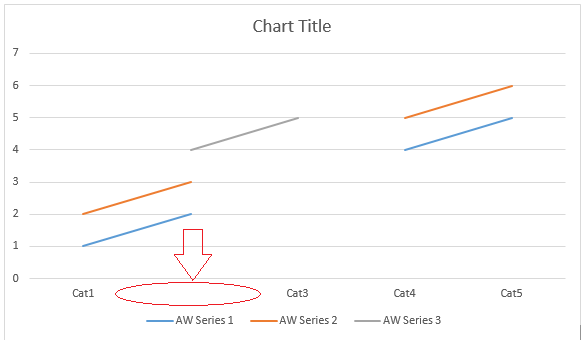

{} 

This page contains release notes for [Aspose.Words for .NET 16.6.0](https://www.nuget.org/packages/Aspose.Words/16.6.0)

{} 
## **Major Features**
There are 113 improvements and fixes in this regular monthly release. The most notable are:

- Fast extraction from DOC format via PlainTextDocument class is faster by a factor of ten (at a cost).
- Saving DOCX as ISO 29500 Strict OOXML format is available now.
- Added support for outer document insertion to LINQ Reporting Engine.
- Added feature to insert empty values in chart series.
- HTML radio input fields are imported to AW as HtmlOleControl nodes/HtmlOleControl nodes are exported to HTML as HTML input tags.
- Implemented support for "show revisions in balloons" option.
- Implemented "suppress endnotes" property.
- Numerous Complex Script improvements, asian typography detection, kinsoku rule handling.
- Improved PDF export to support Acrobat PDF IFilter.
- Field.GetFieldCode() improved to work with nested fields' codes that spanned among paragraphs or sections.
- Introduced a Field.GetFieldCode(bool) overload that controlling whether to include child field codes.
- Added the MailMerge.GetRegionsByName() method so that the user can obtain a list of regions by the specified name.
- Added the MailMergeRegionInfo.Level property that allows to get the nesting level of a mail merge region.
## **Full List of Issues Covering all Changes in this Release**

|**Key**|**Summary**|**Category**|
| :- | :- | :- |
|WORDSNET-10518|UpdateFields does not calculate NOTEREF field properly|Bug|
|WORDSNET-12497|Camera Rotation DML effect with shadow looks incorrect after rendering.|Bug|
|WORDSNET-12568|Text overlaps after generating pdf|Bug|
|WORDSNET-12935|DocumentBuilder.InsertHtml issue with list items|Bug|
|WORDSNET-13008|System.ArgumentOutOfRangeException is thrown when getting chart title font or setting chart title text.|Bug|
|WORDSNET-13187|/shrink spaces/ System.NullReferenceException during converting to PDF|Bug|
|WORDSNET-13194|Adobe Accessibility check fails for Links|Bug|
|WORDSNET-13225|Word to PDF conversion tables formatting changing between the source and the converted document|Bug|
|WORDSNET-13235|Document.UpdateFields doesn't update TOC as MS Word 2016 does in German language environment|Bug|
|WORDSNET-13272|/CJK baseline /The last line is moved to the next page|Bug|
|WORDSNET-13304|CompatibilityOptions.OptimizeFor does not remove "Compatibility mode" ribbon|Bug|
|WORDSNET-13320|Issue with hr indentation when saving doc as html|Bug|
|WORDSNET-13408|Doc to Pdf conversion issue with MACROBUTTON rendering|Bug|
|WORDSNET-13415|The contents of last page are truncated after re-saving the Doc|Bug|
|WORDSNET-13416|The contents of last page are truncated after re-saving the Doc|Bug|
|WORDSNET-13423|Doc to XML conversion issue with markup of images|Bug|
|WORDSNET-13476|Image is lost after saving html to Png/Docx/Html|Bug|
|WORDSNET-13486|Check boxes occupy more space which causes blank page in PDF|Bug|
|WORDSNET-13527|StructuredDocumentTag.RemoveSelfOnly changes the Sdt text|Bug|
|WORDSNET-13539|Rule Kinsoku is applied incorrectly|Bug|
|WORDSNET-13552|Docx to Pdf conversion issue with image rendering|Bug|
|WORDSNET-13562|Result of STYLEREF is rendered on next line in output Pdf|Bug|
|WORDSNET-13572|Aspose.Words.Document generates inefficient XPS|Bug|
|WORDSNET-13580|HeaderFooter of last section is removed after mail merge process|Bug|
|WORDSNET-13583|GetFieldCode on a IF field returning Empty|Bug|
|WORDSNET-13586|TOC update shows Error Bookmark not defined|Bug|
|WORDSNET-13587|TOC update shows Error Bookmark not defined|Bug|
|WORDSNET-13588|Images are not completely visible in generated PDF|Bug|
|WORDSNET-13590|Bounds of primary vertical axis of chart are changed after conversion from Docx to Pdf|Bug|
|WORDSNET-13600|DocumentBuilder.InsertHtml does not render MathML in output document|Bug|
|WORDSNET-13604|Space between ListLabel and List item is removed after conversion from Docx to Pdf|Bug|
|WORDSNET-13607|Bullet list is converted to numbered list after re-saving Docx|Bug|
|WORDSNET-13608|Images are rendering at incorrect position in PDF|Bug|
|WORDSNET-13609|Non-breaking space is converted to square block after conversion from Html to Doc|Bug|
|WORDSNET-13610|Table in TextBox renders incorrectly in PDF|Bug|
|WORDSNET-13614|Format (custom angle) of horizontal axis of chart is changed after re-saving Docx|Bug|
|WORDSNET-13615|Docx to Pdf conversion issue with chart rendering|Bug|
|WORDSNET-13616|Background lines in plot area of chart do not render in output Pdf/Doc|Bug|
|WORDSNET-13617|Chart title is changed after conversion from Docx to Pdf/Doc|Bug|
|WORDSNET-13618|Gradient background appears in plot area of chart in output Doc/Pdf|Bug|
|WORDSNET-13620|Chart data series are changed after conversion from Docx to Pdf|Bug|
|WORDSNET-13622|StructuredDocumentTag of type DROP_DOWN_LIST is not retaining its value when saving as PDF format|Bug|
|WORDSNET-13627|Link disappears during open save a DOCX|Bug|
|WORDSNET-13628|Document.UpdateFields does not update the TOC field|Bug|
|WORDSNET-13632|Diagram gets messed up during open/save a DOCX|Bug|
|WORDSNET-13636|COLSPAN not working for insertHTML|Bug|
|WORDSNET-13637|Images not visible in pdf output|Bug|
|WORDSNET-13638|Incorrect encoding applied upon converting DOC to PDF|Bug|
|WORDSNET-13645|Picture width is incorrect in generated HtmlFixed|Bug|
|WORDSNET-13646|A Drawing renders incorrectly in PDF|Bug|
|WORDSNET-13649|Data missing when inserting SVG image in Word document|Bug|
|WORDSNET-13663|Incorrect positions of list items markers with Roman numerals imported from HTML|Bug|
|WORDSNET-13673|Invalid location of the META element when converting DOCX to HtmlFixed|Bug|
|WORDSNET-13680|Horizontal lines appear at the start of document after re-saving RTF|Bug|
|WORDSNET-13687|Image is cropped after conversion from Docx to Pdf|Bug|
|WORDSNET-13693|Document.UpdateFields incorrectly calculates SUM fields value|Bug|
|WORDSNET-13694|Document.UpdateFields incorrectly calculates SUM fields value|Bug|
|WORDSNET-13713|Field Function 'Page' does not handle all formats when converting Flat-OPC to PDF|Bug|
|WORDSNET-13718|Diagram gets messed up during open/save to PDF.|Bug|
|WORDSNET-13720|Contents of OfficeMath are changed after re-saving Docx|Bug|
|WORDSNET-13727|Field.IsLocked property has no effect when saving document|Bug|
|WORDSNET-13728|Contents move to previous page after conversion from Docx to Pdf|Bug|
|WORDSNET-13731|The rule "Allow hanging punctuation" should not be applied.|Bug|
|WORDSNET-13742|Paragraph alignment is changed after conversion from Doc to HtmlFixed|Bug|
|WORDSNET-13746|Problem converting OfficeMath equations into PDF|Bug|
|WORDSNET-13751|Docx to Pdf conversion issue with NumeralFormat.Context|Bug|
|WORDSNET-1829|Row Height is not retrieved into HTML when HeightRule is Auto.|Bug|
|WORDSNET-5853|While doc to Pdf, Pdf page count is less than input Word file|Bug|
|WORDSNET-6470|AW ignores the sign of the currency when calculating the sum of the range of table cells but Word saves one and shows it in the result field.|Bug|
|WORDSNET-7179|/line metrics + font substitution/ Spacing between lines is incorrect in PDF|Bug|
|WORDSNET-8358|Charts move on to the next page and lose their X,Y position in PDF|Bug|
|WORDSNET-9151|Hidden comments are rendered in PDF|Bug|
|WORDSNET-13239|Indent lists inserted with InsertHtml|Enhancement|
|WORDSNET-13455|List label revision is not exported properly.|Enhancement|
|WORDSNET-13460|Documents converted from Word to PDF are not properly extractable by an IFilter|Enhancement|
|WORDSNET-13683|Aspose.Words.FileCorruptedException is thrown while loading RTF|Enhancement|
|WORDSNET-13692|Docx to Pdf conversion issue with Hebrew content's position|Enhancement|
|WORDSNET-13724|Improve Asian typography detection by using TTFont.IsCjkSupported instead of predefined Asian font list|Enhancement|
|WORDSNET-13738|Export HtmlOleControls to HTML using HTML tags|Enhancement|
|WORDSNET-5412|Checkbox selected attribute is ignored in HTML import|Enhancement|
|WORDSNET-7822|RadioButtons are not preserved during converting HTML to DOCX|Enhancement|
|WORDSNET-8826|Import radio input html field as HTMLCONTROL Forms.HTML:Option.1|Enhancement|
|WORDSNET-13314|Document.Save throws System.ArgumentException while saving Docx to Html|Exception|
|WORDSNET-13443|System.Xml.XmlException is thrown while loading Docx|Exception|
|WORDSNET-13493|MailMerge.ExecuteWithRegions throws System.InvalidOperationException|Exception|
|WORDSNET-13546|Aspose.Words.FileCorruptedException occurs upon loading a XML|Exception|
|WORDSNET-13642|MailMerge.ExecuteWithRegions throws System.InvalidOperationException|Exception|
|WORDSNET-13651|Aspose.Words.FileCorruptedException is thrown while loading Docx|Exception|
|WORDSNET-13656|Aspose.Words.FileCorruptedException is thrown while loading RTF|Exception|
|WORDSNET-13657|Aspose.Words.FileCorruptedException is thrown while loading RTF|Exception|
|WORDSNET-13658|Aspose.Words.FileCorruptedException is thrown while loading RTF|Exception|
|WORDSNET-13659|System.InvalidOperationException occurs during DOCX-to-HTML conversion|Exception|
|WORDSNET-13697|UpdateFields throws "Index was outside the bounds of the array" exception|Exception|
|WORDSNET-13698|Aspose.Words.FileCorruptedException occurs upon loading a MHT|Exception|
|WORDSNET-13703|'An object already included into list' error during document reflow|Exception|
|WORDSNET-13721|Handle the case when DML text effects are used for OTF(CFF) fonts|Exception|
|WORDSNET-12425|Tag with name 'effectStyleLst' is not supported|Feature|
|WORDSNET-12426|Import of element 'effectStyleLst' is not supported in Docx format by Aspose.Words|Feature|
|WORDSNET-12427|Tag with name 'objectDefaults' is not supported|Feature|
|WORDSNET-12428|Import of element 'objectDefaults' is not supported in Docx format by Aspose.Words|Feature|
|WORDSNET-13054|Provide API to change default proofing language|Feature|
|WORDSNET-13329|Add feature to insert Document after populating it with data using LINQ Reporting Engine|Feature|
|WORDSNET-13428|Add feature to insert empty values in chart series|Feature|
|WORDSNET-13432|Add feature to get the nested level number of Mail Merge Region|Feature|
|WORDSNET-13433|Add feature to get MailMergeRegionInfo by Region name|Feature|
|WORDSNET-13739|Add the feature to show the delete revision in pdf|Feature|
|WORDSNET-7741|Load and save ISO/IEC 29500 Strict / Word 2013 OOXML|Feature|
|WORDSNET-9431|A Paragraph in Table breaks into two lines during saving a RTF to DOCX|Feature|
|WORDSNET-9664|Support SuppressEndnotes property when saving to fixed page formats|Feature|
|WORDSNET-13654|Performance degradation in v16.4.0 while inserting EMF into Document and save document to Pdf|Performance|
|WORDSNET-13711|Aspose.Words.FileCorruptedException occurs upon loading a FlatOpc|Regression|
|WORDSNET-13712|System.InvalidOperationException is thrown while saving Docx to Pdf|Regression|
|WORDSNET-13809|Document.UpdateFields throws System.InvalidOperationException|Regression|
## **Public API and Backward Incompatible Changes**
This section lists public API changes that were introduced in Aspose.Words 16.6.0. It includes not only new and obsoleted public methods, but also a description of any changes in the behavior behind the scenes in Aspose.Words which may affect existing code. Any behavior introduced that could be seen as a regression and modifies existing behavior is especially important and is documented here.
### **Added Support for Outer Document Insertion to LINQ Reporting Engine**
WORDSNET-13329 has been resolved. The [Inserting Documents Dynamically](http://www.aspose.com/docs/display/wordsnet/Template+Syntax#TemplateSyntax-InsertingDocumentsDynamically) section was added to the LINQ Reporting Engine's documentation.
### **Fast Extraction from DOC Format via PlainTextDocument Class is Faster by a Factor of Ten (at a cost)**
WORDSNET-13498 has been resolved. We've improved the speed of fast text indexing method for DOC format available via public API as PlainTextDocument. However to do this a special DOC reader had to be written which only guarantees the order of plain text within a story upon reading. This means that document sections may be swapped around, and their order is not guaranteed. However the order of paragraphs words and so forth within is section will be as usual.
### **RevisionOptions has ShowRevisionBalloons Option now**
WORDSNET-13739 has been resolved. ShowRevisionBalloons property has been added to the RevisionOptions class. This option lets a user to show formatting changes in the balloons.
NOTE: Now it works only for delete revisions.



 /// 

/// Allows to specify whether the formatting changes are rendered in the balloons.

/// Default value for this property is <c>false</c>.

/// <remarks>

/// <para>

/// Only works for <see cref="RevisionType.Deletion"/>.

/// For <see cref="RevisionType.FormatChange"/> and <see cref="RevisionType.Insertion"/> is not supported yet.

/// </para>

/// </remarks>

/// 

public bool ShowRevisionBalloons

{

    get { return mShowRevisionBalloons; }

    set

    {

        mHasChanged = true;

        mShowRevisionBalloons = value;

    }

}



Example of how to use:



 Document doc = new Document(@"Document.docx"); 

doc.LayoutOptions.RevisionOptions.ShowRevisionBalloons = true; 

string outFileName = (@"Out.pdf"); 

doc.Save(outFileName);


### **Saving DOCX as ISO 29500 Strict OOXML Format is Available now**
A new member Iso29500_2008_Strict is added into the OoxmlCompliance enum type. UseCase to save as Strict OOXML:



 Document doc = new Document();

OoxmlSaveOptions saveOptions = new OoxmlSaveOptions();

saveOptions.Compliance = OoxmlCompliance.Iso29500_2008_Strict;

doc.Save(@"C:\MyDir\strict_OOXML.docx", saveOptions);



Limitations:

- ISO 29500 Strict forbids VML, so we had to do a quick conversion hack by rendering VML shapes into pictures and storing them as DML Pictures. Proper VML->DML conversion is a big task without an ETA
- Testing has been done on documents mostly from our TestBase, so Support people please be prepared to receive a number of non-conformant, non-compliant and generally bad smelling documents that will violate our model assumptions in one way or another.
### **Added Feature to Insert Empty Values in Chart Series.**
WORDSNET-13428 has been resolved. Starting from 16.6.0 Version, Aspose.Words supports an empty values in chart data series and categories upon creating. For example, you are going to create the chart with the following data:

In this case you have to use the code provided below:
**double.NaN** value is used as empty data value.
**null** is used as empty category name.



 // Add chart with default data.

Shape shape = builder.InsertChart(ChartType.Line, 432, 252);

Chart chart = shape.Chart;

ChartSeriesCollection seriesColl = chart.Series;

seriesColl.Clear();

// Create category names array, second category will be null.

string[] categories = new string[] { "Cat1", null, "Cat3", "Cat4", "Cat5" };

// Adding new series with empty (double.NaN) values.

seriesColl.Add("AW Series 1", categories, new double[] { 1, 2, double.NaN, 4, 5 });

seriesColl.Add("AW Series 2", categories, new double[] { 2, 3, double.NaN, 5, 6 });

seriesColl.Add("AW Series 3", categories, new double[] { double.NaN, 4, 5, double.NaN, double.NaN });



The resulted chart looks like this:

### **Added MailMergeRegionInfo.Level Property**
WORDSNET-13432 has been resolved. We have added the MailMergeRegionInfo.Level property to satisfy customer's requirements logged in WORDSNET-13432.
Following property for getting/setting level number will be added to public API for Aspose.Words.MailMerging.MailMergeRegionInfo class:



 namespace Aspose.Words.MailMerging

{

    /// 

    /// Contains information about a mail merge region.

    /// 

    public class MailMergeRegionInfo

    {

...

        /// 

        /// Return nesting level for the region.

        /// 

        public int Level

        {

            get { return mRegionLevel; }

        }

        /// 

        /// Sets nesting level for the region.

        /// 

        internal void SetRegionLevel(int val)

        {

            mRegionLevel = val;

        }

...

        private int mRegionLevel = 0;

...

}


### **Added MailMerge.GetRegionsByName() Method**
WORDSNET-13433 has been resolved. We have added the MailMerge.GetRegionsByName() method so that the user can obtain a list of regions by the specified name as follows:



 public class MailMerge

{

...

        /// 

        /// Returns a collection of mail merge regions with given name.

        /// 

        /// <param name="regionName">Region name (case-insensitive).</param>

        /// <returns>The list of regions.</returns>

        public ArrayList GetRegionsByName(string regionName)


### **XpsSaveOptions.OptimizeOutput Option Added**
WORDSNET-13572 has been resolved. Following new option is available in XpsSaveOptions:



 /// 

/// Flag indicates whether it is required to optimize output of XPS.

/// If this flag is set redundant nested canvases and empty canvases are removed,

/// also neighbor glyphs with the same formating are concatenated.

///

/// Default is false.

/// 

public bool OptimizeOutput


### **Field.GetFieldCode() Improved, Added Field.GetFieldCode() Overload**
As a resolution for WORDSNET-13583, we decided to improve the method Field.GetFieldCode(). Now it collects field's code properly: the returned string includes all nested fields' codes and results regardless of how the parent field is spanned among paragraphs or sections. Additionally, we have introduced a Field.GetFieldCode(bool) overload that accepts a parameter controlling whether to include child field codes into the resulting string. The user can pass false if they want to see nested fields' results only.
