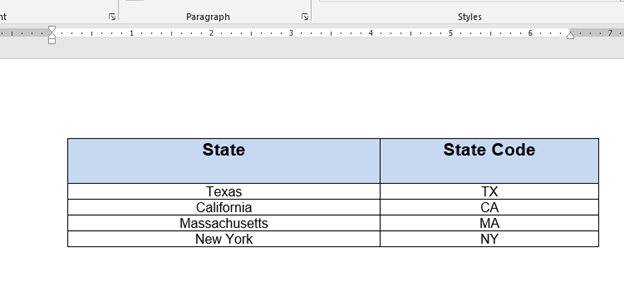

When a user needs to programmatically create, modify, and manage documents, it is always important to choose the right tool that fits particular document development needs. The purpose of this article is to help developers to make the right decision by comparing the available tools: Aspose.Words with Open XML SDK and NPOI.
## **Aspose.Words, Open XML SDK, and NPOI Functional Comparison**
The comparison of Aspose.Words, Open XML SDK, and NPOI functional features are shown in the table below:

|**Feature**|**Open XML SDK**|**Aspose.Words**|**NPOI**|
| :- | :- | :- | :- |
|Supported document formats|DOCX|DOC, RTF, WordML 2003, DOCX, HTML, MHTML, ODT, EPUB, PDF, XPS|dddddddddddddddddddddddddddddddddddddd|
|Convert between document formats|No|Yes| |
|
High-level programming with a document object model:

- Field update engine.

- Find and replace.

- Assemble documents.

- Copy fragments between documents.
|No|Yes| |
|Detailed programming with a document object model, access to individual elements and formatting such as lists, paragraphs, fields, bookmarks.|Yes|Yes| |
|Low-level direct and full access to the underlying XML elements and attributes such as relationship identifiers, list identifiers of an OOXML document.|Yes|No| |
|At least a basic knowledge of the Open XML Specification required.|Yes|No| |
|
Generate reports, populate documents with data:

- Simple mail merge-like reports.

- Nested parent-child mail merge regions.

- Custom data sources.
|No|Yes| |
|Detailed documentation and numerous code samples readily available.|No|Yes| |
|Render documents into pages and save to PDF, XPS, TIFF, display on screen or print.|No|Yes| |
|Update dynamic fields such as the page numbers of a TOC|No|Yes| |
|Supported platforms|Windows, .NET|Windows, Linux, Java, .NET, Mono| |

## **Programming with a document object model: Aspose.Words and Open XML SDK**
This section provides a comparison of some operations with a document performed by using Aspose.Words, Open XML SDK, and NPOI.
### **Creating a word processing document**
This section describes how to create a word processing document by using Aspose.Words, Open XML SDK, and NPOI.
#### **Create a word processing document and adding a paragraph of text with Aspose.Words**
The following code creates a simple console application that uses Aspose.Words to create a new document and insert a line of text:

**.NET**



 using Aspose.Words;

namespace AWApplication1

{

    public class AsposeWordsCreateDoc

    {

        public static void CreateDocument(string filepath)

        {

            // Create a blank document.

            Document doc = new Document();

            // DocumentBuilder provides members to easily add content to a document.

            DocumentBuilder builder = new DocumentBuilder(doc);

            // Write a new paragraph in the document with the text "Hello World!"

            builder.Writeln("Hello World!");

            // Save the document in DOCX format. The format to save as is inferred from the extension of the file name.

             doc.Save(filepath);

        }

    }

}



#### **Create a word processing document and adding a paragraph of text with Open XML**
The code example below shows how to use Open XML to create a simple document:

**.NET**



 using NPOI.XWPF.UserModel;

using System.IO;

namespace NPOI

{

    class CreateDocumentNPOI

    {

        public static void CreateDocument()

        {

            //Load document

            XWPFDocument doc1 = new XWPFDocument();

            // Add paragraph and text

            XWPFParagraph p1 = doc1.CreateParagraph();

            p1.Alignment = ParagraphAlignment.LEFT;

            XWPFRun r1 = p1.CreateRun();

            r1.FontFamily = "Times New Roman";

            r1.FontSize = 12;

            r1.SetText("Hello World!");

            //Save the file

            using (FileStream sw = File.Create("../../../Data/Document1.docx"))

            {

                doc1.Write(sw);

            }

        }

    }

}


### **Creating a simple table**

vvvvvvvvvvvvvvvvvvvv
#### **Creating a simple table with Aspose.Words**
The below code demonstrates how Aspose.Words creates a simple table in the document:

**.NET**



 using System;

using Aspose.Words;

namespace AWApplication1

{

    public class AsposeWordsCreateTable

    {

             public static void CreateTable(string filepath)

               {

                    // ExStart:SimpleTable

                    Document doc = new Document();

                    DocumentBuilder builder = new DocumentBuilder(doc);

                    // We call this method to start building the table.

                    builder.StartTable();

                    // Build the first cell of the first row.

                    builder.InsertCell();

                    builder.Write("Texas");

                    // Build the second cell

                    builder.InsertCell();

                    builder.Write("TX");

                    // Call the following method to end the row and start a new row.

                    builder.EndRow();

                    // Build the first cell of the row.

                    builder.InsertCell();

                    builder.Write("California");

                    // Build the second cell.

                    builder.InsertCell();

                    builder.Write("CA");

                    // Call the following method to end the row and start a new row.

                    builder.EndRow();

                    // Build the first cell of the row.

                    builder.InsertCell();

                    builder.Write("New York");

                    // Build the second cell

                    builder.InsertCell();

                    builder.Write("NY");

                    // Call the following method to end the row and start a new row.

                    builder.EndRow();

                    // Build the first cell of the row.

                    builder.InsertCell();

                    builder.Write("Massachusetts");

                    // Build the second cell.

                    builder.InsertCell();

                    builder.Write("MA");

                    builder.EndRow();

                    // Signal that we have finished building the table.

                    builder.EndTable();

                    // Save the document to disk.

                    doc.Save(filepath);

                    // ExEnd:SimpleTable

      Console.WriteLine("\nSimple table created successfully.\nFile saved     at " + filepath);

                }

    }

} 



#### **Creating a simple table with Open XML**
The below code demonstrates how with Open XML you can add a simple table in the document:

**.NET**



 using DocumentFormat.OpenXml;

using DocumentFormat.OpenXml.Packaging;

using DocumentFormat.OpenXml.Wordprocessing;

namespace OpenXMLApp1

{

    class AddTableOpenXML

    {

        // Take the data from a two-dimensional array and build a table at the 

        // end of the supplied document.

        public static void AddTable(string fileName, string[,] data)

        {

            using (var document = WordprocessingDocument.Open(fileName, true))

            {

                var doc = document.MainDocumentPart.Document;

                Table table = new Table();

                TableProperties props = new TableProperties(

                    new TableBorders(

                    new TopBorder

                    {

                        Val = new EnumValue<BorderValues>(BorderValues.Single),

                        Size = 12

                    },

                    new BottomBorder

                    {

                        Val = new EnumValue<BorderValues>(BorderValues.Single),

                        Size = 12

                    },

                    new LeftBorder

                    {

                        Val = new EnumValue<BorderValues>(BorderValues.Single),

                        Size = 12

                    },

                    new RightBorder

                    {

                        Val = new EnumValue<BorderValues>(BorderValues.Single),

                        Size = 12

                    },

                    new InsideHorizontalBorder

                    {

                        Val = new EnumValue<BorderValues>(BorderValues.Single),

                        Size = 12

                    },

                    new InsideVerticalBorder

                    {

                        Val = new EnumValue<BorderValues>(BorderValues.Single),

                        Size = 12

                    }));

                table.AppendChild<TableProperties>(props);

                for (var i = 0; i <= data.GetUpperBound(0); i++)

                {

                    var tr = new TableRow();

                    for (var j = 0; j <= data.GetUpperBound(1); j++)

                    {

                        var tc = new TableCell();

                        tc.Append(new Paragraph(new Run(new Text(data[i, j]))));

                        // Assume you want columns that are automatically sized.

                        tc.Append(new TableCellProperties(

                            new TableCellWidth { Type = TableWidthUnitValues.Auto }));

                        tr.Append(tc);

                    }

                    table.Append(tr);

                }

                doc.Body.Append(table);

            }

        }

    }

}



You can run the above code by executing the following statement:

**.NET**



             AddTableOpenXML.AddTable(filename, new string[,]

                      { { "Texas", "TX" },

                      { "California", "CA" },

                      { "New York", "NY" },

                      { "Massachusetts", "MA" } }

                      );



### **Inserting a formatted table in the document**
vvvvvvvvvvv
#### **Inserting a formatted table in the document with Aspose.Words**
vvv

**.NET**



 using System;

using Aspose.Words;

using System.Drawing;

using Aspose.Words.Tables;

namespace AWApplication1

{

    public class AsposeWordsCreateFormattedTable

    {

        public static void CreateFormattedTable(string filepath)

        {

            // ExStart:FormattedTable

     Document doc = new Document();

            DocumentBuilder builder = new DocumentBuilder(doc);

            Table table = builder.StartTable();

            // Make the header row.

            builder.InsertCell();

// Set the left indent for the table. Table wide formatting must be applied after 

            // At least one row is present in the table.

            table.LeftIndent = 20.0;

            // Set height and define the height rule for the header row.

            builder.RowFormat.Height = 40.0;

            builder.RowFormat.HeightRule = HeightRule.AtLeast;

            // Some special features for the header row.

     builder.CellFormat.Shading.BackgroundPatternColor = Color.FromArgb(198, 217,     241);

            builder.ParagraphFormat.Alignment = ParagraphAlignment.Center;

            builder.Font.Size = 16;

            builder.Font.Name = "Arial";

            builder.Font.Bold = true;

            builder.CellFormat.Width = 100.0;

            builder.Write("State");

            // Insert the second cell.

            builder.InsertCell();

            builder.CellFormat.Width = 70.0;

            builder.Write("State Code");

            builder.EndRow();

            // Set features for the other rows and cells.

            builder.CellFormat.Shading.BackgroundPatternColor = Color.White;

            builder.CellFormat.Width = 100.0;

            builder.CellFormat.VerticalAlignment = CellVerticalAlignment.Center;

            // Reset height and define a different height rule for table body

            builder.RowFormat.Height = 30.0;

            builder.RowFormat.HeightRule = HeightRule.Auto;

            builder.InsertCell();

            // Reset font formatting.

            builder.Font.Size = 12;

            builder.Font.Bold = false;

            // Build the other cells.

            builder.Write("Texas");

            builder.InsertCell();

            builder.CellFormat.Width = 70.0;

            builder.Write("TX");

            builder.EndRow();

            builder.InsertCell();

            builder.CellFormat.Width = 100.0;

            builder.Write("California");

            builder.InsertCell();

            builder.CellFormat.Width = 70.0;

            builder.Write("CA");

            builder.EndRow();

            // Build the other cells.

            builder.InsertCell();

            builder.CellFormat.Width = 100.0;

            builder.Write("Massachusetts");

            builder.InsertCell();

            builder.CellFormat.Width = 70.0;

            builder.Write("MA");

            builder.EndRow();

            builder.InsertCell();

            //  builder.CellFormat.Width = 100.0;

            builder.CellFormat.Width = 100.0;

            builder.Write("New York");

            builder.InsertCell();

            builder.CellFormat.Width = 70.0;

            builder.Write("NY");

            builder.EndRow();

            builder.EndTable();

            doc.Save(filepath);

            // ExEnd:FormattedTable

            Console.WriteLine("\nFormatted table created successfully.\nFile saved at " + filepath);

        }

    }

}



vvvvvvvvvvvvvvvvvvvvvvvvv
#### **Inserting a formatted table in the document with OpenXML**
The following code example shows how to create a table with 4 rows and 2 columns, set its properties, insert text into a cell in the table, copy a cell, and then insert the table into a word processing document.

**.NET**



 using DocumentFormat.OpenXml;

using DocumentFormat.OpenXml.Packaging;

using DocumentFormat.OpenXml.Wordprocessing;

namespace OpenXMLApp1

{

    class CreateFormatTableOpenXML

    {

        // Create a document

        public static void CreateWordprocessingDocument(string filepath)

        {

            // Create a document by supplying the filepath. 

            using (WordprocessingDocument wordDocument =

            WordprocessingDocument.Create(filepath, WordprocessingDocumentType.Document))

            {

                // Add a main document part. 

                MainDocumentPart mainPart = wordDocument.AddMainDocumentPart();

                // Create the document structure and add some text.

                mainPart.Document = new Document();

                Body body = mainPart.Document.AppendChild(new Body());

                Paragraph para = body.AppendChild(new Paragraph());

                Run run = para.AppendChild(new Run());

            }

        }

            // Insert a table into a word processing document.

            public static void CreateFormattedTable(string filename)

        {

            // Use the file name and path passed in as an argument 

            // to open an existing document.

            using (WordprocessingDocument doc

                = WordprocessingDocument.Open(filename, true))

            {

                // Create an empty table.

                Table table = new Table();

                // Create a TableProperties object and specify its border information.

                TableProperties tblProp = new TableProperties(

                    new TableBorders(

                        new TopBorder()

                        {

                            Val =

                            new EnumValue<BorderValues>(BorderValues.Single),

                            Size = 14

                        },

                        new BottomBorder()

                        {

                            Val =

                            new EnumValue<BorderValues>(BorderValues.Single),

                            Size = 14

                        },

                        new LeftBorder()

                        {

                            Val =

                            new EnumValue<BorderValues>(BorderValues.Single),

                            Size = 14

                        },

                        new RightBorder()

                        {

                            Val =

                            new EnumValue<BorderValues>(BorderValues.Single),

                            Size = 14

                        },

                        new InsideHorizontalBorder()

                        {

                            Val =

                            new EnumValue<BorderValues>(BorderValues.Single),

                            Size = 14

                        },

                        new InsideVerticalBorder()

                        {

                            Val =

                            new EnumValue<BorderValues>(BorderValues.Single),

                            Size = 14

                        }

                    )

                );

                // Append the TableProperties object to the empty table.

               table.AppendChild<TableProperties>(tblProp);

                // First table row:

                // Create a row.

                TableRow tr1 = new TableRow();

                // Create a cell.

                TableCell tc11 = new TableCell();

                // Specify the width property of the table cell.

                tc11.Append(new TableCellProperties(

                    new TableCellWidth() { Type = TableWidthUnitValues.Dxa, Width = "4000" }));

                // Specify the table cell content.

                tc11.Append(new Paragraph(new Run(new Text("State"))));

               var tcp = new TableCellProperties(new TableCellWidth()

                {

                    Type = TableWidthUnitValues.Dxa,

                    Width = "4000",

                });

                // Add cell shading.

                var shading = new Shading()

                {

                    Color = "auto",

                    Fill = "ABCDEF",

                    Val = ShadingPatternValues.Clear

                };

                tcp.Append(shading);

                tc11.Append(tcp);

                // Append the table cell to the table row.

                tr1.Append(tc11);

                // Create a second cell in the first row.

                TableCell tc12 = new TableCell();

                // Specify the width property of the table cell.

                tc12.Append(new TableCellProperties(

                    new TableCellWidth() { Type = TableWidthUnitValues.Dxa, Width = "2000" }));

                // Specify the table cell content.

                tc12.Append(new Paragraph(new Run(new Text("State Code"))));

                var tcp12 = new TableCellProperties(new TableCellWidth()

                {

                    Type = TableWidthUnitValues.Dxa,

                    Width = "2000",

                });

                // Add cell shading.

                var shading2 = new Shading()

                {

                    Color = "auto",

                    Fill = "ABCDEF",

                    Val = ShadingPatternValues.Clear

                };

                tcp12.Append(shading2);

                tc12.Append(tcp12);

                // Append the table cell to the table row.

                tr1.Append(tc12);

                // Append the table row to the table.

                table.Append(tr1);

                // Second table row:

                // Create a row.

                TableRow tr2 = new TableRow();

                // Create a cell.

                TableCell tc21 = new TableCell();

                // Specify the width property of the table cell.

                tc21.Append(new TableCellProperties(

                    new TableCellWidth() { Type = TableWidthUnitValues.Dxa, Width = "2400" }));

                // Specify the table cell content.

                tc21.Append(new Paragraph(new Run(new Text("Texas"))));

                // Append the table cell to the table row.

                tr2.Append(tc21);

                TableCell tc22 = new TableCell();

                // Specify the width property of the table cell.

                tc22.Append(new TableCellProperties(

                    new TableCellWidth() { Type = TableWidthUnitValues.Dxa, Width = "2000" }));

                // Specify the table cell content.

                tc22.Append(new Paragraph(new Run(new Text("TX"))));

                // Append the table cell to the table row.

                tr2.Append(tc22);

                // Append the table row to the table.

                table.Append(tr2);

                /// Third table row:

                // Create a row.

                TableRow tr3 = new TableRow();

                // Create a cell.

                TableCell tc31 = new TableCell();

                // Specify the width property of the table cell.

                tc31.Append(new TableCellProperties(

                    new TableCellWidth() { Type = TableWidthUnitValues.Dxa, Width = "2400" }));

                // Specify the table cell content.

                tc31.Append(new Paragraph(new Run(new Text("California"))));

                // Append the table cell to the table row.

                tr3.Append(tc31);

                // Create a second cell in the third row.

                TableCell tc32 = new TableCell();

                // Specify the width property of the table cell.

                tc32.Append(new TableCellProperties(

                    new TableCellWidth() { Type = TableWidthUnitValues.Dxa, Width = "2000" }));

                // Specify the table cell content.

                tc32.Append(new Paragraph(new Run(new Text("CA"))));

                // Append the table cell to the table row.

                tr3.Append(tc32);

                // Append the table row to the table.

                table.Append(tr3);

                // Fourth table row:

                // Create a row.

                TableRow tr4 = new TableRow();

                // Create a cell.

                TableCell tc41 = new TableCell();

                // Specify the width property of the table cell.

                tc41.Append(new TableCellProperties(

                    new TableCellWidth() { Type = TableWidthUnitValues.Dxa, Width = "2400" }));

                // Specify the table cell content.

                tc41.Append(new Paragraph(new Run(new Text("Massachusetts"))));

                // Append the table cell to the table row.

                tr4.Append(tc41);

                // Create a second table cell in the fourth row.

                TableCell tc42 = new TableCell();

                // Specify the width property of the table cell.

                tc42.Append(new TableCellProperties(

                    new TableCellWidth() { Type = TableWidthUnitValues.Dxa, Width = "2000" }));

                // Specify the table cell content.

                tc42.Append(new Paragraph(new Run(new Text("MA"))));

                // Append the table cell to the table row.

                tr4.Append(tc42);

                // Append the table row to the table.

                table.Append(tr4);

                // Fifth table row:

                // Create a row.

                TableRow tr5 = new TableRow();

                // Create a cell.

                TableCell tc51 = new TableCell();

                // Specify the width property of the table cell.

                tc51.Append(new TableCellProperties(

                    new TableCellWidth() { Type = TableWidthUnitValues.Dxa, Width = "2400" }));

                // Specify the table cell content.

                tc51.Append(new Paragraph(new Run(new Text("New York"))));

                // Append the table cell to the table row.

                tr5.Append(tc51);

                // Create a second table cell in the fifth row.

                TableCell tc52 = new TableCell();

                // Specify the width property of the table cell.

                tc52.Append(new TableCellProperties(

                    new TableCellWidth() { Type = TableWidthUnitValues.Dxa, Width = "2000" }));

                // Specify the table cell content.

                tc52.Append(new Paragraph(new Run(new Text("NY"))));

                // Append the table cell to the table row.

                tr5.Append(tc52);

                // Append the table row to the table.

                table.Append(tr5);

                // Append the table to the document.

                doc.MainDocumentPart.Document.Body.Append(table);

            }

        }

    }

}



vvvvvvvvvvvvvvvvvvvvvvvvvvvvvvvvvvvvvvvvvvvvvvv

vvvvvvvvvvvvvvvvvvvvvvvvvvvvvvvvvvvvvvvvvvvvvvvvvvv
## **See Also**
Open XML SDK might be a suitable choice when it is necessary to perform basic programming operations on a DOCX document. The Open XML SDK is a class library that enables a user to work in a strong-typed way with OOXML documents. The only document format available in Open XML SDK is DOCX. If you need to perform some basic programming operations with Microsoft Word DOCX documents, then Open XML SDK could be an option. The Open XML functionality is limited to such basic programming tasks, as generating a simple DOCX document, adding text, tables, removing comments, adding or removing headers/footers, adding or extracting images. Such operations can be successfully performed both with Open XML SDK and Aspose.Words. Some tasks where you need to directly access the XML elements and attributes of an OOXML, can be accomplished only with Open XML SDK. Aspose.Words is not designed for such operations. Developers who work on Office Open XML format should analyze and edit the OOXML parts. Therefore, they have to unarchive the OOXML document and open the XML file part with some XML editor to edit its contents. Then they have to again zip the xml parts to create the OOXML document.
NPOI is an open source project which is the .NET version of POI Java project, enabling you to create a document, add a table, image, convert between Doc and Docx formats, and perform other basic operations with documents.

The Aspose.Words API is a powerful document processing library intended for providing support for all Microsoft Word and other document formats. With Aspose.Words you can append documents and copy fragments between documents, convert a document to PDF or XPS so it appears exactly like Microsoft Word would have converted it insert, update tables of contents, generate reports, populate documents with data (mail merge reports and ) and other operations (see [Programming with Documents](/words/net/programming-with-documents/)).

Aspose.Words is a class library that allows your application to perform the following document processing tasks:

- High quality conversions from one document format to another.
- Programming with a document object model.
- Generating reports, populating documents with data from a data source.
- Rendering documents to fixed-page formats PDF, XPS and printing.

