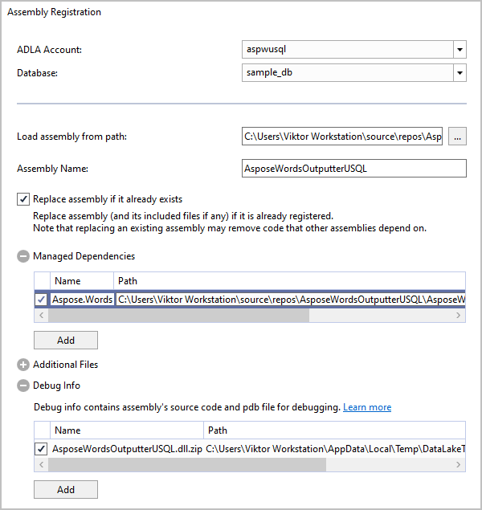
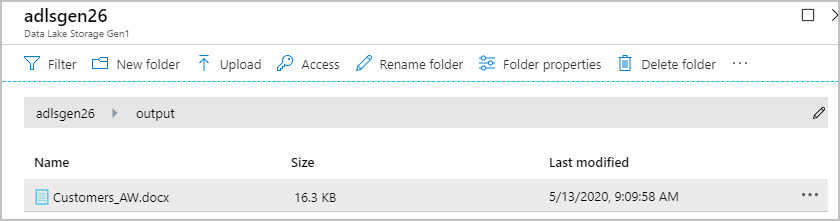
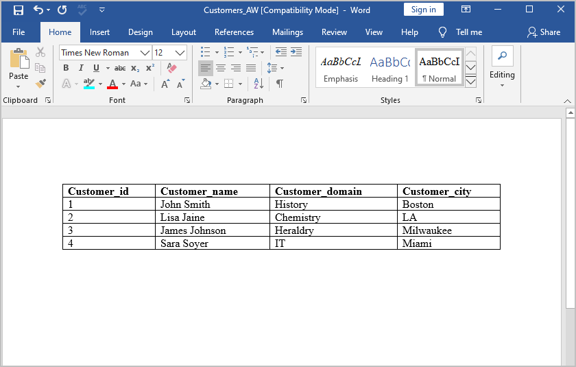

Aspose.Words can be integrated with the Microsoft Azure Data Lake services: Azure Data Lake Analytics (ADLA) and Azure Data Lake Storage (ADLS). This allows you to combine the big data analytics capabilities of the Azure Data Lake cloud storage solution with the power of Aspose.Words, which enables your applications to programmatically perform various document processing tasks, such as generating, modifying, rendering, reading, converting documents between different formats.

This article explains how to configure a C# project in Visual Studio with ADLA, and provides an example that demonstrates the integration of Aspose.Words and Azure Data Lake.
## **Prerequisites**
- Active Microsoft Azure subscription. If you don’t have one, you can create a free account before you begin. For details, refer to the "See Also" section.
- Visual Studio 2019 or Visual Studio 2017 with Azure development installed.
- Installed Azure Data Lake Tools for Visual Studio.
- Configured Visual Studio with ADLA account. For details, refer to the "See Also" section.
## **Build a Document with a Table from a Database on Azure Data Lake**
This topic demonstrates how with Aspose.Words, you can implement the IOutputter interface to create a user-defined outputter, which outputs data from ADLS in formats supported by Aspose.Words.

{} 

In this article, the document is created by the [DocumentBuilder](https://apireference.aspose.com/words/net/aspose.words/documentbuilder) class for demonstration purposes, which is not always convenient to generate reports. With Aspose.Words you can also generate reports using the [Mail Merge](/words/net/mail-merge-and-reporting/) and [LINQ Reporting Engine](/words/net/linq-reporting-engine/) features.

{} 
### **Create the Sample Database Table in Azure Data Lake Storage**
For demonstration purposes, it is required to create a simple database containing the sample data used for populating the resulting document. The **Customers** sample table resides in the **sample_db** database on the ADLS. To create this sample database, sign in to your ADLA account, click **New job**, and then submit the following script:

**U-SQL**



 CREATE DATABASE IF NOT EXISTS sample_db;

USE DATABASE sample_db;

CREATE SCHEMA IF NOT EXISTS dbo;

DROP TABLE IF EXISTS dbo.Customers;

CREATE TABLE dbo.Customers (

Customer_id int,

Customer_name string, 

Customer_domain string, 

Customer_city string,

INDEX idx_customer_id CLUSTERED (Customer_id ASC) )

DISTRIBUTED BY RANGE (Customer_id); 

INSERT INTO sample_db.dbo.Customers

(Customer_id, Customer_name, Customer_domain, Customer_city)

VALUES

(1, "John Smith", "History", "Boston"),

(2, "Lisa Jaine", "Chemistry", "LA"),

(3, "James Johnson", "Heraldry", "Milwaukee"),

(4, "Sara Soyer", "IT", "Miami");


### **IOutputter Interface Implementation**
In Visual Studio, create a new project by adding **C# Class Library (For U-SQL Application)** and add the [Aspose.Words](https://www.nuget.org/packages/Aspose.Words/) reference in your solution using the NuGet package manager.

The following code example shows the IOutputter implementation:

**.NET**



 using Microsoft.Analytics.Interfaces;

using System;

using System.IO;

using System.Linq;

using Aspose.Words;

namespace AsposeWordsOutputterUSql

{

    [SqlUserDefinedOutputter(AtomicFileProcessing = true)]

    public class AsposeWordsOutputer : IOutputter

    {

        public AsposeWordsOutputer(SaveFormat saveFormat)

        {

            // Pass the specified save format.

            mSaveFormat = saveFormat;

            // Create an instance of DocumentBuilder, which will be used to build the document.

            mDocumentBuilder = new DocumentBuilder();

        }

        /// 

        /// The Close method is used to write the document to the file. It is executed only once, after all rows.

        /// 

        public override void Close()

        {

            // End the table.

            mDocumentBuilder.EndTable();

            // The stream passed from IUnstructuredWriter.BaseStream does not support seeking.

            // This causes an exception when saving to PDF.

            // To avoid problems, save the output document into MemoryStream first

            // and then write its content to the IUnstructuredWriter.BaseStream.

            using (BinaryWriter writer = new BinaryWriter(mOutputStream))

            {

                // Save the document and close the stream.

                using (MemoryStream ms = new MemoryStream())

                {

                    mDocumentBuilder.Document.Save(ms, mSaveFormat);

                    writer.Write(ms.ToArray());

                }

            }

        }

        public override void Output(IRow row, IUnstructuredWriter output)

		{

			// Table with header row output--runs only once.

			if (mIsHeaderRow)

				ProcessHeaderRow(row.Schema);

			ProcessRow(row);

			// Reference to the instance of the IO.Stream object for saving document.

			mOutputStream = output.BaseStream;

		}

        /// 

        /// Create HeaderRow of the table.

        /// 

		private void ProcessHeaderRow(ISchema schema)

		{

			// Start the table before building it.

			mDocumentBuilder.StartTable();

			// Build the table.

			for (int i = 0; i < schema.Count(); i++)

			{

				IColumn col = schema[i];

				mDocumentBuilder.InsertCell();

				// Write a header with bold font.

				mDocumentBuilder.Font.Bold = true;

				mDocumentBuilder.Write(col.Name);

			}

			mDocumentBuilder.EndRow();

			// Write data with normal font.

			mDocumentBuilder.Font.Bold = false;

			// Table with header row output--runs only once.

			mIsHeaderRow = false;

		}

        /// 

        /// Create Row of the table.

        /// 

		private void ProcessRow(IRow row)

		{

			// Metadata schema initialization to enumerate column names.

			ISchema schema = row.Schema;

			// Data row output.

			for (int i = 0; i < schema.Count(); i++)

			{

				IColumn col = schema[i];

				string val = "";

				Type type = col.Type;

				// Get the cell value in the current row by column name and cast it to the column type.

				if (type == typeof(string))

					val = row.Get<string>(col.Name);

				else 

				if (type == typeof(int))

					val = row.Get<int>(col.Name).ToString();

				else

					val = "Column type is not supported.";

				mDocumentBuilder.InsertCell();

				mDocumentBuilder.Write(val);

			}

			mDocumentBuilder.EndRow();

		}

        private readonly DocumentBuilder mDocumentBuilder;

        private readonly SaveFormat mSaveFormat;

        private Stream mOutputStream;

        private bool mIsHeaderRow = true;

        static AsposeWordsOutputer()

        {

            // Note: The Aspose.Words license needs to be applied only once before any Document instance is created.

            // To execute the code only once, a static constructor is used. The below code will find and activate the license.

            // Uncomment the following code and add your license file as an embedded resource in the project.

            // Aspose.Words.License lic = new Aspose.Words.License();

            // lic.SetLicense("Aspose.Words.lic");

        }

    }

}



Consider the nuances of licensing described in the code example above. For details on applying the Aspose.Words license, see the "[Licensing](/words/net/licensing/)" article.
### **Run U-SQL Job in Azure Portal**
To integrate the C# class library of your project with the ADLA account, register the assembly with the ADLA account. In Visual Studio, right-click the project name and select Register Assembly. Select the ADLA account name and the database name, expand the Managed Dependencies panel and check Aspose.Words as shown on the screenshot below:

To start the application, you need to run in ADLA the following U-SQL code that contains necessary references and invokes your user-defined outputter:

**U-SQL**



 USE DATABASE [sample_db];

REFERENCE ASSEMBLY AsposeWordsOutputterUSQL;

REFERENCE ASSEMBLY [Aspose.Words];

@test = SELECT * FROM dbo.Customers;

OUTPUT @test TO "/output/Customers_AW.docx" USING new AsposeWordsOutputterUSql.AsposeWordsOutputer(Aspose.Words.SaveFormat.Docx);



{} 

You can output a document using various formats appropriate for a particular project, such as Docx, Doc, Pdf, Rtf, Text, Jpeg, and so on. For details, see the [SaveFormat](https://apireference.aspose.com/words/net/aspose.words/saveformat) enumeration.

{} 

Make sure that names with special characters, such as dot in Aspose.Words, are enclosed in square brackets in the U-SQL code. For details, refer to the "See Also" section.

Locate the file in the output folder on your Azure Data Lake Storage and download it:

The following screenshot shows how the output document looks after running the application:

## **See Also**
- Creating [Azure free account](https://azure.microsoft.com/en-us/free/).
- Microsoft documentation: [U-SQL Identifiers](https://docs.microsoft.com/en-us/u-sql/concepts/identifiers/identifiers).
- Microsoft documentation: [Develop U-SQL scripts by using Data Lake Tools for Visual Studio](https://docs.microsoft.com/en-us/azure/data-lake-analytics/data-lake-analytics-data-lake-tools-get-started).
