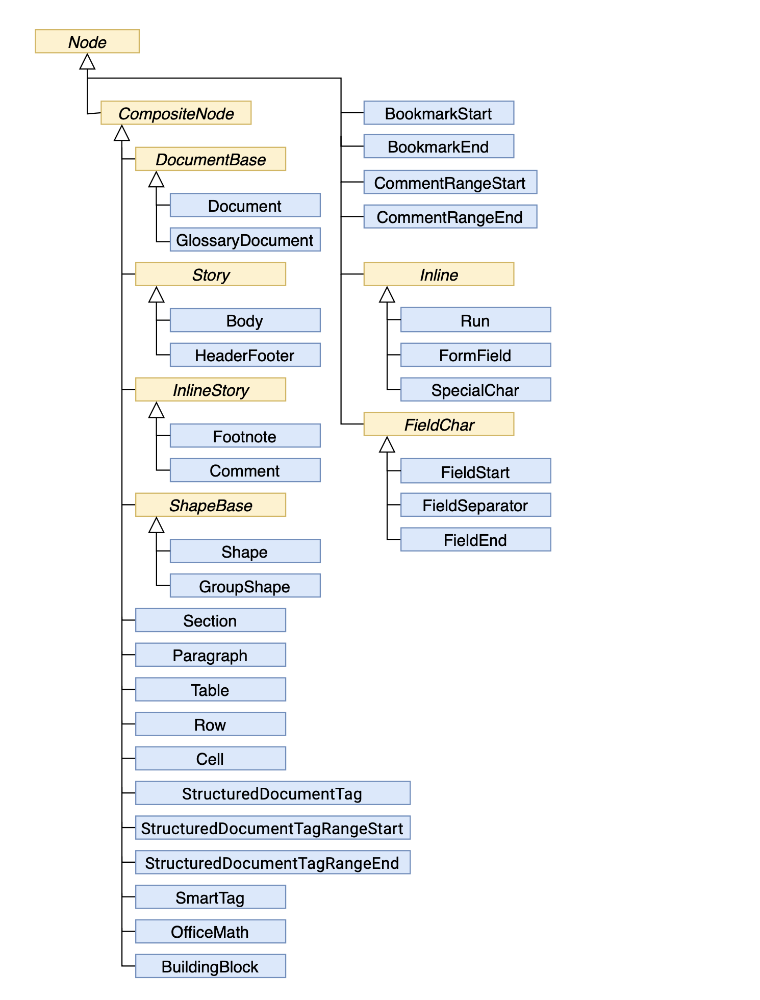
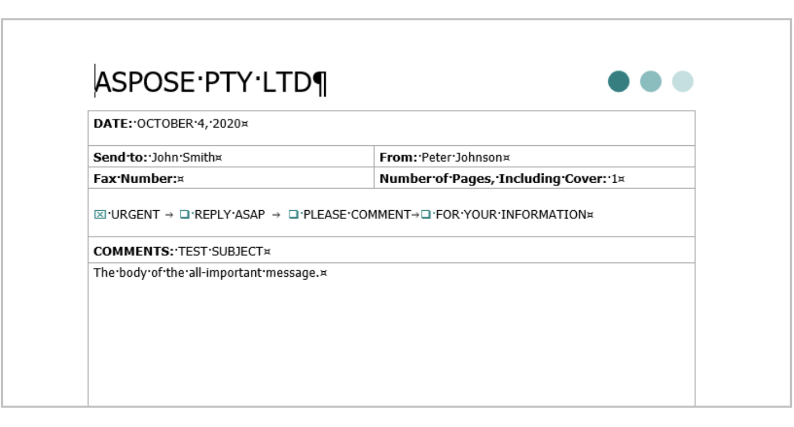
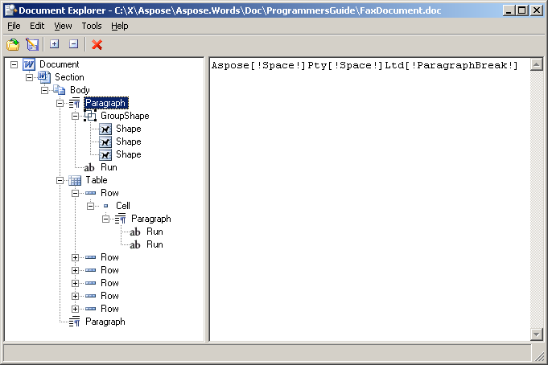
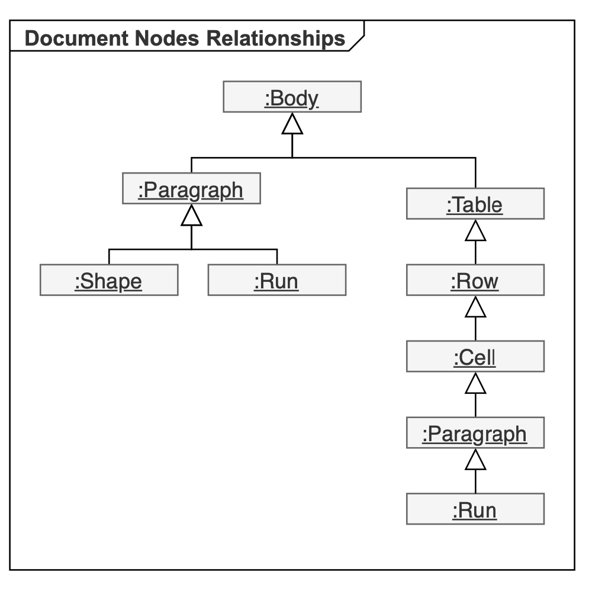

The Aspose.Words Document Object Model (DOM) is an in-memory representation of a Word document. The Aspose.Words DOM allows you to programmatically read, manipulate, and modify the content and formatting of a Word document.

This section describes the main classes of the Aspose.Words DOM and their relationships. By using the Aspose.Words DOM classes, you can obtain programmatic access to document elements and formatting.

## Create a Document Objects Tree {#create-a-document-objects-tree}

When a document is read into the Aspose.Words DOM, then an object tree is built and different types of elements of the source document have their own DOM tree objects with various properties.

### Build Document Nodes Tree {#build-document-nodes-tree}

When Aspose.Words reads a Word document into memory, it creates objects of different types that represent various document elements. Every run of a text, paragraph, table, or a section is a node, and even the document itself is a node. Aspose.Words defines a class for every document node type.

The document tree in Aspose.Words follows the Composite Design Pattern:

- All node classes ultimately derive from the **Node** class, which is the base class in the Aspose.Words Document Object Model.
- Nodes that can contain other nodes, for example, **Section** or **Paragraph**, derive from the **CompositeNode** class, which in turn derives from the **Node** class.

The diagram provided below shows inheritance between node classes of the Aspose.Words Document Object Model (DOM). The names of abstract classes are in Italics.

{}

The Aspose.Words DOM also contains the non-node classes, such as **Style** or **Font**, which are used to customize the appearance and styles  within a document. These classes are not shown in this diagram as not inherited from the **Node** class.

{}

Let's look at an example. The following image shows a Microsoft Word document with different types of content.

When reading the above document into the Aspose.Words DOM, the tree of objects is created, as shown in the schema below.

**Document**, **Section**, **Paragraph**, **Table**, **Shape**, **Run**, and all other ellipses on the diagram are Aspose.Words objects that represent elements of the Word document.

### Get a Node Type {#get-a-node-type}

Although the **Node** class is sufficient enough to distinguish different nodes from each other, Aspose.Words provides the **NodeType** enumeration to simplify some API tasks, such as selecting nodes of a specific type.

The type of each node can be obtained using the **Node.node_type** property. This property returns a **NodeType** enumeration value. For example, a paragraph node represented by the **Paragraph** class returns **NodeType.PARAGRAPH**, and a table node represented by the **Table** class returns **NodeType.TABLE**.

The following example shows how to get a node type using the **NodeType** enumeration:



## Document Tree Navigation {#document-tree-navigation}

Aspose.Words represents a document as a node tree, which enables you to navigate between nodes. This section describes how to explore and navigate the document tree in Aspose.Words.

When you open the sample document, presented earlier, in the Document Explorer, the node tree appears exactly as it is represented in Aspose.Words.

{}

You can learn the sample project "Document Explorer" on the [Aspose.Words GitHub](https://github.com/aspose-words/Aspose.Words-for-.NET/tree/master/Examples/DocsExamples).

{}

### Document Nodes Relationships {#document-nodes-relationships}

The nodes in the tree have relationships between them:

- A node containing another node is a *parent.*
- The node contained in the parent node is a *child.* Child nodes of the same parent are *sibling* nodes.
- The *root* node is always the **Document** node.

The nodes that can contain other nodes derive from the **CompositeNode** class, and all nodes ultimately derive from the **Node** class. These two base classes provide common methods and properties for the tree structure navigation and modification.

The following UML object diagram shows several nodes of the sample document and their relations to each other via the parent, child, and sibling properties:

#### Document is Node Owner

A node always belongs to a particular document, even if it has been just created or removed from the tree, because vital document-wide structures such as styles and lists are stored in the **Document** node. For example, it is not possible to have a **Paragraph** without a **Document** because each paragraph has an assigned style that is defined globally for the document. This rule is used when creating any new nodes. Adding a new **Paragraph** directly to the DOM requires a document object passed to the constructor.

{}

The **Node.document** property returns the document to which the node belongs.

{}

When creating a new paragraph using **DocumentBuilder**, the builder always has a **Document** class linked to it through the **DocumentBuilder.document** property.

The following code example shows that when creating any node, a document that will own the node is always defined:



#### Parent Node

Each node has a parent specified by the **parent_node** property. A node has no parent node, that is, **parent_node** is *None*, in the following cases:

- The node has just been created and has not yet been added to the tree.
- The node has been removed from the tree.
- This is the root **Document** node which always has a None parent node.

You can remove a node from its parent by calling the **Node.remove** method.The following code example shows how to access the parent node:



#### Child Nodes

The most efficient way to access child nodes of a **CompositeNode** is via the **first_child** and **last_child** properties that return the first and last child nodes, respectively. If there are no child nodes, these properties return *None*.

**CompositeNode** also provides the **child_nodes** collection enabling indexed or enumerated access to the child nodes. The **child_nodes** property is a live collection of nodes, which means that whenever the document is changed, such as when nodes are removed or added, the **child_nodes** collection is automatically updated.

If a node has no child, then the **child_nodes** property returns an empty collection. You can check whether the **CompositeNode** contains any child nodes using the **has_child_nodes** property.

The following code example shows how to enumerate immediate child nodes of a **CompositeNode** using the enumerator provided by the **child_nodes** collection:



#### Sibling Nodes

You can obtain the node that immediately precedes or follows a particular node using the **previous_sibling** and **next_sibling** properties, respectively. If a node is the last child of its parent, then the **next_sibling** property is *None*. Conversely, if the node is the first child of its parent, the **previous_sibling** property is *None*.

The following code example shows how to efficiently visit all direct and indirect child nodes of a composite node:



### Typed Access to Child and Parent Nodes {#typed-access-to-child-and-parent-nodes}

So far, we have discussed the properties that return one of the base types – **Node** or **CompositeNode**. But sometimes there are situations where you might need to cast values to a specific node class, such as **Run** or **Paragraph**. That is, you cannot completely get away from casting when working with the Aspose.Words DOM, which is composite.

To reduce the need for casting, most Aspose.Words classes provide properties and collections that provide strongly typed access. There are three basic patterns of typed access:

- A parent node exposes typed **first_XXX** and **last_XXX** properties. For example, the **Document** has **first_section** and **last_section** properties. Similarly, **Table** has properties such as **first_row**, **last_row**, and others.
- A parent node exposes a typed collection of child nodes, such as **Document.sections"", **Body.paragraphs**, and others.
- A child node provides typed access to its parent, such as **Run.parent_paragraph**, **Paragraph.parent_section**, and others.

Typed properties are merely useful shortcuts that sometimes provide easier access than generic properties inherited from **Node.parent_node** and **CompositeNode.first_child**.

The following code example shows how to use typed properties to access nodes of the document tree:


