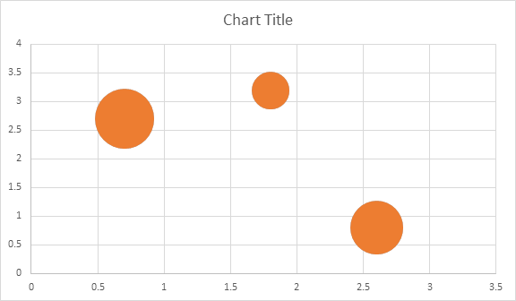
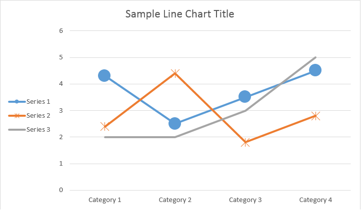
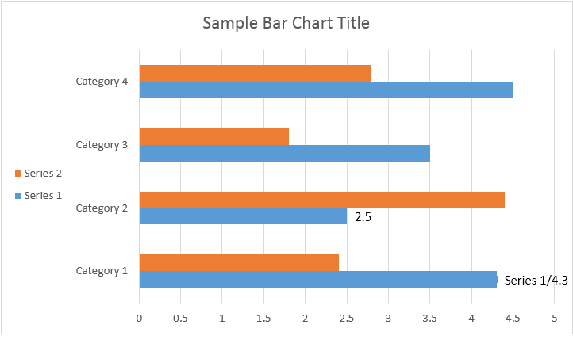
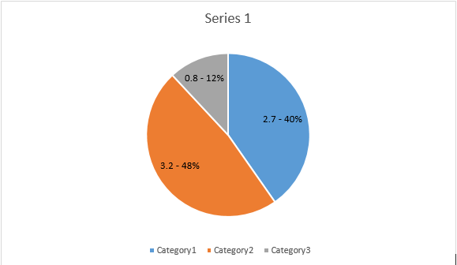

## Creating OOXML Charts from Scratch using Aspose.Words

New **insert_chart** method was added into the **DocumentBuilder** class. So, let's see how to insert a simple column chart into the document using **DocumentBuilder.insert_chart** method:

### How to Insert Column chart

Below examples shows how to insert column chart.



The code produces the following result:

There are **add**, **add_double** and **add_date** methoda, which was exposed to cover all possible variants of data sources for all chart types:



The code produces the following result:

### How to Insert Scatter Chart

Below example shows how to insert a scatter chart.



The code produces the following result:

### How to Insert Area Chart

Below example shows how to insert an area chart.



The code produces the following result:

### How to Insert Bubble Chart

Below example shows how to insert a bubble chart.



The code produces the following result:

## Working with Charts through Shape.chart Object

Once the chart was inserted and filled with data, you are able to change its appearance. **Shape.chart** property contains all chart related options available through the public API. For example, let's change Chart title or legend behavior:



The code generates the followings results:

## How to Work with ChartSeriesCollection of Chart

Let’s look into ChartSeries collection. All chart series are available through chart.Series collection, which is IEnumerable:



You can remove series one by one or clear all of them as well as add a new one if needed. The newly inserted chart has some default series added to this collection. To remove them you need to call **chart.series.clear()** method.

## Working with Single ChartSeries Class

Here is how to work with a particular series.



Please see the result below:

All single **ChartSeries** have default **ChartDataPoint** options, please try using the following code to change them:



## How to Work with Single ChartDataPoint of a ChartSeries

Using ChartDataPoint you are able to customize the formatting of a single data point of the chart series.



Please see the result below:

## How to Work with ChartDataLabel of a Single ChartSeries

Using **ChartDataLabel** you are able to specify the formatting of a single data label of the chart series, like show/hide LegendKey, CategoryName, SeriesName, Value etc.



Please see the result below:

## How to Define Default Options for ChartDataLabels of ChartSeries

The **ChartDataLabelCollection** class defines properties which can be used to set default options for ChartDataLabels for Chart Series. These properties include **show_category_name**, **show_bubble_size**, **show_percentage**, **show_series_name**, **show_value** etc.



Please see the result below:

## How to Format Number of Chart Data Label

Using **ChartDataLabel.number_format** you are able to specify number formatting of a single data label of the chart. The code example given below shows how to format a number of the data label. 



## How to Set Chart Axis Properties

If you want to work with chart axis, scaling, and display units for the value axis, please use **ChartAxis**, **AxisDisplayUnit**, and **AxisScaling** classes. The code example given below shows how to define X and Y-axis properties.



### How to Set Date Time Value of Axis

The following code example shows how to set date/time values to axis properties.



### How to Format Number Value of Axis

` `The following code example shows how to change the format of numbers on the value axis.



### How to Set Bounds of Axis

The **AxisBound** class represents a minimum or maximum bound of axis values. Bound can be specified as a numeric, date-time or a special "auto" value. The following code example shows how to set bounds of an axis.



### How to Set Interval Unit Between Labels

The following code example shows how to set the interval unit between labels on an axis.



### How to Hide Chart Axis

If you want to show or hide the chart axis, you can simply achieve this by setting the value of **ChartAxis.hidden** property. The following code example shows how to hide the Y-axis of the chart. 



### How to Align Chart Label

If you want to set a text alignment for multi-line labels, you can simply achieve this by setting the value of **ChartAxis.tick_label_alignment** property. The following code example shows how to tick label alignment.



{}

MS Word aligns Chart Label to the centre by default.

{}

## How to Set Fill and Stroke Formatting

Fill and stroke formatting can be set for chart series, data points, and markers. To do this, you need to use the properties of the **ChartFormat** type in the **ChartSeries**, **ChartDataPoint**, and **ChartMarker** classes, as well as aliases for some properties, such as **fore_color**, **back_color**, **visible**, and **transparency** in the **Stroke** class.

The following code example shows how to set series color:


doc = aw.Document()
builder = aw.DocumentBuilder(doc)

shape = builder.insert_chart(aw.drawing.charts.ChartType.COLUMN, 432, 252)

chart = shape.chart
seriesColl = chart.series

# Delete default generated series.
seriesColl.clear()

# Create category names array.
categories = [ "AW Category 1", "AW Category 2" ]

# Adding new series. Value and category arrays must be the same size.
series1 = seriesColl.add("AW Series 1", categories, [ 1, 2 ])
series2 = seriesColl.add("AW Series 2", categories, [ 3, 4 ])
series3 = seriesColl.add("AW Series 3", categories, [ 5, 6 ])

# Set series color.
series1.format.fill.fore_color = drawing.Color.red
series2.format.fill.fore_color = drawing.Color.yellow
series3.format.fill.fore_color = drawing.Color.blue

doc.save(docs_base.artifacts_dir + "WorkingWithCharts.set_series_color.docx")


The following code example shows how to set line color and weight:


doc = aw.Document()
builder = aw.DocumentBuilder(doc)

shape = builder.insert_chart(aw.drawing.charts.ChartType.LINE, 432, 252)

chart = shape.chart
seriesColl = chart.series

# Delete default generated series.
seriesColl.clear()

# Adding new series.
series1 = seriesColl.add_double("AW Series 1", [ 0.7, 1.8, 2.6 ], [ 2.7, 3.2, 0.8 ])
series2 = seriesColl.add_double("AW Series 2", [ 0.5, 1.5, 2.5 ], [ 3, 1, 2 ])

# Set series color.
series1.format.stroke.fore_color = drawing.Color.red
series1.format.stroke.weight = 5
series2.format.stroke.fore_color = drawing.Color.light_green
series2.format.stroke.weight = 5

doc.save(docs_base.artifacts_dir + "WorkingWithCharts.line_color_and_weight.docx")
