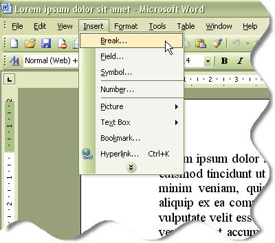
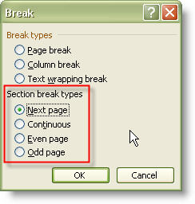

This topic discusses how to work programmatically with document sections using Aspose.Words. Working with sections is very useful when it comes to document generation. You can combine documents, build up an output document from several sections copied from multiple template documents or remove unneeded sections depending on some application logic, effectively filtering a common template document to a specific scenario.

A Word document can contain one or more sections. At the end of the section, there is a section break that separates one section from the next in a document. Each section has its own set of properties that specify page size, orientation, margins, the number of text columns, headers and footers and so on.

## Sections in Microsoft Word

In Microsoft Word, you can easily split the document into sections by adding a section break in the place where you want to start a new section. To join a section in the document with the next one, you need to delete a section break between them.

### Inserting a Section Break in Microsoft Word

A Section break is a mark you insert to show the end of a section. A section break stores the section formatting elements, such as the margins, page orientation, headers and footers, and sequence of page numbers. Just insert section breaks to divide the document into sections, and then format each section the way you want. For example, format a section as a single column for the introduction of a report, and then format the following section as two columns for the report’s body text. To insert a section break, do the following:
1. Click where you want to insert a section break.
1. On the Insert menu, click **Break**. 

1. Under **Section break types** , click the option that describes where you want the new section to begin. 

The following types of section breaks can be inserted:

- **Next page** inserts a section break and starts the new section on the next page.
- **Continuous** inserts a section break and starts the new section on the same page.
- **Odd page** or **Even page** inserts a section break and starts the new section on the next odd-numbered or even-numbered page.

### Deleting a Section Break in Microsoft Word

When you delete a section break, you also delete the section formatting for the text above it. That text becomes part of the following section, and it assumes the formatting of that section.

1. Select the section break you want to delete. If you are in print layout view or outline view and do not see the section break, display hidden text by clicking **Show/Hide** on the **Standard** toolbar.
1. Press DELETE.

## Sections in Aspose.Words

Sections of the document are represented by the **Section** and **SectionCollection** classes. Section objects are immediate children of the Document node and can be accessed via the **Document.sections** property.

### Obtaining a Section

Each section is represented by a **Section** object that can be obtained from the **Document.sections** collection by the index. Default page margins, header/footer distance and column spacing depend on current culture to mimic MS Word behavior. For example, now all page margins are 1’’ for English (United States) and English (United Kingdom). Left, right, top margins are 2.5 cm; bottom margin is 2 cm for German. The new defaults are used for a new document and for a loaded document if an explicit value is not set for the mention parameters.

{} 

It is possible to change culture for current thread that will cause changing default page margins, header/footer distance and column spacing.

{} 

The code sample below shows how to access a section at the specified index. You can download the template file of this example from [here](https://github.com/aspose-words/Aspose.Words-for-Python-via-.NET/blob/master/Examples/Data/Document.docx).



### Adding a Section

The **Document** object provides the section collection that can be accessed by using **Document.sections**. This returns a **SectionCollection** object containing the document’s sections. You can then use the **SectionCollection.add** method on this object to add a section to the end of the document. The code sample below shows how to add a section to the end of the document.



### Deleting a Section

In the same way as discussed above, the document’s sections are retrieved by using **Document.sections**. You can then use **SectionCollection.remove** to remove a specified section or **SectionCollection.remove_at** to remove a section at the specified index. The code sample below shows how to remove a section at the specified index.



The code sample below shows how to remove all sections from a document.



In addition, you can use **SectionCollection.clear** to remove all the sections from the document.

### Adding Section Content

If you want to copy and insert just the main text of a section excluding the section separator and section properties, use **Section.prepend_content** or **Section.append_content** passing a **Section** object for the content being copied. No new section is created; headers and footers are not copied. The former method inserts a copy of the content at the beginning of the section, while the latter inserts a copy of the content at the end of the section. The code sample below shows how to append content of an existing section. The number of sections in the document remains the same.



### Deleting Section Content

To delete the main text of a section, use **Section.clear_content**. Below example shows how to delete main content of a section. You can download the template file of this example from [here](https://github.com/aspose-words/Aspose.Words-for-Python-via-.NET/blob/master/Examples/Data/Document.docx).



To delete the headers and footers in a section, call **Section.clear_headers_footers**.

### Cloning a Section

Use the **Section.clone** method to create a duplicate of a particular section. Below example shows how to create a duplicate of a particular section. You can download the template file of this example from [here](https://github.com/aspose-words/Aspose.Words-for-Python-via-.NET/blob/master/Examples/Data/Document.docx).



### Copying Sections between Documents

Fully or partially copying one document into another is a very popular task. Here is a "pattern" to implement this. Before any node from another document can be inserted, it must be imported using **Document.import_node** method. The **Document.import_node** method makes a copy of the original node and updates all internal document-specific attributes such as lists and styles to make them valid in the destination document. Below example shows how to copy sections between documents. You can download the template file of this example from [here](https://github.com/aspose-words/Aspose.Words-for-Python-via-.NET/blob/master/Examples/Data/Document.docx).



{} 

Sometimes it is necessary to avoid section breaks in the destination document. In this case, you can use **Section.append_content** instead of **SectionCollection.add**.

{} 

## Inserting a Break

If you want to explicitly start a new line, paragraph, column, section, or page, call **DocumentBuilder.insert_break**. Pass to this method the type of the break you need to insert that is represented by the **BreakType** enumeration. Below example shows how to insert page breaks into a document.



## How to Remove Page and Section Breaks

A document often consists of several sections, for example section breaks to provide different page settings for different parts of the document. Likewise, a document can have explicit page breaks to separate content on different pages.

In most cases it is convenient to have a structured document, but sometimes multiple sections and user-defined page breaks are redundant and it may become necessary to remove them. For example after appending multiple documents together you may want to remove the separate section and combine them into one. You may also want to remove redundant page breaks after mail merge.

An explicit page break can be caused by many different things in a document:

- A page breaks character. This is represented in a document by the page break character **ControlChar.PAGE_BREAK_CHAR**.
- A **Section** which is set to begin on a new page (by the section’s **PageSetup.section_start** to **SectionStart.NEW_PAGE**).
- A **Paragraph** with **ParagraphFormat.page_break_before** set. This forces a page break before the paragraph.

This sample shows how to remove page and section breaks from the document using Aspose.Words.

### Solution

To remove page and section breaks from a document you should follow the steps below:

1. Load a document into the **Document** class by passing a file path or stream to the appropriate **Document** constructor.
1. To remove page breaks:
   1. Retrieve the collection of **Paragraph** nodes of document.
   1. Check if each **Paragraph** has the **ParagraphFormat.page_break_before** property set and set it to *False* it if it does.
   1. Scan each run of the paragraph for the **ControlChar.PAGE_BREAK_CHAR** character and remove this character.
1. The work involved to remove section breaks is a bit more involved. To remove section breaks you should combine all sections in document into one section:
   1. Iterate over all sections and move content into the last section.
   1. Remove all sections except for the last section in the document.

It contains one page break and one section break. The section break separates the document into two different sections. The first section contains content in one column, while the second is formatted in a two-column layout.

### Removing Page Breaks

Firstly the code to remove the page breaks is discussed. Generally a single **Run** contains only a page break character by itself. There are cases in which a run can contain text and a page break character and in some cases even multiple page break characters. Therefore the code is made robust and all instances of the page break character found are removed.

Below example removes all page breaks from the document.



Firstly all paragraphs in the document are gathered using the **Document.get_child_nodes** method. (The second parameter of the **Document.get_child_nodes** method is set to true, this instructs the method to select all child nodes recursively, and otherwise only immediate children will be selected.)

During the enumeration if a paragraph has the page break before setting enabled then the setting is removed. Each run of the paragraph is then checked for the presence of a **ControlChar.PAGE_BREAK_CHAR** character. If a run contains one or more of these characters they are removed by replacing them with an empty string.

Note that in a Word Document the same character is used to represent a page break and section break. The **ControlChar.PAGE_BREAK_CHAR** and **ControlChar.SECTION_BREAK_CHAR** are identical. You will only ever encounter a page break represented by this character in a document using Aspose.Words. This is explained further in the section below.

### Removing Section Breaks

Removing section breaks from a document is more complicated than page breaks. In the Aspose.Words document object model, sections are represented as separate instances of the **Section** class. The content found within these sections is added as children of the **Section** object, for example as **Body** or **Paragraph** nodes. To remove section breaks all content of the sections should be combined into one and the other sections removed. This will achieve the same result as deleting each section break in Microsoft Word.

Depending on how you want to modify your document you may find in this situation that simply changing each section to appear continually one after the other is the better option instead of combining them all. This would allow different section formatting to still be retained. This can be achieved by iterating through all sections in the document and setting **PageSetup.section_start** property of the section’s **PageSetup** class to **SectionStart.CONTINUOUS**.

In Microsoft Word when you delete a break between two the newly combined section inherits all properties from the second section. Thus if all sections are combined in the same way the resulting formatting should be inherited from the last section in the document. To match the same behavior programmatically the code is set up to transfer all content from the first sections into the last section of the document:

Below example combines all sections in the document into one.



Starting from the last section the content of each previous section is copied over to the beginning of the last section using the **Section.prepend_content** method. Then the **Section.remove** method is used to remove the empty section.

## Page Setup and Section Formatting

Page setup and section properties are encapsulated in the **PageSetup** object that is returned by the **DocumentBuilder.page_setup** property. The object contains all the page setup attributes of a section (left margin, bottom margin, paper size, and so on) as properties. Below example shows how to set such properties as page size and orientation for the current section.


