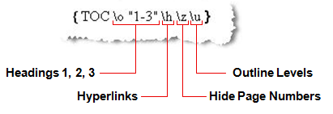
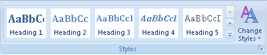
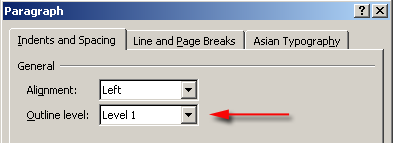
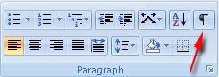
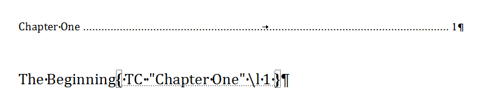
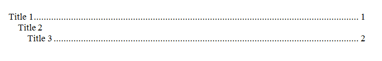
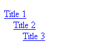
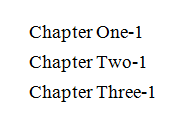
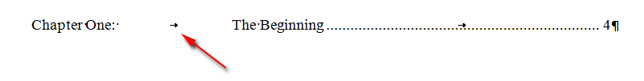
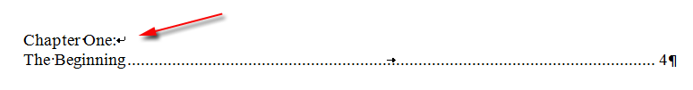

Often you will work with documents containing a table of contents (TOC). Using Aspose.Words you can insert your own table of contents or completely rebuild existing table of contents in the document using just a few lines of code. This article outlines how to work with the table of contents field and demonstrates:

- How to insert a brand new TOC
- Update new or existing TOCs in the document.
- Specify switches to control the formatting and overall structure f the TOC.
- How to modify the styles and appearance of the table of contents.
- How to remove an entire TOC field along with all entries form the document.

## Insert a Table of Contents Programmatically

You can insert a TOC (table of contents) field into the document at the current position by calling the [DocumentBuilder.insert_table_of_contents](https://reference.aspose.com/words/python-net/aspose.words/documentbuilder/insert_table_of_contents/) method.

A table of contents in a Word document can be built in a number of ways and formatted using a variety of options. The field switches that you pass to the method control the way the table is built and displayed in your document.

The default switches that are used in a TOC inserted in Microsoft Word are **“\o “1-3 \h \z \u”**. Descriptions of these switches as well as a list of supported switches can be found later in the article. You can either use that guide obtain the correct switches or if you already have a document containing the similar TOC that you want you can show field codes (*ALT+F9*) and copy the switches directly from the field.

The following code example  shows how to insert a Table of Contents field into a document:



The code demonstrates the new table of contents being inserted into a blank document. The [DocumentBuilder](https://reference.aspose.com/words/python-net/aspose.words/documentbuilder/) class is then used to insert some sample content formatting with the appropriate heading styles which are used to mark the content to be included in the TOC. The next lines then populate the TOC by updating the fields and page layout of the document.

{}

Without the methods used in the example, when you open the output document, you would find the TOC field, but with no visible content. This is because the TOC field has been inserted but is not yet populated until it’s updated in the document. Further information about this is discussed in the next section.

{}

## Update the Table of Contents

Aspose.Words allows you to completely update a TOC with only a few lines of code. This can be done to populate a newly inserted TOC or to update an existing TOC after changes to the document have been made. The following two methods must be used in order to update the TOC fields in the document:

1. [Document.update_fields](https://reference.aspose.com/words/python-net/aspose.words/document/update_fields/)
1. [Document.update_page_layout](https://reference.aspose.com/words/python-net/aspose.words/document/update_page_layout/)

Please note that these two update methods are required to be called in that order. If reversed the table of contents will be populated but no page numbers will be displayed. Any number of different TOCs can be updated. These methods will automatically update all TOCs found in the document.

The following code example shows how to completely rebuild TOC fields in the document by invoking field update:



The first call to [Document.update_fields](https://reference.aspose.com/words/python-net/aspose.words/document/update_fields/) will build the TOC, all text entries are populated and the TOC appears almost complete. The only thing missing is the page numbers which for now are displayed with “?”. The second call to [Document.update_page_layout](https://reference.aspose.com/words/python-net/aspose.words/document/update_page_layout/) will build the layout of the document in memory. This needs to be done to gather the page numbers of the entries. The correct page numbers calculated from this call are then inserted into the TOC.

## Use Switches to Control the Behavior of the Table of Contents.

As with any other field, the TOC field can accept switches defined within the field code that control the how the table of contents is built. Certain switches are used to control which entries are included and at what level while others are used to control the appearance of the TOC. Switches can be combined together to allow complex table of contents to be produced.

By default these switches above are included when inserting a default TOC in the document. A TOC with no switches will include content from the built-in heading styles (as if the \O switch is set). The available TOC switches that are supported by Aspose.Words are listed below and their uses are described in detail. They can be divided into separate sections based off their type. The switches in the first section define what content to include in the TOC and the switches in the second section control the appearance of the TOC. If a switch is not listed here then it is currently unsupported.  All switches will be supported in future versions. We are adding further support with every release.

### Entry Marking Switches

| Switch |Description|
| :- | :- |
|**Heading Styles**  *(\O Switch)* |
This switch defines that the TOC should be built off the built-in heading styles. In Microsoft Word these are defined by Heading 1 – Heading 9. In Aspose.Words these styles are represented by the corresponding StyleIdentifier enumeration. This enumeration represents a locale independent identifier of a style, for example StyleIdentifier.Heading1 represents the Heading 1 style. Using this, the formatting and properties of the style can be retrieved from the Style collection of the document. The corresponding Style class can be retrieved from the Document.Styles collection by using the indexed property of type StyleIdentifier. 

Any content formatted with these styles are included in the table of contents. The level of the heading will define the corresponding hierarchical level of the entry in the TOC. For instance, a paragraph with Heading 1 style will be treated as the first level in the TOC whereas a paragraph with Heading 2 will be treated as the next level in the hierarchy and so forth.
|
|**Outline Levels**  *(\U switch)* |
Each paragraph can define an outline level under Paragraph options. 

This setting dictates which level this paragraph should be treated in document hierarchy. This is commonly used practice used to easily structure the layout of a document. This hierarchy can be viewed by changing to Outline View in Microsoft Word. Similar to heading styles, there can be 1 – 9 outline levels in addition to the “Body Text” level. Outline levels 1 – 9 will appear in the TOC in the corresponding level of the hierarchy  Any content with an outline level either set in the paragraph style or directly on the paragraph itself is included in the TOC. In Aspose.Words the outline level is represented by the ParagraphFormat.OutlineLevel property of the Paragraph node. The outline level of a paragraph style is represented in the same way by the Style.ParagraphFormat property.

{} 

Note that built-in heading styles such as Heading 1 have an outline level compulsory set in style settings.

{}
|
|**Custom Styles**  *(\T switch)* |
This switch will allow custom styles to be used when collecting entries to be used in the TOC. This is often used in conjunction with the \O switch to include custom styles along with built-in heading styles in the TOC.  The parameters of the switch should be enclosed within speech marks. Many custom styles can be included, for each style the name should be specified followed by a comma followed by the level that the style should appear in the TOC as. Further styles are also separated by a comma as well.  For instance 


{ TOC \o "1-3" \t "CustomHeading1, 1,   CustomHeading2, 2"}

will use content styled with CustomHeading1 as level 1 content in the TOC and CustomHeading2 as level 2.
|
|**Use TC Fields**  *(\F and \L Switches)* |
In older versions of Microsoft Word, the only way to build a TOC was the use of TC fields. These fields are inserted hidden into the document even when field codes are shown. They include the text that should be displayed in the entry and the TOC is built from them. This functionality is now not used very often but may still be useful in some occasions to include entries in the TOC which are not indented to be visible in the document.  When inserted these fields appear hidden even when field codes are displayed. They cannot be seen without showing hidden content. To see these fields Show paragraph formatting must be selected. 

These fields can be inserted into a document at any position like any other field and are represented by the FieldType.FieldTOCEntry enumeration.   The \F switch in a TOC is used to specify that TC fields should be used as entries. The switch on its own without any extra identifier means that any TC field in the document will be included. Any extra parameter, often a single letter, will designate that only TC fields which have a matching \f switch will be included in the TOC. For instance *

{ TOC \f t }

will only include TC fields such as 

{   TC \f t }

The TOC field also has a related switch, the “\L” switch specifies that only TC field with levels within the specified range are included.  

The TC fields themselves also can have several switches set. These are:

- *\F – Explained above.*

- *\L – Defines which level in the TOC this TC field will appear in. A TOC which uses this same switch will only include this TC field if it’s within the specified range.*

- _\N – The page numbering for this TOC entry is not displayed.Sample code of how to insert TC fields can be found in the next section.
|

### Appearance Related Switches

| Switch |Description|
| :- | :- |
|**Omit Page Numbers**  *(\N Switch)* |
This switch is used to hide page numbers for certain levels of the TOC. For example you can define 

{TOC \o "1-4" \n "3-4" }

and the page numbers on the entries of levels 3 and four will be hidden along with the leader dots (if there are any). To specify only one level a range should still be used, for example “1-1” will exclude page numbers only for the first level.  Supplying no level range will omit page numbers for all levels in the TOC. This is useful to set when exporting a document to HTML or similar format. This is because HTML based formats don’t have any page concept and thus don’t need any page numbering. 

|
|**Insert As Hyperlinks**  *(\H Switch)* |
This switch specifies that TOC entries are inserted as hyperlinks. When viewing a document in Microsoft Word these entries will still appear as normal text inside the TOC but are hyperlinked and thus can be used to navigate to the position of the original entry in the document by using *Ctrl + Left Click* in Microsoft Word. When this switch is included then these links are also preserved in other formats. For instance in HTML based formats including EPUB and rendered formats such as PDF and XPS these will be exported as working links.  Without this switch set the TOC in all of these outputs will be exported as plain text and will not demonstrate this behavior.  If a document is opened in MS Word the text of the entries will also not be clickable in this way but the page numbers can still be used to navigate to the original entry. 

|
|**Set Separator Character**  *(\P Switch)* |
This switch allows the content separating the title of the entry and page numbering to be easily changed in the TOC. The separator to use should be specified after this switch and enclosed in speech marks.  Contrary to what is documented in Office documentation, only one character can be used instead of up to five. This applies to both MS Word and Aspose.Words.  Using this switch is not recommended as it does not allow much control over what it used to separate entries and page numbers in the TOC. Instead it is recommended to edit the appropriate TOC style such as StyleIdentifier.TOC1 and from there edit the leader style with access to specific font members etc. Further details of how to do this can be found later in the article. 

|
|**Preserve Tab Entries**  *(\W Switch)* |
Using this switch will specify that that any entries that have a tab character, for instance a heading which has a tab at the end of the line, will be retained as a proper tab character when populating the TOC. This means the function of the tab character will be present in the TOC and can be used to format the entry. For example certain entries may use tab stops and tab characters to evenly space out the text. As long as the corresponding TOC level defines the equivalent tab stops then the generated TOC entries will appear with similar spacing.   In the same situation if this switch was not defined then the tab characters would be converted to white space equivalent as non functioning tabs. The output would then not appear as expected. 

|
|**Preserve New Line Entries**  *(\X Switch)* |
Similar to the switch above, this switch specifies that headings spanning over multiple lines (using new line characters not separate paragraphs) will be preserved as they are in the generated TOC. For example, a heading which is to spread across multiple lines can use the new line character (Ctrl + Enter or ControlChar.LineBreak) to separate content across different lines. With this switch specified, the entry in the TOC will preserve these new line characters as shown below.   In this situation if the switch is not defined then the new line characters are converted to a single white space. 

|

## Insert TC Fields

You can insert a new TC field at the current position of the [DocumentBuilder](https://reference.aspose.com/words/python-net/aspose.words/documentbuilder/) by calling the [DocumentBuilder.insert_field](https://reference.aspose.com/words/python-net/aspose.words/documentbuilder/insert_field/) method and specifying the field name as “TC” along with any switches that are needed. Below example shows how to insert a TC field into the document using [DocumentBuilder](https://reference.aspose.com/words/python-net/aspose.words/documentbuilder/).



## Modify a Table of Contents

The formatting of entries in the TOC do not use the original styles of the marked entries, instead each level is formatted using an equivalent TOC style. For example the first level in the TOC is formatted with the **TOC1** style, the second level formatted with the **TOC2** style and so on. This means that to change the look of the TOC these styles must be modified. In Aspose.Words these styles are represented by the locale independent [StyleIdentifier.TOC1](https://reference.aspose.com/words/python-net/aspose.words/styleidentifier/#toc1) through to [StyleIdentifier.TOC9](https://reference.aspose.com/words/python-net/aspose.words/styleidentifier/#toc9) and can be retrieved from the [Document.styles](https://reference.aspose.com/words/python-net/aspose.words/documentbase/styles/) collection using these identifiers.

Once the appropriate style of the document has been retrieved the formatting for this style can be modified. Any changes to these styles will be automatically reflected on the TOCs in the document. Below example changes a formatting property used in the first level TOC style.



It is also useful to note that any direct formatting of a paragraph (defined on the paragraph itself and not in the style) marked to be included the TOC will be copied over in the entry in the TOC. For example if the Heading 1 style is used to mark content for the TOC and this style has Bold formatting while the paragraph also has italic formatting directly applied to it. The resulting TOC entry will not be bold as that is part of style formatting however it will be italic as this is directly formatted on the paragraph.

You can also control the formatting of the separators used between each entry and page number. By default this is a dotted line which is spread across to the page numbering using a tab character and a right tab stop lined up close to the right margin.

Using the [Style](https://reference.aspose.com/words/python-net/aspose.words/style/) class retrieved for the particular TOC level you want to modify, you can also modify how these appear in the document. To change how this appears firstly [Style.paragraph_format](https://reference.aspose.com/words/python-net/aspose.words/style/paragraph_format/) must be called to retrieve the paragraph formatting for the style. From this the tab stops can be retrieved by calling [ParagraphFormat.tab_stops](https://reference.aspose.com/words/python-net/aspose.words/paragraphformat/tab_stops/) and the appropriate tab stop modified. Using this same technique the tab itself can be moved or removed all together. Below example shows how to modify the position of the right tab stop in TOC related paragraphs.



## Remove a Table of Contents from the Document

A table of contents can be removed from the document by removing all nodes found between the [FieldStart](https://reference.aspose.com/words/python-net/aspose.words.fields/fieldstart/) and [FieldEnd](https://reference.aspose.com/words/python-net/aspose.words.fields/fieldend/) node of the TOC field. The code below demonstrates this. The removal of the TOC field is simpler than a normal field as we do not keep track of nested fields. Instead we check the [FieldEnd](https://reference.aspose.com/words/python-net/aspose.words.fields/fieldend/) node is of type [FieldType.FIELD_TOC](https://reference.aspose.com/words/python-net/aspose.words.fields/fieldtype/#field_toc) which means we have encountered the end of the current TOC. This technique can be used in this case without worrying about any nested fields as we can assume that any properly formed document will have no fully nested TOC field inside another TOC field.

Firstly the [FieldStart](https://reference.aspose.com/words/python-net/aspose.words.fields/fieldstart/) nodes of each TOC are collected and stored. The specified TOC is then enumerated so all nodes within the field are visited and stored. The nodes are then removed from the document. Below code sample demonstrates how to remove a specified TOC from a document.



## Extract Table of Contents

If you want to extract a table of contents from any Word document, the following code sample can be used.


doc = aw.Document(docs_base.my_dir + "Table of contents.docx")

for field in doc.range.fields :
            
    if (field.type == aw.fields.FieldType.FIELD_HYPERLINK) :
                
        hyperlink = field.as_field_hyperlink()
        if (hyperlink.sub_address != None and hyperlink.sub_address.find("_Toc") == 0) :
                    
            tocItem = field.start.get_ancestor(aw.NodeType.PARAGRAPH).as_paragraph()
                        
            print(tocItem.to_string(aw.SaveFormat.TEXT).strip())
            print("------------------")
    
            bm = doc.range.bookmarks.get_by_name(hyperlink.sub_address)
            pointer = bm.bookmark_start.get_ancestor(aw.NodeType.PARAGRAPH).as_paragraph()
                        
            print(pointer.to_string(aw.SaveFormat.TEXT))

