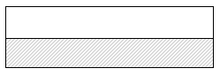
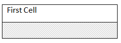
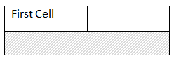
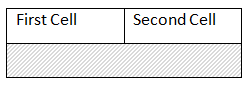
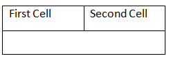
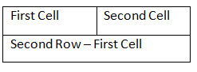

---
title: Introduction and Creating Tables in Python
articleTitle: Introduction and Creating Tables
linktitle: Introduction and Creating Tables
description: "Create and manage tables in a document using python."
type: docs
weight: 10
url: /python-net/introduction-and-creating-tables/
aliases: [/python/introduction-and-creating-tables/]
---

## Tables in Microsoft Word

All versions of Microsoft Word provide special commands for inserting and working with tables. The exact location of these differs between older and newer versions of Microsoft Word but they are all present. These are some of the more common tasks required when working with tables in Microsoft Word.

### Inserting a Table in Microsoft Word

**To insert a table in Microsoft Word 2003 and earlier:**

1. Click the Table menu from the top toolbar.
1. Click Insert and then Table.
1. Fill in the appropriate values and press Ok to insert the table.

**To insert a table in Microsoft Word 2007 and later:**

1. Click the Insert tab.
1. Choose the Tables drop down menu.
1. Select Insert Table.
1. Fill in the appropriate values and press Ok to insert the table.

### Removing a Table or Table Elements in Microsoft Word

**To remove a table or individual table elements in Microsoft Word 2003 and earlier:**

1. Click inside the table in the position that you want.
1. Click the Table menu from the top toolbar.
1. Click Delete.
1. Choose the menu item of element you want to delete. For instance choosing Table will remove the entire table from the document.

**To remove a table or individual table elements in Microsoft Word 2007 and later:**

1. Click inside the table at the desired position.
1. The Layout tab should appear. Click this tab.
1. Click the Delete drop down menu.
1. Choose the menu item of the element you want to delete. For instance choosing Delete Table will remove the entire table from the document.
   **Merging Cells in a Table in Microsoft Word**
1. Select the cells to be merged by dragging the cursor over the cells.
1. Right click on the selection.
1. Select Merge Cells from the popup menu.

### Using the AutoFit feature in Microsoft Word

**To use the AutoFit feature to automatically size a table in Microsoft Word:**

1. Right click anywhere inside the desired table.
1. Select AutoFit from popup menu.
1. Select the desired autofit option
   1. AutoFit to Contents fits the table around content.
   1. AutoFit to Window resizes the table so it fills the available page width between the left and right margins.
   1. Fixed Column Width sets each column width to an absolute value. This means even if the content within the cells were to change the width of each column in the table will stay the same.

## Tables in Aspose.Words

A table from any document loaded into Aspose.Words is imported as a **Table** node. A table can be found as a child of the main body of text, an inline story such as a comment or footnote, or within a cell as a nested table. Furthermore, tables can be nested inside other tables up to any depth.

A **Table** node does not contain any real content - instead it is a container for other such nodes which make up the content:

- A **Table** contains many **Row** nodes. A **Table** exposes all the normal members of a node which allows you to freely move, modify and remove the table in the document.
- A **Row** represents a single row of a table and contains many **Cell** nodes. Additionally a **Row** provides members which define how a row is displayed, for example the height and alignment.
- A **Cell** is what contains the true content seen in a table and is made up of **Paragraph** and other block level nodes. Additionally cells can contain further nested tables.

This relationship is best represented by inspecting the structure of a **Table** node in a document through the use of **DocumentExplorer** .

You can see in the diagram above that the document contains a table which consists of one row which in turn consists of two cells. Each of the two cells contains a paragraph which is the container of the formatted text in a cell. In Aspose.Words all table related classes and properties are contained in the **aspose.words.tables** namespace.

You should also notice table is succeeded with an empty paragraph. It is a requirement for a Microsoft Word document to have at least one paragraph after a table. This is used to separate consecutive tables and without it such consecutive tables would be joined together into one. This behavior is identical in both Microsoft Word and Aspose.Words.

## Creating Tables

Aspose.Words provides several different methods to create new tables in a document. This article presents the full details of how to insert formatted tables using each technique as well as a comparison of each technique at the end of the article. A newly created table is given similar defaults as used in Microsoft Word:

|Table Property|Default in Aspose.Words|
| :- | :- |
|Border Style|Single|
|Border Width|1/2 pt|
|Border Color|Black|
|Left and Right Padding|5.4 pts|
|AutoFit Mode|AutoFit to Window|
|Allow AutoFit|True|
{} 

A table can be inline where it is tightly positioned or can be floating where it can be positioned anywhere on the page. By default, Aspose.Words always creates inline tables.

{} 

### Inserting a Table using DocumentBuilder

In Aspose.Words a table is normally inserted using **DocumentBuilder**. The following methods are used to build a table. Other methods will also be used to insert content into the table cells.

- **DocumentBuilder.start_table**
- **DocumentBuilder.insert_cell**
- **DocumentBuilder.end_row**
- **DocumentBuilder.end_table**
- **DocumentBuilder.writeln**

|Operation|Description|Table State|
| :- | :- | :- |
|**DocumentBuilder.start_table**|Starts building a new table at the current cursor position. The table is created empty and has no rows or cells yet.||
|**DocumentBuilder.insert_cell**|Inserts a new row and cell into the table.||
|**DocumentBuilder.writeln**|Writes some text into the current cell.||
|**DocumentBuilder.insert_cell**|Appends a new cell at the end of the current row.||
|**DocumentBuilder.writeln**|Writes some text into the current cell (now the second cell).||
|**DocumentBuilder.end_row**|Instructs the builder to end the current row and to begin a new row with the next call to **DocumentBuilder.insert_cell** .||
|**DocumentBuilder.insert_cell**|Creates a new row and inserts a new cell.||
|**DocumentBuilder.writeln**|Inserts some text into the first cell of the second row.||
|**DocumentBuilder.end_table**|Called to finish off building the table. The builder cursor will now point outside the table ready to insert content after the table.||

### Algorithm for Creating a Table

The basic algorithm for creating a table using **DocumentBuilder** is simple:

1. Start the table using **DocumentBuilder.start_table**.
1. Insert a cell using **DocumentBuilder.insert_cell**. This automatically starts a new row. If needed, use the **DocumentBuilder.cell_format** property to specify cell formatting.
1. Insert cell contents using the **DocumentBuilder** methods.
1. Repeat steps 2 and 3 until the row is complete.
1. Call **DocumentBuilder.end_row** to end the current row. If needed, use **DocumentBuilder.row_format** property to specify row formatting.
1. Repeat steps 2 - 5 until the table is complete.
1. Call **DocumentBuilder.end_table** to finish the table building. The appropriate **DocumentBuilder** table creation methods are described below.

#### Starting a Table

Calling **DocumentBuilder.start_table** is the first step in building a table. It can be also called inside a cell, in which case it starts a nested table. The next method to call is **DocumentBuilder.insert_cell**.

#### Inserting a Cell

After you call **DocumentBuilder.insert_cell**, a new cell is created and any content you add using other methods of the **DocumentBuilder** class will be added to the current cell. To start a new cell in the same row, call **DocumentBuilder.insert_cell** again. Use the **DocumentBuilder.cell_format** property to specify cell formatting. It returns a **CellFormat** object that represents all formatting for a table cell.

#### Ending a Row

Call **DocumentBuilder.end_row** to finish the current row. If you call **DocumentBuilder.insert_cell** immediately after that, then the table continues on a new row.

Use the **DocumentBuilder.row_format** property to specify row formatting. It returns a **RowFormat** object that represents all formatting for a table row.

#### Ending a Table

Call **DocumentBuilder.end_table** to finish the current table. This method should be called only once after **DocumentBuilder.end_row** was called. When called, **DocumentBuilder.end_table** moves the cursor out of the current cell to a position just after the table. The following example demonstrates how to build a formatted table that contains 2 rows and 2 columns.



Below example shows how to create a simple table using DocumentBuilder with default formatting.



Below example shows how to create a formatted table using DocumentBuilder.



Below example shows how to insert a nested table using DocumentBuilder.



### Inserting a Table Directly into the Document Object Model

You can insert tables directly into the DOM at a particular node position. The same table defaults are used as when using a **DocumentBuilder** to create a table. To build a new table from scratch without the use of **DocumentBuilder**, first create a new **Table** node using the appropriate constructor, and then add it to the document tree.

Note that you must take into account that the table will initially be completely empty (i.e contains no child rows yet). In order to build the table you will first need to add the appropriate child nodes.

Below example shows how to insert a table using the constructors of nodes.



### Inserting a Clone of an Existing Table

Often there are times when you have an existing table in a document and would like to add a copy of this table then apply some modifications. The easiest way to duplicate a table while retaining all formatting is to clone the table node using the **Table.clone** method. Below example shows how to insert a table using the constructors of nodes. You can download the template file of this example from [here](https://github.com/aspose-words/Aspose.Words-for-Python-via-.NET/blob/master/Examples/Data/Tables.docx).



{} 

The same technique can be used to add copies of an existing row to a table.

{} 

Below example shows how to make a clone of the last row of a table and append it to the table. You can download the template file of this example from [here](https://github.com/aspose-words/Aspose.Words-for-Python-via-.NET/blob/master/Examples/Data/Tables.docx).



If you are looking at creating tables in document which dynamically grow with each record from your data source, then the above method is not advised.
Instead the desired output is achieved more easily by using Mail Merge or LINQ Reporting Engine.

### Inserting a Table from HTML

Aspose.Words supports inserting content into a document from an HTML source by using the **DocumentBuilder.insert_html** method. The input can be a full HTML page or just a partial snippet. Using this method we can insert tables into our document by using table elements e.g &lt;table&gt;, &lt;tr&gt;, &lt;td&gt;. Below example shows how to insert a table in a document from a string containing HTML tags.



### Comparison of Insertion Techniques

As described in previous articles, Aspose.Words provides several methods for inserting new tables into a document. Each have their advantages and disadvantages, so often the choice of which to use depends on your situation. The table below can give you an idea of each technique.

|Method|Advantages|Disadvantages|
| :- | :- | :- |
|DocumentBuilder (**DocumentBuilder.start_table**)|Standard method of inserting tables and other document content.|Sometimes hard to create many varieties of tables at the same time with the same instance of the builder.|
|Table(**Table**) | Fits in better with surronding code that creates and inserts nodes directly into the DOM without the use of DocumentBuilder.|Table is created “blank”. Before most operations are performed **Table.ensure_minimum** must be called to create any missing child nodes.||
|Cloning (**Table.clone**)|Can create a copy of an existing table while retaining all formatting on rows and cells.|The appropriate child nodes must be removed before the table is ready for use.|
|From an HTML source. (**DocumentBuilder.insert_html**)|Can create a new table from HTML source e.g the &lt;table&gt;, &lt;tr&gt;, &lt;td&gt; tags|Not all possible formatting on a Microsoft Word table can be applied in HTML.|

## Extracting Plain Text from a Table

A **Table** like any other node in Aspose.Words has access to a **Range** object. Using this object, you can call methods over the entire table range to extract the table as plain text. The **Range.text** property is used for this purpose. Below example shows how to print the text range of a table.



{} 

The same technique is used to extract the content from individual cells of a table only.

{} 

Below example shows how to print the text range of row and table elements.



## Replacing Text in a Table

Using a table’s range object you can replace text within the table. However, there are currently restrictions which prevent any replacement with special characters being made so care must be taken to ensure that the replacement string does not carry over more than one paragraph or cell. If such a replacement is made which spans across multiple nodes, such as paragraphs or cells, then an exception is thrown.

Normally the replacement of text should be done at the cell level (per cell) or at the paragraph level.

Below example shows how to replace all instances of string of text in a table and cell.


