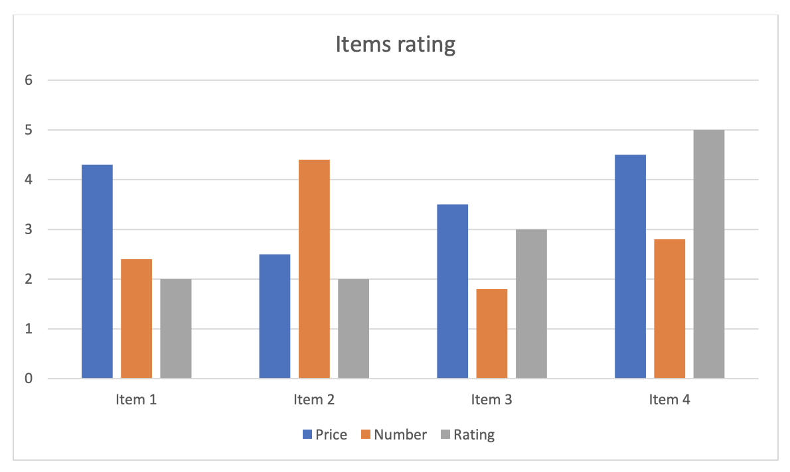
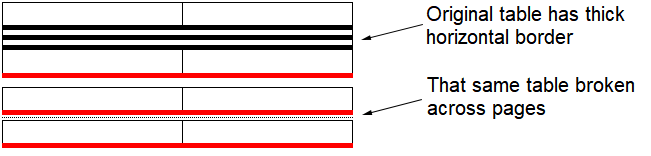

---
title: Converting to Fixed-page Format in Python
articleTitle: Converting to Fixed-page Format
linktitle: Converting to Fixed-page Format
description: "Aspose.Words for Python via .NET implements its own page layout engine to describe the geometry and position of objects on document pages. This allows you to save documents to PDF, XPS, HTML, XAML, PostScript, and PCL formats."
type: docs
weight: 10
url: /python-net/converting-to-fixed-page-format/
aliases: [/python/converting-to-fixed-page-format/]
---

Aspose.Words implements its own page layout engine. Prior to delving into its specifications, it is worthwhile to first discuss document at a high level. When thinking about a document, users typically imagine a number of paper sheets containing words, images, tables, and charts. Documents can be of various types, such as text, spreadsheets, slides, CAD drawings, flowcharts, and, therefore, can have essentially different layouts. Most applications allow sending documents to a printer; this is when a user can actually view the document’s final intended appearance.

## Displaying a Document in Various Applications

Various document viewing or publishing applications allow users to open (Adobe Acrobat, XPS Viewer), and sometimes edit (Adobe InDesign) documents of specific formats. These applications typically produce so-called "fixed-page" format documents. Such a document format describes precisely where a document’s content is placed on every page. Internally, the PDF or XPS format contains a description of every page, as well as drawing instructions, specifying the layout of the content on the page. This is similar to image formats, describing where the content is shown either in raster or vector form.

In contrast, some text editing applications do not support the viewing of a document’s pages. For instance, Microsoft Notepad supports very few functions other than simply displaying, editing and printing text. The important observation here is that such applications can neither show pages of the document nor tell a user how many of them would be printed, only allowing to view the document content. The document can be saved in plain text format and can be opened by many other applications. Using an application that allows viewing binary content of an arbitrary file one can see what is stored in the document file – it is just plain text, there is nothing else in it.

Slightly more sophisticated text-editing applications, such as Microsoft WordPad, save the document in Rich Text Format (RTF), which supports more formatting functions, such as insertion of images, character formatting, paragraph margins and spacing. However, the RTF format also contains only the document’s content, having no information about pages.

Microsoft Word is the most advanced text-editing application in Windows today. It formats files in the DOCX format, which describes the document’s content flexibly and extensively, allowing users to specify page size, orientation for a document section, and, being a WYSIWYG application even show document pages on the screen. Nevertheless, there is still no information regarding how the document’s content is displayed on pages available in the document file. The document file only describes the content itself, and the relationship of document objects to each other, along with some geometric constraints. As a result, before displaying a document, Microsoft Word computes that information itself. This is where a page layout comes into play.

## What is a Page Layout

A document page layout is a data structure, describing where a particular object is located on pages for all document objects. In addition, since objects have properties that affect their appearance, such as font size, shading or drawing effects, you need to not only know where the object is, but also what area(s) of the page it occupies, and whether it will apply to multiple pages so that other objects do not overlap the same area(s).

Aspose.Words implements page layout functionality internally enabling it to produce all of the fixed page formats, such as PDF, XPS, and various image formats. Without page layout, the information stored in the fixed page document file would not be available and all these formats would not be supported.

The relation between a document and a page layout is quite simple. Whereas a document describes the content, the corresponding page layout describes the geometry of that content. Note, that a page layout cannot exist without a document since there would be no content for computing the geometry, but a document can exist without a page layout. For example, when a DOCX document is converted into an RTF document, it is typically unnecessary to know the geometry, since neither format stores it.

## Creating Page Layout

Creating a page layout can be a costly procedure, both in terms of speed and memory. This is due to several reasons:

- The document may have a large amount of content, which may need to be displayed on thousands of pages. The geometry of every object on every page would need to be described, consuming memory resources.
- The document may have many rules, placing constraints on geometry. Considerable computational time may be spent, ensuring every constraint is satisfied. 
- Some document features, for example, NUMPAGES field, create recursive dependencies for future property values, which are not available at time of computation. This leads to repetitive calculations and adds up in computation time.

Due to the aforementioned reasons, Aspose.Words will create a page layout only when it is necessary. A typical reason for this would be a request to render document pages or to obtain a field value that depends on information available in page layout. A less obvious reason could be exporting a document to HTML. Even though HTML is not a fixed-page format and it does not describe geometry of the content objects, it still supports images. Such images may be in the form of shapes created in Microsoft Word with a text inside them. For example, a chart with axis labels can be exported into HTML as an image, but before this can be done Aspose.Words needs to render that image, and hence needs to know where to display the label. See the chart example below:

### Non-Geometric Properties

In addition to handling geometric information, a page layout is also responsible for calculating colors and border styles. In Microsoft Word, text color can be specified as automatic, implying that the color selection should be based on the shading color of the cell or paragraph, or based on the color of the page, where the text appears.

Page layout computes where the text will appear and what content will be rendered behind it, enabling color calculation. There are other specific calculations performed by the page layout. For instance, a horizontal border in a table depends on whether a table row is last in a column of text, and whether it is broken across columns. If a row is rendered last in a column, the bottom border is used instead of horizontal.

In Aspose.Words, a user can request whether to build a new page layout, or update an existing one. Both of these can be performed by the **update_page_layout** method, provided by the **Document** class. If a page layout does not exist, but there is need for it (for example, when the document is exported to a fixed-page format), Aspose.Words will automatically call this method. However, if a page layout does already exist, Aspose.Words will use the existing one, in order to avoid consuming the resources necessary to update it. In this case, the user needs to call the **update_page_layout** method, in order to ensure that the page layout is up to date with the document model.

### Dynamic Structure

The process of creation of page layout comprises of the following steps:

- *Conversion* – enumerating content of the document model and preparing corresponding layout objects.
- *Build* – arranging layout objects to represent content of the document on pages.
- *Reflow* – updating objects arrangement to satisfy geometry constraints.
- *Projecting layout objects into fixed page presentation and finalizing color information*.
- *Building and reflowing of shape content* – a step required if document contains shapes with nested text content.

Note, that the page layout is a dynamic structure, which can be partially rebuilt. This is especially needed when it is impossible to calculate field values without rebuilding the document layout structure. The field can reference the location of an object on a page, and at the same time the field value itself is also rendered on the page, affecting the location of the referenced object. A page layout cannot be built in one go, because field values may not yet be available at the time of positioning on a page.

Consider the typical scenario when the NUMPAGES field appears in the footer of the first page in the document. The value of this field is the total number of pages. In order to position the field on a page, its value should be known. If only the first page is being currently built then the total number of pages is not yet known. In this case, the page layout has to use the default value and later come back to that field and change its value according to actual computations. However, changing the field value may affect other document content on a page and ultimately cause a new page to be appended or an existing page removed, thus making the computed value outdated. This issue can be solved by making it possible to update the existing page layout.

When creating a layout, it is also possible to set up **LayoutOptions** properties that affect the output of the document on pages.

## Saving to Fixed-page Format

After the page layout is built and the geometry of objects and their position on the page are calculated, the document can be saved in a fixed-page format supported by Aspose.Words. When saving documents to fixed-page formats, the rendering options common to all of these formats can be used. They allow to control:

- The number and range of pages contained in the output document (**page_index**, **page_count**).
- A set of characters that are used to numbers rendering (**numeral_format**).
- A metafile player (**metafile_rendering_options**). For more details, see the ["Handling Windows Metafiles"](/words/python-net/handling-windows-metafiles/) article.
- A quality rate for recompressing JPEG images, the value of which may differ slightly, depending on the selected save format (**jpeg_quality**).
- Optimization of vector graphics in Aspose.Words output (**optimize_output**).
- Graphics options when saving to Tiff, Png, Bmp, Jpeg, Emf formats (**use_anti_aliasing**, **use_high_quality_rendering**).
- Saving the document in grayscale (**color_mode**).
- Switching between rendering of DrawingML shapes and fallback shapes (**dml_rendering_mode**).
- Switching between DML effects rendering modes (**dml_effects_rendering_mode**).

The example below demonstrates how to save a document to JPEG format using the Save method and rendering options:


# Open the document
doc = aw.Document(docs_base.my_dir + "Rendering.docx")
# Save as a JPEG image file with default options
doc.save(docs_base.artifacts_dir + "Rendering.JpegDefaultOptions.jpg")

# Save document to stream as a JPEG with default options
docStream = io.BytesIO()
doc.save(docStream, aw.SaveFormat.JPEG)
# Rewind the stream position back to the beginning, ready for use
docStream.seek(0)

# Save document to a JPEG image with specified options.
# Render the third page only and set the JPEG quality to 80%
# In this case we need to pass the desired SaveFormat to the ImageSaveOptions constructor 
# to signal what type of image to save as.
imageOptions = aw.saving.ImageSaveOptions(aw.SaveFormat.JPEG)
imageOptions.page_index = 2
imageOptions.page_count = 1
imageOptions.jpeg_quality = 80
doc.save(docs_base.artifacts_dir + "Rendering.JpegCustomOptions.jpg", imageOptions)

