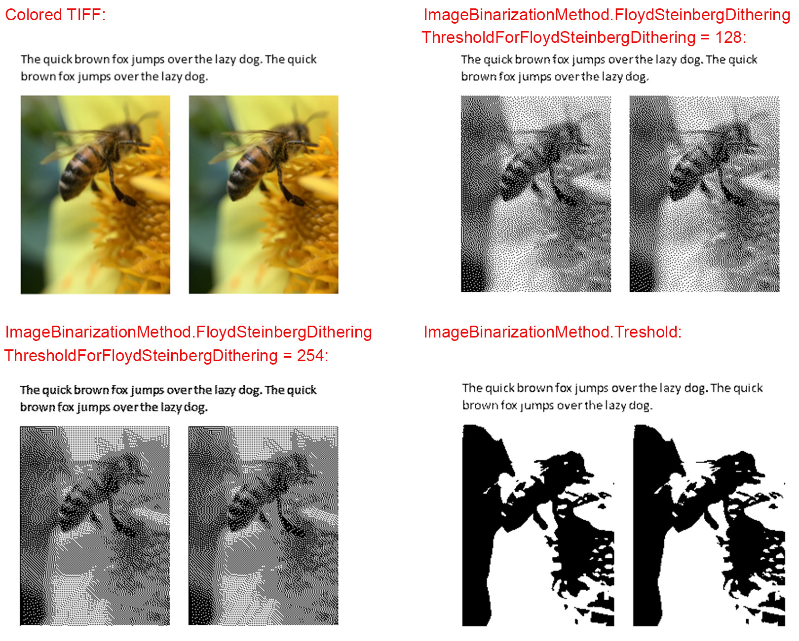

When working with documents, you often need to convert your document to a raster image file(s). This is especially relevant if you have to present your document in a readable and printable, but not editable format. For example, you can use a raster image of the first page of your document as a preview. This article describes how to convert a document to a raster image using the example of the TIFF format – one of the more popular image formats.

## Converting DOC to Multi-Page TIFF

In Aspose.Words, conversion from DOC to TIFF can be performed with one line of code, by simply passing the “save to” path and the relevant file extension to the **save** method. The **save** method automatically derives the **SaveFormat** from the file name extension specified in the path. The following example demonstrates how to convert a document to the TIFF format:



## Specifying Additional Options When Rendering TIFF

You often need to specify additional options, which affect the rendering result. For this purpose, use the **ImageSaveOptions** class, which contains properties that determine how the document is displayed on the image. You can specify the following:

- Save format to determine the list of available options (**save_format**)
- Resolution (**horizontal_resolution**, **vertical_resolution**, **resolution**)
- Number of pages (**page_index**, **page_count**)
- Color and lighting settings (**paper_color**, **image_color_mode**, **image_brightness**, **image_contrast**)
- Image quality (**jpeg_quality**, **scale**, **tiff_compression**, **graphics_quality_options**)
- Method used to binarize the image (**tiff_binarization_method**, **threshold_for_floyd_steinberg_dithering**)
- Pixel format for generated images (**pixel_format**)
- Windows metafiles handling by Aspose.Words (**metafile_rendering_options**, **use_gdi_emf_renderer**)
- Additional options that you can see in the **ImageSaveOptions** class

The following example shows how to convert DOC to TIFF with configured options:



## Threshold for TIFF Binarization

A TIFF image can be saved in 1bpp b/w format by setting the **pixel_format** property to **FORMAT1BPP_INDEXED** pixel format type, and the **tiff_compression** property to either **CCITT3** or **CCITT4**.

For image segmentation, Aspose.Words uses the simplest method — thresholding. This method converts a gray-scale TIFF image into a binary image, using a threshold value. Therefore, when a document needs to be converted to the TIFF file format, it is possible to get or set the threshold for TIFF binarization via the **threshold_for_floyd_steinberg_dithering** property. The default value for this property is set to 128, and the higher this value, the darker the image.

The following example shows how to perform TIFF binarization with a specified threshold:



Below you can compare images on which TIFF binarization was performed at various threshold values:

