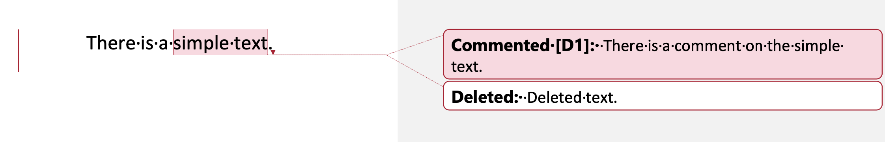

Aspose.Words enables you to create output documents with various layouts, depending on the parameters specified in properties of the **LayoutOptions** class. Some of these properties resemble some of the Microsoft Word user interface menu options – they will be described in this article.

For a complete list of parameters such as **continuous_section_page_numbering_restart** to calculate page numbers in a continuous section that restarts page numbering, or **ignore_printer_metrics** to ignore the "Use printer metrics to lay out document" compatibility option, see the **LayoutOptions** class page.

## Formatting Marks

Aspose.Words allows to manage formatting marks using the following properties:

- **show_hidden_text** – a Boolean value, which specifies whether the hidden text is rendered.
- **show_paragraph_marks** – a Boolean value, which specifies whether paragraph mark characters are rendered.

The page depicted in the example below contains three paragraphs. The second one is hidden. A user can change the **show_hidden_text** option to display this hidden text on the page. Also, each paragraph has a paragraph mark at the end. The paragraph mark usually is not visible unless the **show_paragraph_marks** property is set to render it.

In Microsoft Word, these parameters are set using the "File → Options → Display" dialog box as follows:

## Comments and Revisions

With Aspose.Words, you can render document comments that will look the same as in Microsoft Word. To specify whether comments are rendered, use the **show_comments** property.

In Microsoft Word, this parameter is set using the "Track Changes Options" dialog box, as shown below:

Also, Aspose.Words allows you to display revisions in a document. Use the **revision_options** property of the **LayoutOptions** class to define whether the document revisions are displayed. To control their appearance (revision highlighting color, revision bar color, etc.), use the **RevisonOptions** class.

You can also have revisions displayed as comments to the content. For this purpose, use the **comment_display_mode** property and **show_in_balloons** value.

The following code example shows how to customize revisions display:



The image below shows how Aspose.Words renders comments and the Delete revisions:

