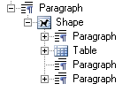
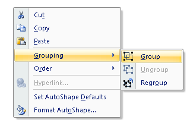
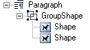

---
title: Rendering Shapes Separately from a Document – Aspose.Words for Python via .NET
articleTitle: Rendering Shapes Separately from a Document
linktitle: Rendering Shapes Separately from a Document
description: "Aspose.Words for Python via .NET provides the ability to extract various graphic objects, such as images, text box containing paragraphs, or arrow shapes, when processing a document, and export them to an external location."
type: docs
weight: 40
url: /python-net/rendering-shapes-separately-from-a-document/
aliases: [/python/rendering-shapes-separately-from-a-document/]
---

When processing documents, a common task is to extract all images found in the document and export them to an external location. This task becomes simple with the Aspose.Words API, which already provides the functionality for extracting and saving image data. However, sometimes you may want to similarly extract other types of graphic content that is represented by a different type of drawing object, for example, a text box containing paragraphs, arrow shapes, and a small image. There is no straightforward way of rendering this object since it is a combination of individual content elements. You may also encounter a case when the contents have been grouped together into the object that looks like a single image.

Aspose.Words provides functionality for extracting this type of content in the same way you can extract a simple image from a shape as rendered content. This article describes how to utilize this functionality to render shapes independently of the document.

## Shape Types in Aspose.Words

All the content in a document drawing layer is represented by the **Shape** or **GroupShape** node in the Aspose.Words Document Object Module (DOM). Such contents can be text boxes, images, AutoShapes, OLE objects, etc. Some fields are also imported as shapes, for example, the INCLUDEPICTURE field.

A simple image is represented by a **Shape** node of **ShapeType.IMAGE**. This shape node has no child nodes but the image data contained within this shape node can be accessed by the **Shape.image_data** property. On the other hand, a shape can also be made up of many child nodes. For instance, a text box shape, which is represented by the **ShapeType.TEXT_BOX** property, can be made up of many nodes, such as **Paragraph** and **Table**. Most shapes can include the **Paragraph** and **Table** block-level nodes. These are the same nodes as those appearing in the main body. Shapes are always parts of some paragraph, either included directly inline or anchored to the **Paragraph,** but “floating” anywhere in the document page.

A document can also contain shapes which are grouped together. Grouping can be enabled in Microsoft Word by selecting multiple objects and clicking “Group” in the right-click menu.

In Aspose.Words, these groups of shapes are represented by the **GroupShape** node. These can also be invoked in the same way to render the entire group to image.

The DOCX format can contain special types of images, such as diagrams or charts. These shapes are also represented through the **Shape** node in Aspose.Words, which also provides a similar method for rendering them as images. By design, a shape cannot contain another shape as a child, unless that shape is an image (**ShapeType.IMAGE**). For example, Microsoft Word does not allow you to insert a text box inside another text box.

The shape types described above provide a special method to render the shapes through the **ShapeRenderer** class. An instance of the **ShapeRenderer** class is retrieved for a **Shape** or **GroupShape** through the **get_shape_renderer** method or by passing the **Shape** to the constructor of the **ShapeRenderer** class. This class provides access to members, which allow rendering a shape to the following:

- File on the disk
- Stream

{} 

When rendering a **Shape**, it must be a part of the document hierarchy. If the **Shape** is not a part of the document tree then the rendered output will be blank after invoking **ShapeRenderer** methods.

{} 

## Rendering to File or Stream

The **save** method provides overloads that render a shape directly to a file or stream. Both overloads accept an instance of the **ImageSaveOptions** class, which allows to define options for rendering the shape. This works in the same way as the **Document.save** method. Even though this parameter is required, you can pass a null value, specifying that there are no custom options.

The shape can be exported in any image format specified in the **SaveFormat** enumeration. For example, the image can be rendered as a raster image, such as JPEG by specifying the **SaveFormat.JPEG** enumeration, or as a vector image, such as EMF by specifying the **SaveFormat.EMF**.

The code example below illustrates rendering a shape to an EMF image separately from document, and saving to disk:


r = shape.get_shape_renderer()

# Define custom options which control how the image is rendered. Render the shape to the JPEG raster format.
imageOptions = aw.saving.ImageSaveOptions(aw.SaveFormat.EMF)
imageOptions.scale = 1.5
        
# Save the rendered image to disk.
r.save(docs_base.artifacts_dir + "TestFile.RenderToDisk_out.emf", imageOptions)


The code example below illustrates rendering a shape to a JPEG image separately from document, and saving to a stream:


r = shape.get_shape_renderer()

# Define custom options which control how the image is rendered. Render the shape to the vector format EMF.
imageOptions = aw.saving.ImageSaveOptions(aw.SaveFormat.JPEG)
        
# Output the image in gray scale
imageOptions.image_color_mode = aw.saving.ImageColorMode.GRAYSCALE

# Reduce the brightness a bit (default is 0.5f).
imageOptions.image_brightness = 0.45
        
stream =  io.FileIO(docs_base.artifacts_dir + "TestFile.RenderToStream_out.jpg", "w+b")

# Save the rendered image to the stream using different options.
r.save(stream, imageOptions)

# Close the stream
stream.close()


The **ImageSaveOptions** class allows you to specify a variety of options that control how the image is rendered. The functionality described above can be applied in the same manner to the **GroupShape** and **Shape** nodes.

## Rendering a Shape Image

The **Shape** class represents objects in the drawing layer, such as an AutoShape, text box, freeform, OLE object, ActiveX control, or a picture. Using the **Shape** class, you can create or modify shapes in a Microsoft Word document. An important property of a shape is its **shape_type**. Shapes of different types can have different capabilities in a Word document. For example, only image and OLE shapes can have images inside them while most of the shapes can have text only.

The following example shows how to render a Shape image to a JPEG image separately from the document and save it to the disk:


# Save the rendered image to disk.
shape.get_shape_renderer().save(docs_base.artifacts_dir + "TestFile.RenderShapeImage.jpeg", None)


## Retrieving a Shape Size

The **ShapeRenderer** class also provides functionality to retrieve the size of the shape in pixels through the **get_size_in_pixels** method. This method accepts two float (Single) parameters – the scale and DPI, which are used in calculation of the shape size when the shape is rendered. The method returns the **Size** object, which contains the width and height of the calculated size. This is useful when it is required to know the size of the rendered shape in advance. The **size_in_points** property returns the Shape size measured in points. The result is a **SizeF** object containing the width and height. Also you can use **bounds_in_points** property to get actual bounds of the shape.



