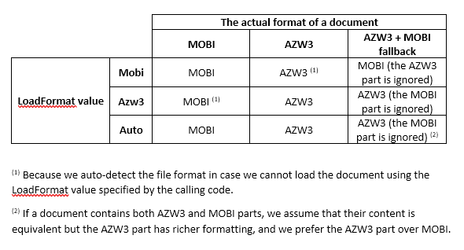

{}

This page contains release notes for [Aspose.Words for Python via .NET](https://pypi.org/project/aspose-words/22.3.0/).

{}

## Major Features

There are 355 improvements and fixes in this release. The most notable are:

- Added saving to PDF 2.0 and several other improvements in PDF output.
- Improved DML chart axis scaling algorithm.
- Improved table comparing algorithm.
- Provided comments syntax in LINQ Reporting.
- AZW3 format (KF8 is another name of the format) is now supported for loading.
- Added an ability to get custom field data which is associated with the field.
- Provided an ability to convert Shapes to SVG images upon export to HTML, MHTML or EPUB.
- Improved rendering of operators in MathML formulas.
- Introduced a new option to control conflicting styles behavior upon import.
- Provided dynamic text color setting using LINQ Reporting Engine.
- Introduced an ability to get OOXML of content control.
- Implemented loading previously saved font search cache to speed up the font cache initialization process upon rendering.
- Added recognition of non-standard footnotes in PDF documents during the import workflow.
- Implemented support for 'Allow Latin text to wrap in the middle of a word' feature.

## Full List of Issues Covering all Changes in this Release (Reported by .NET Users)

|Key|Summary|Category|
| :- | :- | :- |
| WORDSNET-1506 | Add feature to set image as background of TextBox | New Feature |
| WORDSNET-5101 | Support AES encryption algorithms | New Feature |
| WORDSNET-6614 | Support of PdfCompliance PDF/UA | New Feature |
| WORDSNET-9675 | Layout of the document is incorrect:   paragraph justify and table grids | New Feature |
| WORDSNET-11377 | DOCX to PDF conversion issue with table rendering | New Feature |
| WORDSNET-11575 | Add option to stop Document.Save method after specific time | New Feature |
| WORDSNET-12792 | Add feature to set Fill.ImageBytes | New Feature |
| WORDSNET-14614 | Improve TOC style and page numbers | New Feature |
| WORDSNET-16357 | Implement ability to replace shape background image | New Feature |
| WORDSNET-18739 | Gather data about gradient fills | New Feature |
| WORDSNET-18936 | Implement performance logger | New Feature |
| WORDSNET-19268 | Incorrect behavior of KeepSourceFormatting ImportFormatMode | New Feature |
| WORDSNET-20127 | Inconsistent behavior with dynamic columns and horizontal merge | New Feature |
| WORDSNET-20128 | Inconsistent behavior with dynamic columns and horizontal merge   (portrait vs landscape) | New Feature |
| WORDSNET-22278 | Add a possibility to cache FontSearchInfos in a file and then load it | New Feature |
| WORDSNET-22409 | Requesting feature to get OOXML of content control | New Feature |
| WORDSNET-22411 | Add support for loading of AZW3 (Kindle KF8) format documents | New Feature |
| WORDSNET-22811 | Implement Fill.SetImage() method | New Feature |
| WORDSNET-22882 | Provide dynamic text color setting using LINQ Reporting Engine | New Feature |
| WORDSNET-22891 | Add loading progress notification for TXT documents | New Feature |
| WORDSNET-22892 | Add loading progress notification upon Markdown loading | New Feature |
| WORDSNET-23235 | Consider adding an html save option to export shapes as SVG. | New Feature |
| WORDSNET-23246 | Provide list style in Aps | New Feature |
| WORDSNET-23250 | Support PDF 2.0 version | New Feature |
| WORDSNET-23319 | Add saving progress notification | New Feature |
| WORDSNET-23414 | Preserve paragraph outline level upon importing tagged PDF document | New Feature |
| WORDSNET-23490 | Provide comments syntax in LINQ Reporting | New Feature |
| WORDSNET-20756 | DOCX to PDF conversion issue with accessibility | Enhancement |
| WORDSNET-22664 | Shape.OleFormat returns null when Excel chart is copied to Word using   Option "Link & Keep Source Formatting" | Enhancement |
| WORDSNET-22692 | Compare document with content control | Enhancement |
| WORDSNET-22884 | Cross-reference not working in Docker after CustomXmlParts property is   set | Enhancement |
| WORDSNET-23223 | Pass a hyperlink ScreenTip from model to Aps | Enhancement |
| WORDSNET-23264 | Improve ConvertTabStops code during conversion from DOCX to fixed page   format | Enhancement |
| WORDSNET-837 | Table layout algorithm does not work for "merged cells" that   are simply wide | Bug |
| WORDSNET-6683 | UpdateTablelayout resizes the cell widths incorrectly | Bug |
| WORDSNET-7379 | Table layout issue on converting DOCM to PDF | Bug |
| WORDSNET-8933 | DOCX to PDF conversion issue with table rendering | Bug |
| WORDSNET-9035 | "Automatically resize to fit contents" table option does not   work during converting to PDF | Bug |
| WORDSNET-9291 | Incorrect SmartArt rendering in output PDF | Bug |
| WORDSNET-9595 | Calling UpdateTableLayout makes table widths incorrect | Bug |
| WORDSNET-10113 | Table width is changed after conversion from DOC to fixed file format | Bug |
| WORDSNET-10721 | A floating table partially renders beyond left/right page margins in PDF | Bug |
| WORDSNET-12200 | Table column widths are not correct in PDF/HTML | Bug |
| WORDSNET-12869 | DOC to XPS conversion issue with image rendering | Bug |
| WORDSNET-13360 | Table's cell contents are wrapped to next line in output PDF | Bug |
| WORDSNET-13803 | Table's width is changed after conversion from DOCX to PDF | Bug |
| WORDSNET-14064 | Table's width is changed after conversion from DOCX to PDF | Bug |
| WORDSNET-14634 | Table's width shrinks when two cells are merged | Bug |
| WORDSNET-14846 | An image and the text are bunched together with no padding in PDF | Bug |
| WORDSNET-15017 | Table and cell width is changed in output Pdf | Bug |
| WORDSNET-15380 | A word splits and renders on two lines | Bug |
| WORDSNET-15755 | Difference in number of pages between Aspose.Words and MS Word generated   PDF | Bug |
| WORDSNET-15766 | Document layout differs from Word | Bug |
| WORDSNET-15845 | Pages with landscape orientation trimmed after PDF rendition | Bug |
| WORDSNET-15846 | The document content corrupted after PDF rendition | Bug |
| WORDSNET-16293 | RTF Documents Comparison Issue with Table Cells | Bug |
| WORDSNET-16375 | Table width is decreased after conversion from DOCX to PDF | Bug |
| WORDSNET-16511 | Path gradient fill of rotated shape is rendered incorrectly | Bug |
| WORDSNET-16918 | Document.Compare generates the incorrect revisions | Bug |
| WORDSNET-17060 | Wrong Table column width in PDF export when mixing millimeter and percent   widths | Bug |
| WORDSNET-17446 | Table column content truncated in generated PDF | Bug |
| WORDSNET-17523 | How to determine maximum value for table border | Bug |
| WORDSNET-18140 | DML fill can not be retrieved and set correctly | Bug |
| WORDSNET-18188 | Documents comparing gives incorrect revisions | Bug |
| WORDSNET-18518 | Table compare bug | Bug |
| WORDSNET-18661 | Imitate MS Word logic of table grid calculation for auto-fit tables with   cells spanning multiple columns | Bug |
| WORDSNET-18696 | Wrong detections of revisions (paragraphs marked deleted) | Bug |
| WORDSNET-18698 | Curved text is not rendered correctly | Bug |
| WORDSNET-18703 | Check the compare produces incorrect revisions | Bug |
| WORDSNET-18786 | Document.PageCount returns incorrect page count | Bug |
| WORDSNET-19048 | Document.Compare produces incorrect revisions | Bug |
| WORDSNET-19160 | OfficeMath renders incorrectly in output EMF | Bug |
| WORDSNET-19395 | Document.PageCount returns incorrect value after saving document | Bug |
| WORDSNET-19692 | Formula converted incorrectly (DOCX to PDF) | Bug |
| WORDSNET-19739 | Incorrect scaling of the horizontal axis after converting to PDF | Bug |
| WORDSNET-20056 | Document comparison result issue if comments are there in document | Bug |
| WORDSNET-20110 | Bangla in Microsoft Equation does not render correctly in PDF | Bug |
| WORDSNET-20192 | Curved lines of SmartArt render are rendered incorrectly in output PDF | Bug |
| WORDSNET-20578 | Table corruption during Word to PDF conversion | Bug |
| WORDSNET-20649 | Document.Compare generates incorrect revision for table's column | Bug |
| WORDSNET-20685 | Content are push down to page after DOCX to PDF conversion | Bug |
| WORDSNET-20686 | Cell Content are rendered on two lines after DOCX to PDF conversion | Bug |
| WORDSNET-20687 | DOCX to PDF conversion issue with Table header | Bug |
| WORDSNET-20705 | Word to PDF conversion issue with Phonetic Guides, resulting in   misaligned text | Bug |
| WORDSNET-20766 | Structure element issues after DOCX to PDF conversion | Bug |
| WORDSNET-20819 | Exception was thrown: Could not create the bitmap with the specified   parameters | Bug |
| WORDSNET-20829 | Table Rows being pushed to previous Pages in PDF | Bug |
| WORDSNET-20830 | Preserve empty page during Word DOCX to PDF Conversion | Bug |
| WORDSNET-20844 | Table layout does not match Word | Bug |
| WORDSNET-21070 | Support Widow/Orphan paragraph rule for the first line in a column when   footnotes balancing | Bug |
| WORDSNET-21129 | Compare Document functionality is not working as expected with tables | Bug |
| WORDSNET-21205 | DOCX to PDF conversion issue with chart rendering | Bug |
| WORDSNET-21384 | Embedded graphs are rendered wrong when saving to PDF | Bug |
| WORDSNET-21416 | Strikethrough formatting in list indent is disappeared after DOCX to PDF   conversion | Bug |
| WORDSNET-21501 | Incorrect rendering of complex SVG image when&nbsp; document save as PNG | Bug |
| WORDSNET-21626 | Narrowing of Table columns cause increase in Table heights and an extra   page in PDF | Bug |
| WORDSNET-21918 | Pie chart color is changed in output PDF | Bug |
| WORDSNET-22056 | Unwanted revisions are appeared after re-saving DOC | Bug |
| WORDSNET-22074 | Image logo and text moved toward left side of page in output PDF | Bug |
| WORDSNET-22127 | Heading style attributes are not applied | Bug |
| WORDSNET-22192 | DOCX to HTML and Back to DOCX conversion loses the footer page number   alignment | Bug |
| WORDSNET-22198 | Text position is changed after DOCX to PDF conversion | Bug |
| WORDSNET-22406 | System.InvalidOperationException is thrown when DOCX is saved to   HTML | Bug |
| WORDSNET-22424 | Table AutoFit not working While converting From Word To PDF | Bug |
| WORDSNET-22504 | PDF size comparison between .NET framework and .NET Core | Bug |
| WORDSNET-22522 | Table Error\! No text of specified style in document after appending   documents | Bug |
| WORDSNET-22526 | Unwanted styles appear during DOTX to DOCX conversion | Bug |
| WORDSNET-22564 | Comments for Content controls are messed up after clone | Bug |
| WORDSNET-22618 | Percentage Values of a Vertical Axis of Chart are not Preserved | Bug |
| WORDSNET-22645 | Text of Table cell is lost after HTML to DOCX conversion | Bug |
| WORDSNET-22660 | Compile Time error when using Aspose Words for .NET in C++/CLI project | Bug |
| WORDSNET-22671 | Table and image are overlapped after DOCX to PDF conversion | Bug |
| WORDSNET-22682 | After rendering a DML shape gets larger by 1 pixel than its original   image | Bug |
| WORDSNET-22689 | Table cell width increased in Aspose PDF | Bug |
| WORDSNET-22710 | Bad performance of "UpdatePageLayout" | Bug |
| WORDSNET-22723 | Word to PDF Conversion loses space and lines | Bug |
| WORDSNET-22735 | Content are lost after DOCX to PDF conversion | Bug |
| WORDSNET-22743 | Build logical structure for layout graphics | Bug |
| WORDSNET-22780 | Shape is shifted when rendering | Bug |
| WORDSNET-22782 | System.ArgumentOutOfRangeException is raised while exporting into Markdown format | Bug |
| WORDSNET-22791 | Setting mapping creates corrupted output | Bug |
| WORDSNET-22795 | Incorrect rendering of Chinese font | Bug |
| WORDSNET-22804 | Document.Compare throws System.InvalidCastException | Bug |
| WORDSNET-22818 | Text formatting is italicized in the PDF | Bug |
| WORDSNET-22826 | Chart X-Axis are changed after DOCX to PDF Conversion | Bug |
| WORDSNET-22830 | Chart is not rendered correctly after DOCX to PDF conversion | Bug |
| WORDSNET-22839 | Infinite loop in FloaterOverlapResolver due to shape with zero height | Bug |
| WORDSNET-22845 | PDF Accessibility Checker (PAC 3) reports failures upon testing for   PDF/UA compatibility | Bug |
| WORDSNET-22850 | Convert docx to PDF radar chart missing category labels and incorrect scale | Bug |
| WORDSNET-22853 | Image of a DML shape is shifted to the right after rendering | Bug |
| WORDSNET-22854 | Image of a DML shape is shifted to the top left after rendering | Bug |
| WORDSNET-22859 | Image disappears when render document to PDF with SkiaSharp 2.80.3 | Bug |
| WORDSNET-22874 | WML to PDF conversion issue with hyperlink | Bug |
| WORDSNET-22875 | DOCX to PDF conversion issue with hyperlink | Bug |
| WORDSNET-22876 | Conversion issue with hyperlink upon converting to PDF | Bug |
| WORDSNET-22877 | Unable to set bit depth of output TIFF image | Bug |
| WORDSNET-22881 | RTF to HTML - System.ArgumentNullException | Bug |
| WORDSNET-22883 | Cross-reference not working after removing XML mapping | Bug |
| WORDSNET-22886 | Extra characters are added in output after DOCX to PDF conversion | Bug |
| WORDSNET-22898 | Incorrect table column widths on conversion to PDF | Bug |
| WORDSNET-22899 | Document compare is not working properly | Bug |
| WORDSNET-22903 | Some SVG symbols look distorted | Bug |
| WORDSNET-22906 | Rich text content control is not visible when the SetMapping function is used | Bug |
| WORDSNET-22907 | DrawingML textbox position and text orientation is changed after updating page layout | Bug |
| WORDSNET-22909 | ArgumentNullException is thrown in Linux when render Mhtml | Bug |
| WORDSNET-22916 | Image is lost after DOCX to PDF conversion | Bug |
| WORDSNET-22917 | Opening MHT file encoded quoted-printable hangs indefinitely | Bug |
| WORDSNET-22919 | Word table formatting issue using Customer XML data | Bug |
| WORDSNET-22925 | Math Equation (Shape) does not render correctly in output PDF | Bug |
| WORDSNET-22928 | ArgumentNullException: Value cannot be null. (Parameter 'buffer') with SkiaSharp 20.8.3 in Docker | Bug |
| WORDSNET-22931 | Sigma is rendered as S in EQ Field | Bug |
| WORDSNET-22934 | Missing font fallback settings for the Geometric Shapes Extended Unicode block | Bug |
| WORDSNET-22939 | NullReferenceException while converting DOCX to PDF | Bug |
| WORDSNET-22946 | Incorrect position calculation for East Asian characters in MathTextElement | Bug |
| WORDSNET-22949 | draft2digital.com shows exception for EPUB generated by Aspose.Words | Bug |
| WORDSNET-22954 | Formatting of footnote is changed after re-saving document | Bug |
| WORDSNET-22955 | TOC in document prevents replacements with Range.Replace below the TOC if IgnoreFields = True | Bug |
| WORDSNET-22958 | System.ArgumentNullException with SkiaSharp 20.8.3 in Docker | Bug |
| WORDSNET-22960 | Comment ranges are lost after comparing documents | Bug |
| WORDSNET-22967 | Variables declared in document header when using LINQ are not working in document body | Bug |
| WORDSNET-22968 | System.IO.FileLoadException while loading PDF | Bug |
| WORDSNET-22969 | PDF to DOCX - content is missing | Bug |
| WORDSNET-22970 | PDF to DOCX - extra content added | Bug |
| WORDSNET-22974 | XmlException while saving to FOPC | Bug |
| WORDSNET-22978 | Unexpected behavior of UpdateFields() | Bug |
| WORDSNET-22979 | string.IsNullOrEmpty() method in LINQ template throws an exception | Bug |
| WORDSNET-22980 | FileCorruptedException is thrown upon loading RTF document | Bug |
| WORDSNET-22981 | Image becomes hidden after open/save document | Bug |
| WORDSNET-22988 | DOCX to PDF/a: Empty 'P' tag added to output | Bug |
| WORDSNET-22989 | Document cannot be unprotected with correct password | Bug |
| WORDSNET-23020 | NullReferenceException at CSJ2K's readBox() | Bug |
| WORDSNET-23021 | NullReferenceException at CSJ2K's FileBitstreamReaderAgent..ctor | Bug |
| WORDSNET-23023 | FormatException at PdfTokenParser.EnterHexStringState | Bug |
| WORDSNET-23026 | InvalidOperationException: Encrypt element in the trailer dictionary must   also be dictionary | Bug |
| WORDSNET-23027 | NullReferenceException at SASLPrepAlgorithm.MapCharacters | Bug |
| WORDSNET-23028 | NullReferenceException at CSJ2K's FileFormatReader.readFileFormat | Bug |
| WORDSNET-23029 | NullReferenceException at PdfContext.ProcessCrossReferenceStream | Bug |
| WORDSNET-23034 | InvalidOperationException: Unexpected nested BT operator | Bug |
| WORDSNET-23036 | IndexOutOfRangeException at PdfUnfilteredStream.ApplyFilters | Bug |
| WORDSNET-23037 | IndexOutOfRangeException at JBig2Decoder.JBIG2Bitmap.DuplicateRow | Bug |
| WORDSNET-23041 | Wrong letters order for RTL text (Persian OCR) | Bug |
| WORDSNET-23044 | Fix row detection issues on OCR Table.png | Bug |
| WORDSNET-23047 | NotImplementedException: Security handler is not implemented for V=5, R=6 | Bug |
| WORDSNET-23048 | Text was skipped because of incorrect ClippingBounds calculation | Bug |
| WORDSNET-23049 | Too big font size when notes are written on the page borders | Bug |
| WORDSNET-23050 | NullReferenceException when a PDF file has empty cross-reference stream | Bug |
| WORDSNET-23051 | DivideByZeroException in TextCorrectionService if language is incorrect | Bug |
| WORDSNET-23060 | Duplicated letters in words after the conversion | Bug |
| WORDSNET-23061 | NullReferenceException at TableOfContentsTabStorage.NumberIsIncreasing | Bug |
| WORDSNET-23062 | InvalidOperationException: Subtype must be present in a Font resource | Bug |
| WORDSNET-23065 | InvalidOperationException: Pdf corrupted | Bug |
| WORDSNET-23139 | System.InvalidOperationException: Collection was modified | Bug |
| WORDSNET-23140 | InvalidOperationException: Footnotes are only allowed inside the main text of the document | Bug |
| WORDSNET-23150 | Rotated PathGradient shapes inside group are rendered incorrectly | Bug |
| WORDSNET-23151 | Wrong date format in chart after converting DOCX to PDF | Bug |
| WORDSNET-23157 | OutOfMemoryException is thrown upon updating fields | Bug |
| WORDSNET-23158 | FileCorruptedException is thrown while loading DOC | Bug |
| WORDSNET-23161 | DllNotFoundException occurs when use HarfBuzzTextShaperFactory in .NET   6.0 | Bug |
| WORDSNET-23165 | Text of Field's code part is exported into Markdown format | Bug |
| WORDSNET-23171 | System.StackOverflowException is thrown while loading RTF | Bug |
| WORDSNET-23173 | The shape is changed while exporting from DOCX to PDF, DOC or RTF | Bug |
| WORDSNET-23175 | IndexOutOfRangeException in PdfSyntaxParser.ParseArray | Bug |
| WORDSNET-23177 | NullReferenceException if page resources are missing | Bug |
| WORDSNET-23178 | InvalidOperationException: End of stream while reading literal string | Bug |
| WORDSNET-23179 | NullReferenceException at FootnoteDetector.AddSegmentToFootnotes | Bug |
| WORDSNET-23180 | Section breaks are changed after inserting document | Bug |
| WORDSNET-23184 | Opening HTM file hangs indefinitely | Bug |
| WORDSNET-23185 | Lost table while convert from PDF to MD | Bug |
| WORDSNET-23187 | FileCorruptedException is thrown while loading document | Bug |
| WORDSNET-23189 | FormatException at TimeSpanFormat.FormatCustomized | Bug |
| WORDSNET-23190 | KeyNotFoundException: MediaBox was not present in the dictionary | Bug |
| WORDSNET-23191 | KeyNotFoundException: Dictionary doesn't contain "S" entry | Bug |
| WORDSNET-23192 | KeyNotFoundException in RomanNumber.TryParse | Bug |
| WORDSNET-23193 | InvalidCastException: Cannot cast PdfDictionary to PdfArray | Bug |
| WORDSNET-23194 | Saving RTF file hangs indefinitely | Bug |
| WORDSNET-23196 | Tables overlap after rendering document | Bug |
| WORDSNET-23199 | InvalidOperationException: Cannot read AES initialization vector | Bug |
| WORDSNET-23202 | InvalidOperationException in CffReader.ReadOffsets | Bug |
| WORDSNET-23203 | NullReferenceException at PdfOperatorTj.Apply | Bug |
| WORDSNET-23204 | Incorrect text with black background after the conversion | Bug |
| WORDSNET-23205 | InvalidOperationException: Page content invalid at PdfPage.get_Contents() | Bug |
| WORDSNET-23206 | Incorrect text of the legend items of the PieChart | Bug |
| WORDSNET-23207 | InvalidOperationException at PdfStream.ToByteArray | Bug |
| WORDSNET-23209 | Revision.Accept fails for a specific document | Bug |
| WORDSNET-23211 | Setting mapping creates corrupted table | Bug |
| WORDSNET-23212 | IndexOutOfRangeException at ColorSpaceDeviceRGB.ToRgb | Bug |
| WORDSNET-23213 | The end-of-cell marker has been removed from the new row | Bug |
| WORDSNET-23214 | Table is rendered improperly | Bug |
| WORDSNET-23220 | The paragraph is missing when using WordOpenXML | Bug |
| WORDSNET-23221 | Incorrect result of PdfFlateDecodeFilter | Bug |
| WORDSNET-23224 | Process hangs when calling UpdateFields method | Bug |
| WORDSNET-23226 | Incorrect size and position of the minus sign | Bug |
| WORDSNET-23227 | Support xlink:href during import HTML with SVG image | Bug |
| WORDSNET-23229 | Fix minor rendering issue | Bug |
| WORDSNET-23231 | Shape.Id is duplicated for watermarks inserted by Aspose.Words | Bug |
| WORDSNET-23232 | NullReferenceException on cloning | Bug |
| WORDSNET-23233 | File can no be re-saved | Bug |
| WORDSNET-23234 | NullReferenceException while re-saving document | Bug |
| WORDSNET-23236 | Fix accuracy tests keeping failing | Bug |
| WORDSNET-23237 | RTF to DOCX - PUA characters treated as symbols instead of text | Bug |
| WORDSNET-23238 | Missing some contents after converting PDF to DOCX | Bug |
| WORDSNET-23244 | Improve single-path frame DML WordArt rendering | Bug |
| WORDSNET-23252 | Font is changed after open/save DOCX | Bug |
| WORDSNET-23256 | DOCX to PDF conversion issue with page number rendering in footer | Bug |
| WORDSNET-23257 | ODT to DOC: output is different from MS Word | Bug |
| WORDSNET-23258 | IReplacingCallback is called before processing FindWholeWordsOnly option | Bug |
| WORDSNET-23259 | Consider keeping support of deprecated PDF-A1 | Bug |
| WORDSNET-23262 | Repeating table header is rendered improperly | Bug |
| WORDSNET-23265 | PDF import takes a lot of time | Bug |
| WORDSNET-23269 | Remove obsolete property LayoutOptions.ShowComments | Bug |
| WORDSNET-23270 | WordArt glyphs are rendered with an extra outline | Bug |
| WORDSNET-23272 | Add ListNumbering attribute to the PDF logical structure | Bug |
| WORDSNET-23274 | Paragraph space after is changed in diagram after open/save DOCX document | Bug |
| WORDSNET-23281 | Footnote paragraphs are broken | Bug |
| WORDSNET-23283 | StackOverflowException is thrown upon loading DOCX document. | Bug |
| WORDSNET-23284 | The end-of-cell marker has been removed and revisions have changed when   creating custom XML | Bug |
| WORDSNET-23287 | Aspose.Words produces invalid document after DOCX to DOCX to DOCM   conversion | Bug |
| WORDSNET-23292 | An error "Alternative description missing for an annotation" in   PDF/UA document | Bug |
| WORDSNET-23304 | Aspose.Words hangs on document layout | Bug |
| WORDSNET-23307 | Footnote contains original reference name | Bug |
| WORDSNET-23308 | Missing bookmarks in DOCX to PDF conversion | Bug |
| WORDSNET-23309 | Repair OCR in Aspose.Apps project before next website release | Bug |
| WORDSNET-23312 | Some content is pushed to the previous page after converting DOCX to PDF | Bug |
| WORDSNET-23315 | Custom document property cannot be retrieved from the PDF generated by   Aspose.Words | Bug |
| WORDSNET-23318 | Formatting is lost after open/save DOC file | Bug |
| WORDSNET-23327 | HTML markup becomes visible in a document loaded from AZW3 | Bug |
| WORDSNET-23328 | A MOBI document cannot be loaded | Bug |
| WORDSNET-23339 | Oval shape with text is wrapped improperly | Bug |
| WORDSNET-23340 | An exception occurs when open ODT document | Bug |
| WORDSNET-23344 | Consider exporting hyperlink screentip as alternative text to PDF logical   structure | Bug |
| WORDSNET-23347 | Out of memory exception when creating custom XML | Bug |
| WORDSNET-23359 | "The document appears to be corrupted and cannot be loaded."   exception when opening ODT file | Bug |
| WORDSNET-23364 | Text is justified improperly | Bug |
| WORDSNET-23366 | ImportFormatMode.KeepSourceFormatting behaves differently in AW and MS   Word | Bug |
| WORDSNET-23372 | DOCX to RTF conversion throws an InvalidOperationException | Bug |
| WORDSNET-23373 | FileCorruptedException when opening DOC | Bug |
| WORDSNET-23374 | Custom footnote missed while converting from PDF to Word document | Bug |
| WORDSNET-23387 | Alignment of the equation changed after converting a DOCX to PDF | Bug |
| WORDSNET-23392 | No way to apply Style to ApplyFont in FindReplaceOptions | Bug |
| WORDSNET-23398 | MSG to PDF line spacing issue | Bug |
| WORDSNET-23405 | ArgumentException when Load document with SVG image | Bug |
| WORDSNET-23407 | "NC sync failed" occurs upon comparing Docx files with SDT | Bug |
| WORDSNET-23417 | NullReferenceException is thrown when comparing a document | Bug |
| WORDSNET-23418 | "Unexpected subdocument type" when saving to DOC | Bug |
| WORDSNET-23424 | Text is incorrectly wrapped in table cell | Bug |
| WORDSNET-23428 | Range.Replace does not throw RegexMatchTimeoutException | Bug |
| WORDSNET-23433 | Resolving the ranged Sdt without Id | Bug |
| WORDSNET-23436 | Paragraphs indents (in character units) incorrectly calculated when   Document Grid&nbsp; is defined | Bug |
| WORDSNET-23439 | InvalidOperationException: 'Linked list is in invalid state.' upon saving   document to HTML or rendering | Bug |
| WORDSNET-23444 | LayoutEnumerator does not work for textbox | Bug |
| WORDSNET-23452 | Unexpected text next to image after converting RTF to PDF | Bug |
| WORDSNET-23460 | ArgumentException: 'Parameter is not valid.' is thrown upon rendering   document to XPS and FixedHtml | Bug |
| WORDSNET-23469 | Issue with Document.ExtractPages(..) | Bug |
| WORDSNET-23471 | FileCorruptedException is thrown upon loading RTF document | Bug |
| WORDSNET-23472 | NullReferenceException at GetBorders | Bug |
| WORDSNET-23478 | Some characters are retrieved incorrectly | Bug |
| WORDSNET-23487 | XmlException: 'w16sdtdh' is an undeclared prefix.&nbsp; Is thrown upon opening DOCX produced by   Aspose.Words | Bug |
| WORDSNET-23488 | Wrong table style is applied to a table after comparison | Bug |
| WORDSNET-23492 | FileFormatUtil.DetectFileFormat() detects some TIFF images as text | Bug |
| WORDSNET-23497 | Table is distorted on PDF import | Bug |
| WORDSNET-23510 | Arabic text inside table cells is too large | Bug |
| WORDSNET-23516 | List labels are displayed as question marks (0xF03F) after conversion   from RTF to another formats | Bug |

## Full List of Issues Covering all Changes in this Release (Reported by Java Users)

|Key|Summary|Category|
| :- | :- | :- |
| WORDSNET-17734 | DOCX to PDF conversion issue with table and images rendering | New Feature |
| WORDSNET-23142 | Support HTML color codes as color values for LINQ Reporting Engine tags | New Feature |
| WORDSNET-23198 | Make FieldData property public | New Feature |
| WORDSNET-23326 | Tables are rendered with incorrect column   widths | New Feature |
| WORDSNET-16282 | Document.Compare generates incorrect revisions for tables | Bug |
| WORDSNET-17015 | DOCX to PDF - incorrect table cell width | Bug |
| WORDSNET-17379 | SmartArt text is rotated in output PDF | Bug |
| WORDSNET-18898 | MODIFY_ANNOTATIONS incorrectly Allows Commenting, Filling of Form Fields   and Signing in PDF | Bug |
| WORDSNET-18902 | Size of SVG images are not displayed correctly | Bug |
| WORDSNET-19422 | HTML to RTF conversion removes blank lines | Bug |
| WORDSNET-19833 | IndexOutOfRangeException is thorwn while saving DOCX to PDF | Bug |
| WORDSNET-20439 | Document.compare performs unexpected comparison | Bug |
| WORDSNET-20449 | Document.Compare generates incorrect revisions | Bug |
| WORDSNET-20549 | More rows rendered on first Page causing lesser total pages in PDF | Bug |
| WORDSNET-20853 | Two Table Rows Created with Insertion and Deletion Revisions after   Comparing Word Documents | Bug |
| WORDSNET-20945 | Document.Compare generates the incorrect output | Bug |
| WORDSNET-21033 | Document.Compare generates the incorrect output | Bug |
| WORDSNET-21082 | Aspose Saved DOCX Converted to PDF Suppresses First Column from Table | Bug |
| WORDSNET-21135 | Different table widths in resultant file | Bug |
| WORDSNET-21328 | Charts rendered incorrect when converted to PDF | Bug |
| WORDSNET-21921 | Number is wrapped to next line in table cell after DOCX to PDF   conversion | Bug |
| WORDSNET-22436 | Font-size incorrectly added to paragraph tag, it should be added to span   instead | Bug |
| WORDSNET-22480 | DOCX to PDF conversion issue with hidden bookmark | Bug |
| WORDSNET-22562 | Document.Compare does not ignore comment | Bug |
| WORDSNET-22670 | Wrong text commented after comparing DOCX files | Bug |
| WORDSNET-22779 | Document Compare changes the list numbers | Bug |
| WORDSNET-22785 | Elements overlap when converting DOC to PDF with Java | Bug |
| WORDSNET-22824 | Chart issues when converting DOCX to PDF | Bug |
| WORDSNET-22827 | Table row is pushed down to next page in output PDF | Bug |
| WORDSNET-22862 | Chart conversion issue upon converting to PDF | Bug |
| WORDSNET-22895 | Insert SVG with special characters in Text fails to render in output DOCX   and PDF | Bug |
| WORDSNET-22922 | Exporting highlighted paragraphs to PDF | Bug |
| WORDSNET-22923 | DOCX to PDF: Differences in generated   output files | Bug |
| WORDSNET-22926 | NullReferenceException is thrown on updating layout | Bug |
| WORDSNET-22953 | Comparing documents with changes around a table cause the table to be   marked as deleted and re-added | Bug |
| WORDSNET-22956 | Revision.Accept throws System.InvalidOperationException | Bug |
| WORDSNET-22961 | DOCX to HTML conversion throws System.NullReferenceException | Bug |
| WORDSNET-22971 | DOC to PDF conversion issue - new line in wrong place | Bug |
| WORDSNET-22972 | getBoundsWithEffects returns 0 width and 0 height | Bug |
| WORDSNET-22976 | DOCX to PDF: Inserted image has different dimensions | Bug |
| WORDSNET-22977 | IndexOutOfBoundsException when setting alternate text on the shape | Bug |
| WORDSNET-22983 | Blank page is produced in output PDF where hidden content was in the   original document | Bug |
| WORDSNET-23170 | RTF to HTML conversion issue with List labels | Bug |
| WORDSNET-23215 | InvalidCastException is thrown upon loading document | Bug |
| WORDSNET-23253 | Exported PDF contains image with lower resolution | Bug |
| WORDSNET-23278 | Horizontal axis scaling is incorrect upon rendering chart | Bug |
| WORDSNET-23299 | ArgumentException is thrown while inserting document | Bug |
| WORDSNET-23305 | Redundant table format revision is rendered | Bug |
| WORDSNET-23346 | DOCX to PDF missing lines in the chart | Bug |
| WORDSNET-23378 | Content is missed upon rendering document. | Bug |
| WORDSNET-23410 | IndexOutOfRangeException is thrown upon saving document to HTML | Bug |
| WORDSNET-23427 | Content in table cell is slightly overlaps border | Bug |
| WORDSNET-23484 | Bookmark is pointing to wrong page after rendering to PDF | Bug |

## Public API and Backward Incompatible Changes

This section lists public API changes that were introduced in Aspose.Words 22.3. It includes not only new and obsoleted public methods, but also a description of any changes in the behavior behind the scenes in Aspose.Words which may affect existing code. Any behavior introduced that could be seen as regression and modifies the existing behavior is especially important and is documented here.

### Added saving to PDF 2.0 and several other improvements in PDF output

Related issue: WORDSNET-23250

1. New value [PDF20](https://reference.aspose.com/words/python-net/aspose.words.saving/pdfcompliance/#pdf20) added to [PdfCompliance](https://reference.aspose.com/words/python-net/aspose.words.saving/pdfcompliance/) enum

2. Improvements in PDF digital signatures
Changed PDF digital signature type from "adbe.pcks7.sha1" to "adbe.pcks7.detached" to fit all supported PDF versions.
Added [PdfDigitalSignatureHashAlgorithm.RIPE_MD160](https://reference.aspose.com/words/python-net/aspose.words.saving/pdfdigitalsignaturehashalgorithm/#ripe_md160) value.
`PdfDigitalSignatureHashAlgorithm.SHA1` and `PdfDigitalSignatureHashAlgorithm.MD5` values are marked as obsolete.
Default value for [PdfDigitalSignatureDetails.hash_algorithm](https://reference.aspose.com/words/python-net/aspose.words.saving/pdfdigitalsignaturedetails/hash_algorithm/) changed from [PdfDigitalSignatureHashAlgorithm.SHA512](https://reference.aspose.com/words/python-net/aspose.words.saving/pdfdigitalsignaturehashalgorithm/#sha512) to [PdfDigitalSignatureHashAlgorithm.SHA256](https://reference.aspose.com/words/python-net/aspose.words.saving/pdfdigitalsignaturehashalgorithm/#sha256). SHA256 is most popular hashing algorithm, it is strong enough and it is used by default by Adobe Acrobat when signing the document.

3. Improvements in PDF encryption
Removed `PdfEncryptionAlgorithm` enum and `encryption_algorithm` parameter from [PdfEncryptionDetails](https://reference.aspose.com/words/python-net/aspose.words.saving/pdfencryptiondetails/) constructor. This is a breaking change.
Now PDF 1.7 output is encrypted with AES-128 encryption algorithm and PDF 2.0 output with AES-256 algorithm.

4. Several options ([use_core_fonts](https://reference.aspose.com/words/python-net/aspose.words.saving/pdfsaveoptions/use_core_fonts/), [custom_properties_export](https://reference.aspose.com/words/python-net/aspose.words.saving/pdfsaveoptions/custom_properties_export/) in [PdfSaveOptions](https://reference.aspose.com/words/python-net/aspose.words.saving/pdfsaveoptions/) cannot be used when saving PDF 2.0

5. Removed obsolete `PdfCompliance.PDF15` enum value

### Added FieldStart.field_data property

Related issue: WORDSNET-23198

The following public property is added to [FieldStart](https://reference.aspose.com/words/python-net/aspose.words.fields/fieldstart/) class:

@property
def field_data(self) -> bytes:
    """Gets custom field data which is associated with the field."""
    ...


Use Case:

doc = aw.Document(filename)
field = doc.range.fields[0]
print(len(field.start.field_data))


### Added HtmlSaveOptions.save_shapes_as_svg public property

Related issue: WORDSNET-23235

This option controls whether [Shape](https://reference.aspose.com/words/python-net/aspose.words.drawing/shape/) nodes are converted to SVG images when saving to HTML, MHTML or EPUB. 
Default value is `False`.

If this option is set to `True`, [Shape](https://reference.aspose.com/words/python-net/aspose.words.drawing/shape/) nodes are exported as \<svg\> elements.
Otherwise, they are rendered to bitmaps and are exported as \ elements.

Note that this options also affects text boxes, because they are represented by [Shape](https://reference.aspose.com/words/python-net/aspose.words.drawing/shape/) nodes.
As a result, if this option is set to `True`, it overrides the `export_text_box_as_svg` property
value and causes text boxes to be converted to SVG.

Use Case:

doc = aw.Document(filename)
save_options = aw.saving.HtmlSaveOptions()
save_options.export_shapes_as_svg = True
doc.save(output_filename, save_options)


### AZW3 format is now supported for loading

Related issue: WORDSNET-22411

Aspose.Words can now load AZW3 documents (KF8 is another name of the format). Usually, documents in the AZW3 format have the ".azw3" or ".mobi" extension. However, a ".mobi" document may be in the older MOBI format, and some ".mobi" documents contain two versions of content - MOBI and AZW3 - for backward compatibility.

The following table explains what reader Aspose.Words uses to load MOBI and AZW3 documents in different cases:

Currently, Aspose.Words always loads all topics from an AZW3 document in the order in which they appear in the table of contents.

The following publicly visible enum values were added:
- [LoadFormat.AZW3](https://reference.aspose.com/words/python-net/aspose.words/loadformat/#azw3)

The [FileFormatUtil](https://reference.aspose.com/words/python-net/aspose.words/fileformatutil/) class can now be used to determine if a file is an AZW3 document. For example, the following call

info = aw.FileFormatUtil.detect_file_format("book.azw3");


will return an info instance with the [FileFormatInfo.load_format](https://reference.aspose.com/words/python-net/aspose.words/fileformatinfo/load_format/) property set to [LoadFormat.AZW3](https://reference.aspose.com/words/python-net/aspose.words/loadformat/#azw3).

Currently, no load options have effect when loading AZW3 documents. [LoadOptions.resource_loading_callback](https://reference.aspose.com/words/python-net/aspose.words.loading/loadoptions/resource_loading_callback/) is not invoked when loading AZW3 documents, because Aspose.Words expects all referenced resource files to be stored locally in the AZW3 document. Like in the Kindle reader, references to external resource files are ignored.

As a result, the only use cases for loading AZW3 documents that is currently available is the one illustrated below:

doc = aw.Document("book.azw3")


### Breaking change – explicit Table.auto_fit() call may be required to make table structure match the specified cell widths in a builder scenario

A major update that handles tables with incorrect or missing column width data in the source document is released.

Cell/column width data and the number of columns spanned by a cell are re-calculated from table and cell properties. Column width data stored in the document are replaced by re-calculated values.

The algorithm imitates MS Word logic that does not use cell widths. (In fact, cell width is not even stored in .DOCX format used by MS Word).

The new logic may change the output for some document builder scenarios. In the following example the number of columns spanned by the cell in row 2 is no longer calculated automatically from the specified cell widths:

doc = aw.Document()
builder = aw.DocumentBuilder(doc)

# First row
builder.start_table()

cell1 = builder.insert_cell()
cell1.cell_format.width = 100
builder.write("Text in cell 1.")

cell2 = builder.insert_cell()
cell2.cell_format.width = 100
builder.write("Text in cell 2.")

# End of first row
builder.end_row()

# Second row
cell3 = builder.insert_cell()
cell3.cell_format.width = 200
builder.write("Row 2 cell spans 2 columns.")

# End of second row
builder.end_row()
builder.end_table()

doc.update_page_layout()
doc.save("merged_cell.docx")


The behavior was changed because cell width data proved to be unreliable in a number of generated documents.

In order to preserve the specified cell widths in the above scenario and calculate the number of columns spanned by a cell from cell width, Aspose.Words should be explicitly instructed by calling [Table.auto_fit()](https://reference.aspose.com/words/python-net/aspose.words.tables/table/auto_fit/) method:

...
table = builder.end_table()

# Re-calculate table structure from the specified cell widths.
table.auto_fit(aw.tables.AutoFitBehavior.FIXED_COLUMN_WIDTHS)
doc.update_page_layout()
doc.save("merged_cell.docx")


This will also set table layout to fixed, which is better suited for preserving cell widths regardless of contents.

### Removed obsolete property FieldXE.has_page_range_bookmark_name

Removed obsolete property `FieldXE.has_page_range_bookmark_name`. Please, use the [FieldXE.page_range_bookmark_name](https://reference.aspose.com/words/python-net/aspose.words.fields/fieldxe/page_range_bookmark_name/) property instead.

### Added new Chart.source_full_name property

Related issue: WORDSNET-22664

The following public property has been added to the [Chart](https://reference.aspose.com/words/python-net/aspose.words.drawing.charts/chart/) class. If a chart is linked to an external xls/xlsx document, the property returns its file name.

@property
def source_full_name(self) -> str:
    """Gets the path and name of an xls/xlsx file this chart is linked to."""
    ...


Use Case:

doc = aw.Document(filename)
shape = doc.get_child(aw.NodeType.SHAPE, 0, True).as_shape()
print(shape.chart.source_full_name)


### Added new ImportFormatOptions.force_copy_styles property

Related issue: WORDSNET-19268.

[ImportFormatOptions.force_copy_styles](https://reference.aspose.com/words/python-net/aspose.words/importformatoptions/force_copy_styles/) is a boolean value indicating either to copy conflicting styles
in [ImportFormatMode.KEEP_SOURCE_FORMATTING](https://reference.aspose.com/words/python-net/aspose.words/importformatmode/#keep_source_formatting) mode.
The default value is `False`.

By default, if a matching style already exists in a destination document, the source style formatting
is expanded into direct node attributes and the style of this node is reset to a default.

When this option is set to `True`, the source style will be forcibly copied
into destination document with unique name and applied to the imported node.

Note, in this case it is not guaranteed that formatting of the imported node in destination document
will be preserved.

Use Case: Explains how to force import styles in `KEEP_SOURCE_FORMATTING` mode.

# There are MyStyle1 and MyStyle2 in both source and destination document.
# Also there is style MyStyle3 that exists only in source document.
src_doc = aw.Document("Src.docx")
dst_doc = aw.Document("Dst.docx")

options = aw.ImportFormatOptions()
options.force_copy_styles = True
node_importer = aw.NodeImporter(src_doc, dst_doc, aw.ImportFormatMode.KEEP_SOURCE_FORMATTING, options)

print("Imported styles:")
paras = src_doc.first_section.body.paragraphs
for i in range(paras.count):
    imported_para = node_importer.import_node(paras[i], True).as_paragraph()
    print(imported_para.paragraph_format.style_name)

# The code produces the following output:
# Imported styles:
# MyStyle1_0
# MyStyle2_0
# MyStyle3


### Added saving to PDFUA-1

Related issue: WORDSNET-6614

New value [PDF_UA1](https://reference.aspose.com/words/python-net/aspose.words.saving/pdfcompliance/#pdf_ua1) added to [PdfCompliance](https://reference.aspose.com/words/python-net/aspose.words.saving/pdfcompliance/) enum.

The primary purpose of PDF/UA is to define how to represent electronic documents in the PDF format in a
manner that allows the file to be accessible.

### Removed obsolete property LayoutOptions.show_comments

Removes obsolete property `LayoutOptions.show_comments`.

Use [LayoutOptions.comment_display_mode](https://reference.aspose.com/words/python-net/aspose.words.layout/layoutoptions/comment_display_mode/) property instead:

doc = aw.Document("in.docx")
doc.layout_options.comment_display_mode = aw.layout.CommentDisplayMode.SHOW_IN_BALLOONS
doc.save("out.pdf")


### Added new feature to save and load font search cache

Related issue: WORDSNET-22278

Loading previously saved font search cache will speed up the font cache initialization process. It is especially useful when access to font sources is complicated (e.g. when fonts are loaded via network).

To provide this feature following methods and properties has been added:

class FontSettings:

    def save_search_cache(self, output_stream: io.BytesIO):
        """Saves the font search cache to the stream.
        
        :param output_stream: Output stream."""
        ...
     
    def set_fonts_sources(self, sources: List[aw.fonts.FontSourceBase], cache_input_stream: io.BytesIO):
        """Sets the sources where Aspose.Words looks for TrueType fonts and additionally loads previously saved
        font search cache.
    
        Loading previously saved font search cache will speed up the font cache initialization process. It is
        especially useful when access to font sources is complicated (e.g. when fonts are loaded via network).
    
        When saving and loading font search cache, fonts in the provided sources are identified via cache key.
        For the fonts in the SystemFontSource and FolderFontSource cache key is the path
        to the font file. For MemoryFontSource and StreamFontSource cache key is defined
        in the MemoryFontSource.cache_key and StreamFontSource.cache_key properties
        respectively. For the FileFontSource cache key is either FileFontSource.cache_key
        property or a file path if the FileFontSource.cache_key is None.
    
        It is highly recommended to provide the same font sources when loading cache as at the time the cache was saved.
        Any changes in the font sources (e.g. adding new fonts, moving font files or changing the cache key) may lead to the
        inaccurate font resolving by Aspose.Words.
    
        :param sources: An array of sources that contain TrueType fonts.
        :param cache_input_stream: Input stream with saved font search cache.
        """
        ...

 

class FileFontSource:

    def __init__(self, file_path: str, priority: int, cache_key: str):
        """Initializer.
        
        :param file_path: Path to font file.
        :param priority: Font source priority. See the FontSourceBase.priority property description for more information.
        :param cache_key: The key of this source in the cache. See cache_key property description for more information.
        """
        ...
     
    @property
    def cache_key(self) -> str:
        """The key of this source in the cache.
        
        This key is used to identify cache item when saving/loading font search cache with
        FontSettings.save_search_cache() and FontSettings.set_fonts_sources() methods.
    
        If key is not specified then file_path will be used as a key instead.
        """
        ...

 

class MemoryFontSource:

    def __init__(self, font_data: bytes, priority: int, cacheKey: str):
        """Initializer.
        
        :param font_data: Binary font data.
        :param priority: Font source priority. See the FontSourceBase.priority property description for more information.
        :param cache_key: The key of this source in the cache. See cache_key property description for more information.
        """
        ...
     
    @property
    def cache_key(self) -> str:
        """The key of this source in the cache."""
    
        This key is used to identify cache item when saving/loading font search cache with
        FontSettings.save_search_cache() and FontSettings.set_fonts_sources() methods.
        ...


Use Case:

# Prepare font sources and generate font search cache beforehand.
file_source = aw.fonts.FileFontSource(file_path, file_source_priority, file_source_key)
memory_source = aw.fonts.MemoryFontSource(font_data, memory_source_priority, memory_source_key)
settings = aw.fonts.FontSettings()
settings.set_fonts_sources([file_source, memory_source])
settings.save_search_cache(cache_output_stream)

# Set font sources and load search cache before processing documents. Note that sources should be the same as when saving font search cache.
file_source = aw.fonts.FileFontSource(file_path, file_source_priority, file_source_key)
memory_source = aw.fonts.MemoryFontSource(font_data, memory_source_priority, memory_source_key)
settings = aw.fonts.FontSettings()
settings.set_fonts_sources([file_source, memory_source], cache_input_stream)


### Added new public method Fill.set_image

Related issue: WORDSNET-22811

Use Case: Explains how to work with [Fill.set_image](https://reference.aspose.com/words/python-net/aspose.words.drawing/fill/set_image/).

builder = aw.DocumentBuilder()

# Add new rectangle shape.
shape = builder.insert_shape(aw.drawing.ShapeType.RECTANGLE, 80, 80)
# Apply one single image to the shape.
shape.fill.set_image("ShapeBackground.jpg")

builder.document.save("SingleImageDocument.docx")


### Added word_open_xml property for content control nodes

Related issue: WORDSNET-22409

The following member has been added to the [StructuredDocumentTag](https://reference.aspose.com/words/python-net/aspose.words.markup/structureddocumenttag/) and [StructuredDocumentTagRangeStart](https://reference.aspose.com/words/python-net/aspose.words.markup/structureddocumenttagrangestart/) nodes:

@property
def word_open_xml(self) -> str:
    """Gets a string that represents the XML contained within the node in the SaveFormat.FLAT_OPC format."""
    ...


Use Case: 

doc = aw.Document("Test.docx")
sdt = doc.get_child(aw.NodeType.STRUCTURED_DOCUMENT_TAG, 0, True).as_structured_document_tag()
fopc_content = sdt.word_open_xml

