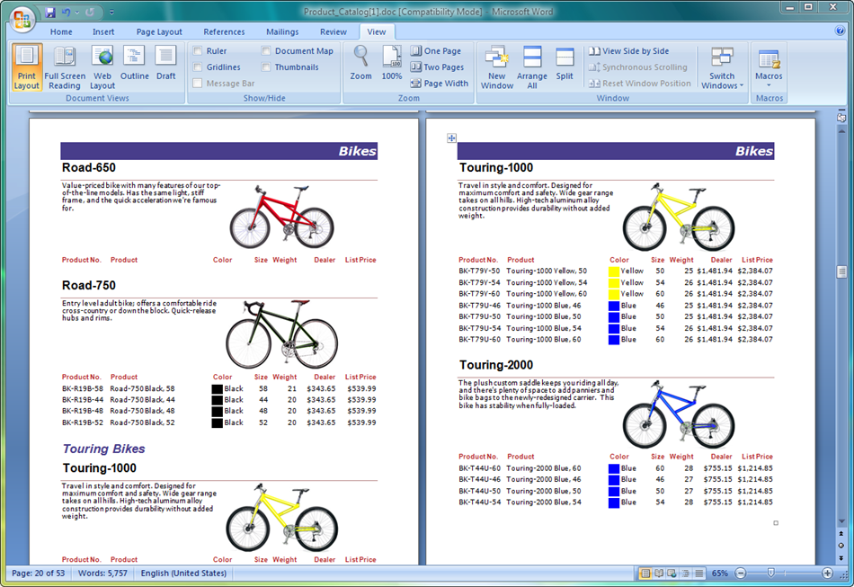

{} 

Aspose.Words for Reporting Services fully supports all of the RDL specification. This has two great advantages:

- **No need to redesign existing reports.** You can export any existing RDL report as a Microsoft Word document and it will appear exactly according to the RDL design.
- **No need to use a specific report designer.** You can use any RDL report designer and the report will be exported exactly the way you’ve designed it.

{} 

Aspose.Words for Reporting Services supports the following RDL elements:

- Page, headers, footers
- Textboxes
- Images
- Charts
- Lists
- Tables
- Matrices
- Tablix (Reporting Services 2008, 2012 and 2014)
- Styles
- Rectangles, lines
- Subreports
- Third-party controls (such as Dundas Chart for Reporting Services)

**A complex report with headers, footers, images, subreports, tables, textboxes, rectangles and lines exported as a Microsoft Word (DOC) document.** 

For more sample reports, see the [Sample Reports Gallery](/words/reportingservices/sample-gallery-html/).
