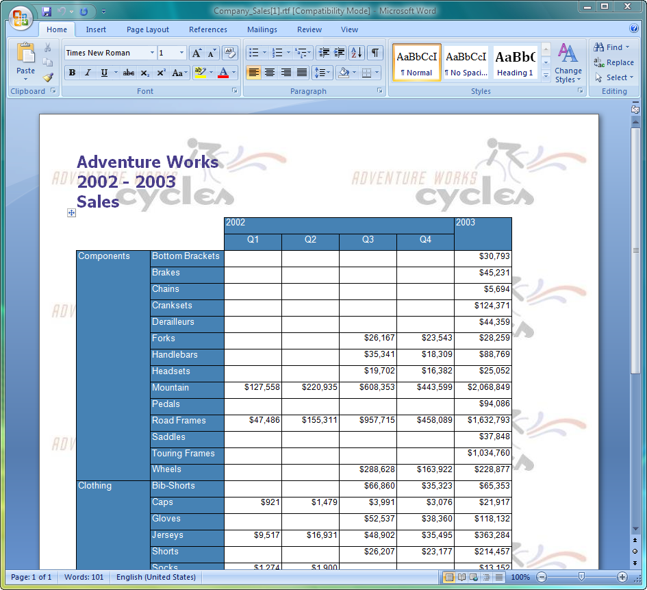
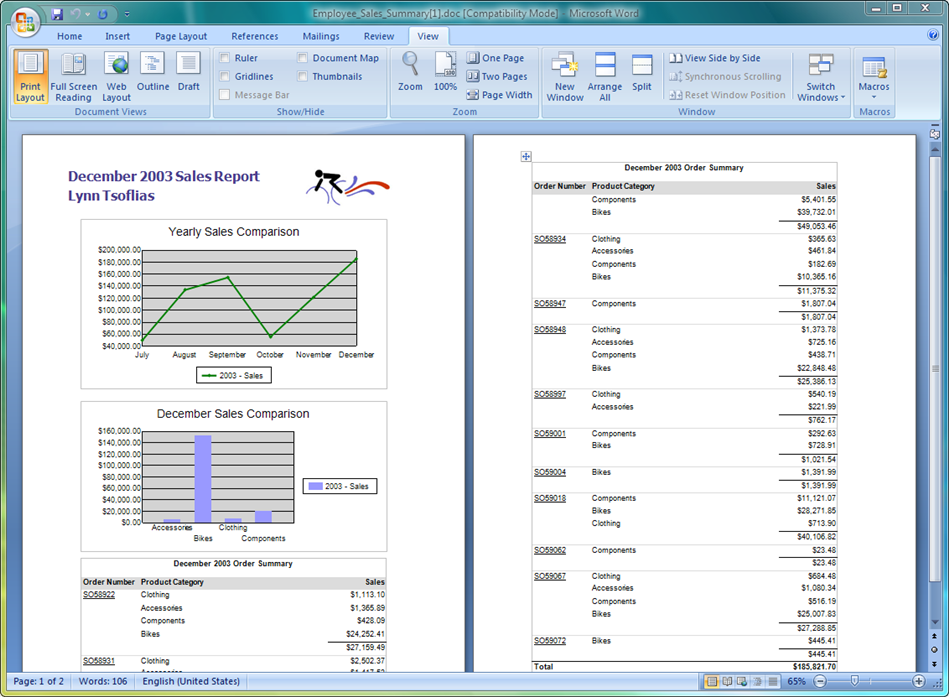
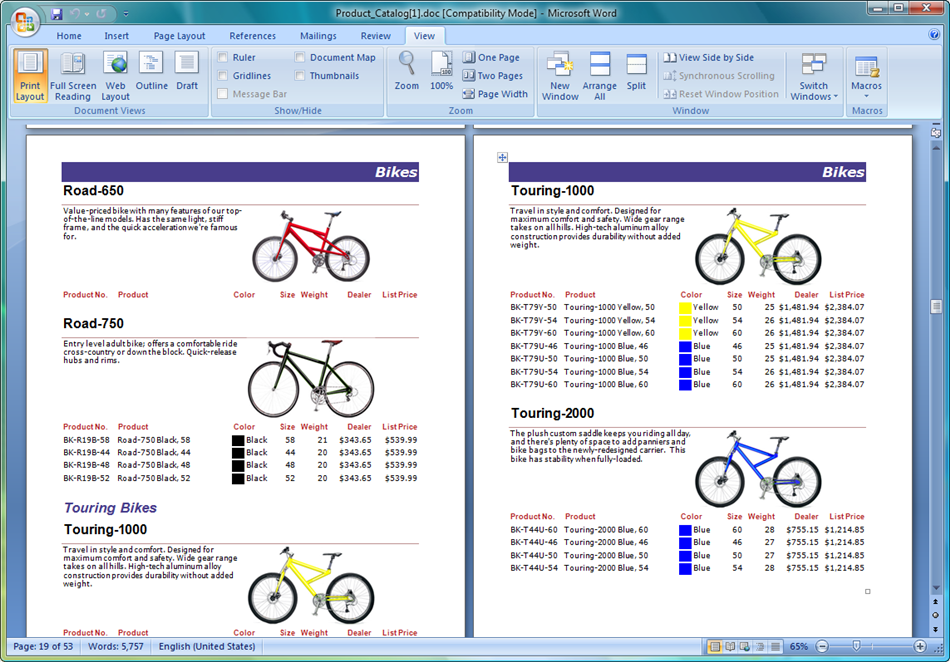

{} 

This gallery demonstrates screenshots of various reports generated by Aspose.Words for Reporting Services.

Most of the reports shown here come from the AdventureWorks database. AdventureWorks is a sample database for Microsoft SQL Server, available for [download from Microsoft](http://www.microsoft.com/en-us/download/details.aspx?id=10679). 

{} 

**Company Sales: RTF, matrix (grows vertically and horizontally), background image.** 

**Employee Sales Summary: DOC, charts, images, textboxes, tables.** 

**Product Catalog: DOC, title page, images, headers, footers, rectangles, lines, subreports.** 

**Product Line Sales: DOC, charts, subreports, images, lists.** 

**Sales Order Detail: WordML, tables, styles, rectangles, textboxes, images.** 

**Third Party Controls: OOXML, textboxes, Dundas Chart for Reporting Services in the report.** 

