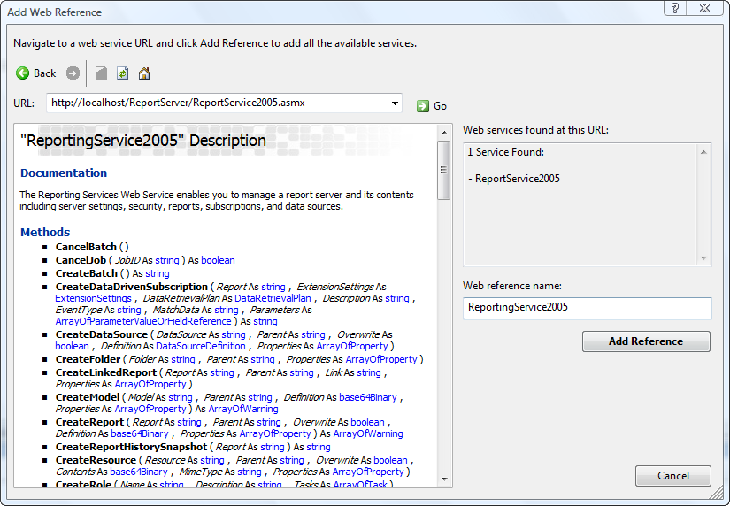
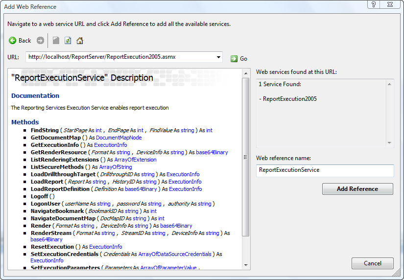

---
title: Rendering Reports Programmatically
second_title: Aspose.Words for Reporting Services
articleTitle: Rendering Reports Programmatically
linktitle: Rendering Reports Programmatically
description: "How to render report without report viewer and report manager interfaces using the Aspose.Words for Reporting Services."
type: docs
weight: 10
url: /reportingservices/rendering-reports-programmatically/
---

{}

Sometimes you need to render reports programmatically instead of using the Report Manager or Report Viewer interface. This might happen, for example, if you need to include report rendering in your application where the user may want to export the report to Microsoft Word document by clicking a button on the form. The following code samples demonstrate how to render reports programmatically in your application.

{}

## Rendering via Reporting Services Web Service

If you have a Report Server running with Aspose.Words for Reporting Services installed on it, you can render reports to Microsoft Word documents using the Reporting Service Web Service. Follow these steps to achieve that (assuming you use Reporting Services 2005):

### Step 1. Add a reference to the ReportingService2005 Web service.

Open your project in Visual Studio, right click on the **References** folder and select **Add Web Reference** . Enter the URL of the **ReportingService2005** Web service ( ReportService2005.asmx) or browse for it using the browser on the left. Once the service is found, enter “ReportingService2005” in the **Web reference name** textbox and click the **Add Reference** button.

**Adding a reference to the ReportingService2005 Web service in Visual Studio.**

### Step 2. Add a reference to the ReportExecutionService Web service.

Repeat Step 1 for the **ReportExecutionService** ( ReportExecution2005.asmx) Web service. Name it ReportExecutionService and click the **Add Reference** button.

**Adding a reference to the ReportExecutionService Web service in Visual Studio.**

### Step 3. Implement the rendering method.

Implement the following method in your application:

**C#**


using System;
using System.IO;
/// 

/// Renders a report located on Report Server to a Microsoft Word document on disk.
/// 

/// <param name="reportName">The name of the report (including path) on Report Server.</param>
/// <param name="fileName">The name of the resulting document (including path) on disk.</param>
/// <param name="format">
/// The export format, should be:
/// "AWDOC" for DOC
/// "AWDOCX" for DOCX
/// "AWRTF" for RTF
/// "AWWML" for WordML
/// "AWHTML" for HTML
/// "AWMHTML" for MHTML
/// "AWODT" for ODT
/// "AWTXT" for TXT
/// "AWXPS" for XPS
/// "AWEPUB" for EPUB
/// </param>
/// <param name="deviceInfo">
/// The device info string as it would appear in rsreportserver.config, for example
/// "<DeviceInfo><PageBreaksMode>OnEachPage</PageBreaksMode></DeviceInfo>". May be null.
/// </param>
private static void RenderReportToFile(
    string reportName,
    string fileName,
    string format,
    string deviceInfo)
{
    // Create Web service proxies.
    ReportingService2005.ReportingService2005 rs = new ReportingService2005.ReportingService2005();
    ReportExecutionService.ReportExecutionService rsExec = new ReportExecutionService.ReportExecutionService();
    try
    {
        string encoding;
        string mimeType;
        string extension;
        ReportExecutionService.Warning[] warnings;
        string[] streamIDs;

        // Load the report.
        ReportExecutionService.ExecutionInfo info = rsExec.LoadReport(reportName, null);

        // Get if the report requires parameters set.
        ReportingService2005.ReportParameter[] parameters = rs.GetReportParameters(
            reportName,
            null,
            false,
            null,
            null);

        // Set report parameters if needed.
        if (parameters.Length > 0)
        {
            ReportExecutionService.ParameterValue value = new ReportExecutionService.ParameterValue();
            value.Label = "SalesOrderNumber";
            value.Name = "SalesOrderNumber";
            value.Value = "SO50750";
            ReportExecutionService.ParameterValue[] values = new ReportExecutionService.ParameterValue[1];
            values[0] = value;
            rsExec.SetExecutionParameters(values, "en-us");
        }

        // Render the report.
        byte[] reportBytes = rsExec.Render(
            format,
            deviceInfo,
            out extension,
            out mimeType,
            out encoding,
            out warnings,
            out streamIDs);

        // Write report bytes to a file.
        using (FileStream stream = File.OpenWrite(fileName))
            stream.Write(reportBytes, 0, reportBytes.Length);
    }
    catch (Exception ex)
    {
        // Exception handing code, such as
        // Console.WriteLine(ex);
    }
}


### Step 4. Call the `RenderReportToFile` method.

You can call the **RenderReportToFile** method from any point of your application. The call might look like the following:

**C#**


RenderReportToFile(
    @"/AdventureWorks Sample Reports/Sales Order Detail",
    @"C:\Work\Sales Order Detail.doc",
    "AWDOC",
    null);


## Rendering via Report Viewer Working in Local Mode

If you use the Microsoft Report Viewer control in your application, you can use its capabilities to render local reports (RDL and RDLC) to Microsoft Word documents programmatically. Follow these steps (assuming you use Report Viewer 2005):

### Step 1. Integrate Aspose.Words for Reporting Services with Report Viewer.

Follow the instructions described in the section [Integrate with Microsoft Report Viewer in Local Mode](/words/reportingservices/configure-aspose-words-for-reporting-services/)

### Step 2. Implement the rendering method.

Implement the following method in your application:

**C#**


using System;
using System.Collections;
using System.Collections.Generic;
using System.Data;
using System.IO;
using System.Reflection;
using System.Windows.Forms;
using Aspose.Words.ReportingServices;
using Microsoft.Reporting.WinForms;
using Microsoft.ReportingServices.ReportRendering;
/// 

/// Renders a local (RDL or RDLC) reports to a Microsoft Word document on disk.
/// 

/// <param name="viewer">A ReportViewer instance with Aspose.Words for Reporting Services export formats integrated.</param>
/// <param name="reportName">The name (including path) of the local report.</param>
/// <param name="documentName">The name (including path) of the resulting document.</param>
/// <param name="format">
/// The export format, should be:
/// "AWDOC" for DOC
/// "AWDOCX" for DOCX
/// "AWRTF" for RTF
/// "AWWML" for WordML
/// "AWHTML" for HTML
/// "AWMHTML" for MHTML
/// "AWODT" for ODT
/// "AWTXT" for TXT
/// "AWXPS" for XPS
/// "AWEPUB" for EPUB
/// </param>
/// <param name="deviceInfo">
/// The device info string as it would appear in rsreportserver.config, for example
/// "<DeviceInfo><PageBreaksMode>OnEachPage</PageBreaksMode></DeviceInfo>". May be null.
/// </param>
private static void RenderReportToFile(
    ReportViewer viewer,
    string reportName,
    string documentName,
    string format,
    string deviceInfo)
{
    string extension;
    string mimeType;
    string encoding;
    Warning[] warnings;
    string[] streamIds;
    LocalReport report = viewer.LocalReport;

    // Load and set up the report.
    report.ReportPath = reportName;
    report.EnableExternalImages = true;
    report.EnableHyperlinks = true;

    // Get the information about report's parameters.
    ReportParameterInfoCollection parameterInfos = report.GetParameters();
    if (parameterInfos.Count > 0)
    {
        // If the report requires parameters set, add them as the following pattern shows:
        List<Microsoft.Reporting.WinForms.ReportParameter> parameters = new List<Microsoft.Reporting.WinForms.ReportParameter>();

        // Repeat this until all parameters are set.
        Microsoft.Reporting.WinForms.ReportParameter parameter = new Microsoft.Reporting.WinForms.ReportParameter(
            "name",
            "value");
        parameters.Add(parameter);
        report.SetParameters(parameters);
    }

    // We have to specify data sources for local report rendering. GetDataTables() returns a list of DataTable objects
    // populated with real report data.
    List<DataTable> tables = GetDataTables();

    // Add the data sources.
    foreach (DataTable table in tables)
        report.DataSources.Add(new ReportDataSource(table.TableName, table));

    // Render to appropriate format using Aspose extensions
    ReportViewerHelper asposeHelper = new ReportViewerHelper(reportViewer);
    asposeHelper.AddExtensions();
    byte[] reportBytes = asposeHelper.Render(format);

    // Write document bytes to a file.
    using (FileStream stream = File.OpenWrite(documentName))
        stream.Write(reportBytes, 0, reportBytes.Length);
}


### Step 3. Call the `RenderReportToFile` method.

You can call the **RenderReportToFile** method from any point of your application. The call might look like the following:

**C#**


RenderReportToFile(
    reportViewer1,
    @"C:\Work\MyReport.rdlc",
    @"C:\Work\MyReport.doc",
    "AWDOC",
    null);

