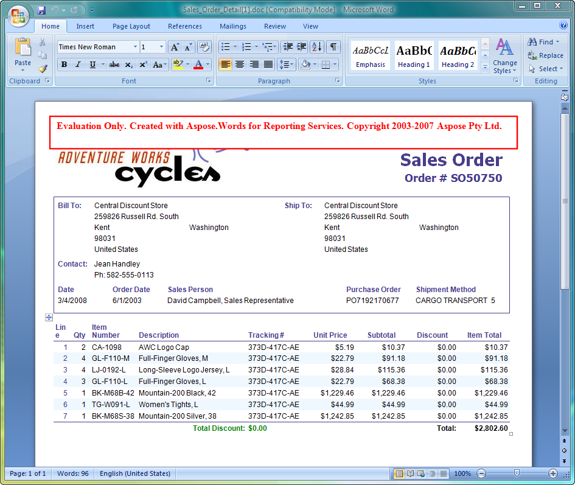

---
title: Evaluation Version Limitations
description: "This page describes evaluation version limitations of the Aspose.Words for Reporting Services."
type: docs
weight: 60
url: /reportingservices/evaluation-version-limitations/
---

{}

Make sure to take advantage of the free Aspose.Words for Reporting Services evaluation as it has no time limit, and free technical support is provided for evaluation users.

{}

It is the same download for both the evaluation and the paid version of Aspose.Words for Reporting Services. Simply download Aspose.Words for Reporting Services from the [download page](http://www.aspose.com/community/files/52/ssrs-rendering-extensions/aspose.words-for-reporting-services/default.aspx) , install it and it will work in the evaluation mode.

Evaluation mode injects watermarks into exported reports and limits them to several pages. When you have purchased a license, simply copy the license file to the appropriate folder and Aspose.Words for Reporting Services will then work in the licensed mode.

You can [request a free 30-day free trial license](http://www.aspose.com/community/forums/aspose.purchase/220/showforum.aspx) to evaluate Aspose.Words for JasperReports with no limitations.

**Aspose.Words for Reporting Services injects a watermark when working in the evaluation mode.**

