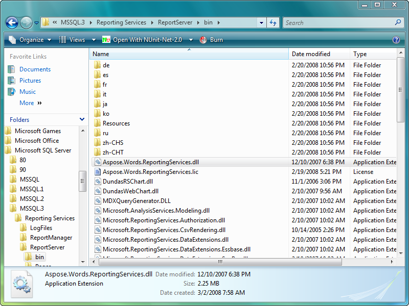

---
title: Easy and Lightweight Deployment
articleTitle: Easy and Lightweight Deployment
linktitle: Easy and Lightweight Deployment
description: "This page describes deployment steps of the Aspose.Words for Reporting Services."
type: docs
weight: 60
url: /reportingservices/easy-and-lightweight-deployment/
---

{}

Aspose.Words for Reporting Services is available for download as an MSI installer and as a ZIP archive.

Run the MSI installer for a server or a developer installation. The installer integrates Aspose.Words for Reporting Services with Microsoft Visual Studio Report Designer and registers to run with all Microsoft SQL Server Reporting Services installations found on the computer.

It is also easy to deploy Aspose.Wordsfor Reporting Services manually or as a part of your application, because it is comprised of only one .NET assembly, written completely in C#, is CLS compliant and contains only safe managed code.

The MSI installer and the ZIP download include several versions of Aspose.Words for Reporting Services:

- **Bin\SSRS2005\Aspose.Words.ReportingServices.dll** – built for Microsoft SQL Server 2005 and .NET Framework 2.0 (use for both x86 and x64) and Microsoft Visual Studio 2005 Report Designer.
- **Bin\SSRS2008\Aspose.Words.ReportingServices.dll** – built for Microsoft SQL Server 2008 (and 2008 R2) and .NET Framework 2.0 (use for both x86 and x64) and Microsoft Visual Studio 2008/2010 Report Designer.
- **Bin\SSRS2012\Aspose.Words.ReportingServices.dll** – built for Microsoft SQL Server 2012 and .NET Framework 3.5 (use for both x86 and x64) and Microsoft Visual Studio 2012 Report Designer.
- **Bin\SSRS2014\Aspose.Words.ReportingServices.dll** – built for Microsoft SQL Server 2014 and .NET Framework 3.5 (use for both x86 and x64) and Microsoft Visual Studio 2013 Report Designer.
- **Bin\SSRS2016\Aspose.Words.ReportingServices.dll** – built for Microsoft SQL Server 2016 and .NET Framework 3.5 (use for x64) and Microsoft Visual Studio 2015 Report Designer.
- **Bin\SSRS2017\Aspose.Words.ReportingServices.dll** – built for Microsoft SQL Server 2017 and .NET Framework 3.5 (use for x64) and Microsoft Visual Studio 2015 Report Designer.
- **Bin\SSRS2019\Aspose.Words.ReportingServices.dll** – built for Microsoft SQL Server 2019 and .NET Framework 3.5 (use for x64) and Microsoft Visual Studio 2015 Report Designer.
- **Bin\ReportViewer2005\Aspose.Words.ReportingServices.dll** – built for use with Microsoft Report Viewer 2005.
- **Bin\ReportViewer2008\Aspose.Words.ReportingServices.dll** – built for use with Microsoft Report Viewer 2008.
- **Bin\ReportViewer2010\Aspose.Words.ReportingServices.dll** – built for use with Microsoft Report Viewer 2010.
- **Bin\ReportViewer2012\Aspose.Words.ReportingServices.dll** – built for use with Microsoft Report Viewer 2012.
- **Bin\ReportViewer2015\Aspose.Words.ReportingServices.dll** – built for use with Microsoft Report Viewer 2015.

{}

**The MSI installer copies Aspose.Words.ReportingServices.dll to the ReportServer\bin directory and registers it in relevant configuration files.**

