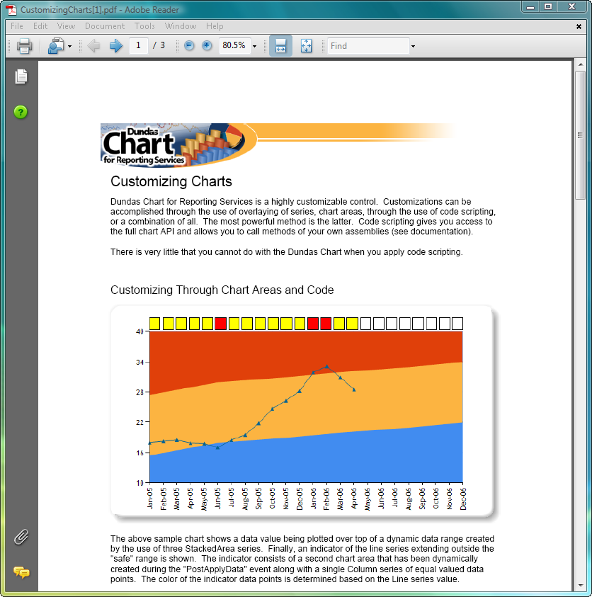
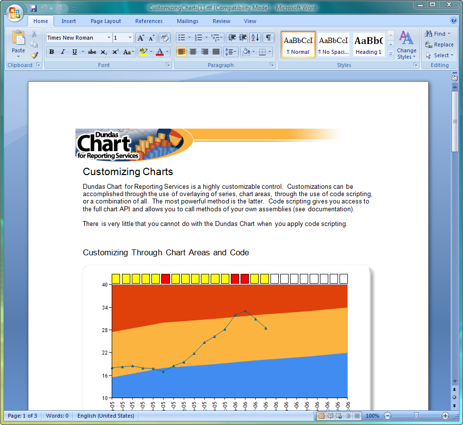
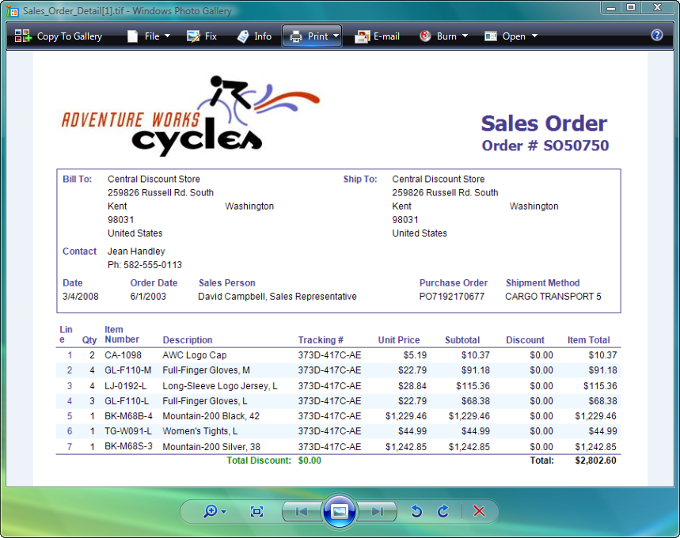
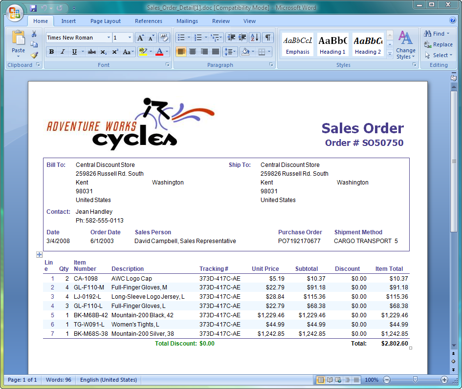
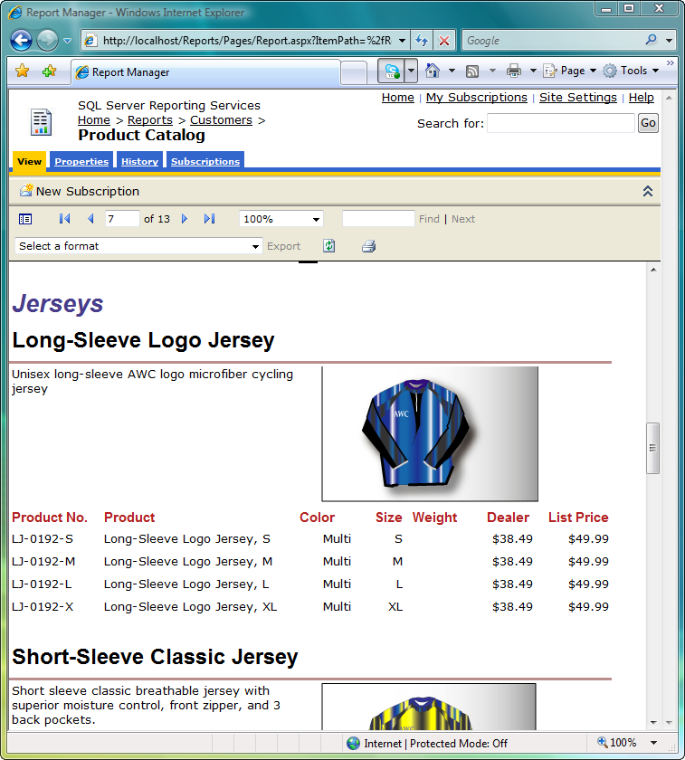
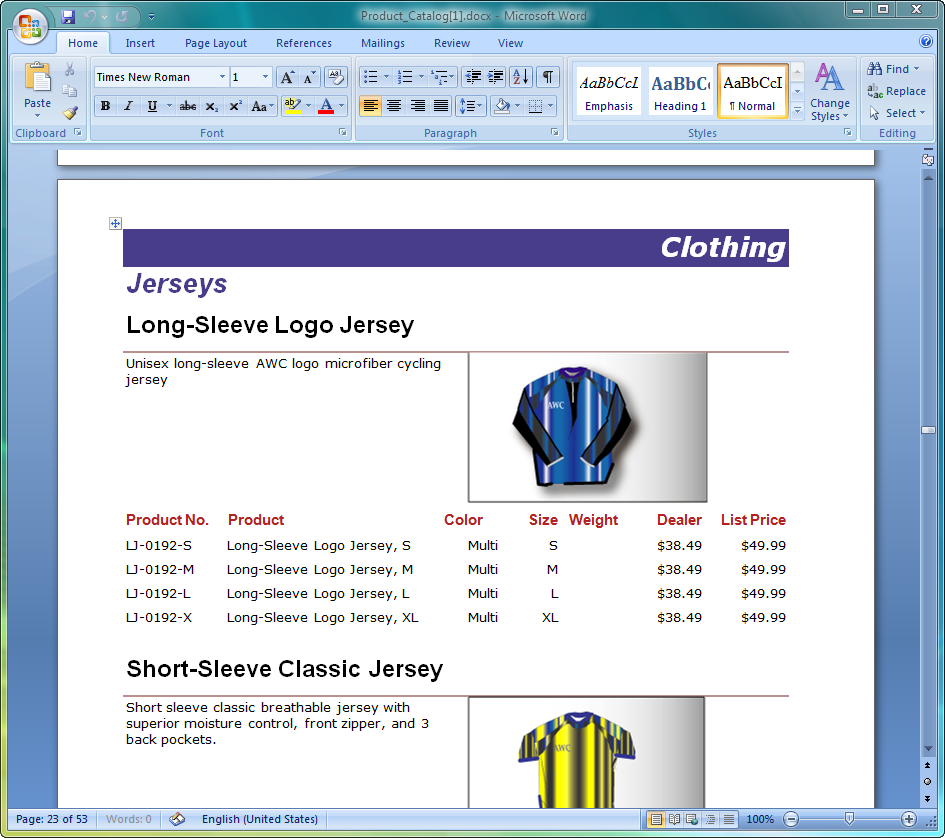

---
title: High Fidelity to the Report Design
type: docs
weight: 50
url: /reportingservices/high-fidelity-to-the-report-design/
---

{} 

Aspose.Words for Reporting Services exports reports as Microsoft Word documents in such a way that they appear identical to reports exported by the Microsoft SQL Server Reporting Services’ built-in renderers. 

{} 

## AWesomeExport

Aspose.Words for Reporting Services employs a smart technology known as AWesomeExport to produce “editable” Microsoft Word documents. The goal of the AWesomeExport technology is to balance editability of the exported document against the accuracy of the RDL to Microsoft Word conversion.

With AWesomeExport you can choose between two types of document layout: 

- Flow Layout (default) 
- Positioned Layout 

### Flow Layout

The *Flow Layout* produces most “editable” Microsoft Word documents that consist of simple paragraphs, tables, section breaks, etc as if an office worker created the document in Microsoft Word.

The benefit of exporting reports in the Flow Layout is that you can open such documents in Microsoft Word and edit them easily. The drawback is that the generated document might look slightly different from the original RDL report because not all of the RDL features can be converted 100% accurately to Microsoft Word. 

### Positioned Layout

The *Positioned Layout* produces reports with the most accurate conversion of RDL to Microsoft Word documents. Tables and matrices from the report are exported as Microsoft Word tables, while some elements are exported as positioned textboxes.

The benefit of the Positioned Layout is the high quality of the RDL to Microsoft Word conversion. The drawback is that it might be harder to edit a generated report in Microsoft Word because of the many positioned objects it might contain. 

## High Fidelity

Regardless of the layout type chosen, Aspose.Words for Reporting Services always attempts to export reports with *high fidelity* (as close as possible) to reports generated by the Microsoft SQL Server Reporting Services’ built-in renderers.

The following table demonstrates the similarity of reports generated by Microsoft SQL Server Reporting Services’ out-of-the-box renderers and the Aspose.Words for Reporting Services renderer. The left column contains screenshots of reports generated by Microsoft SQL Server Reporting Services. The right column contains screenshots of reports generated by Aspose.Words for Reporting Services. 

|PDF exported by a Microsoft SQL Server Reporting Services built-in renderer |RTF exported by Aspose.Words for Reporting Services |
| :- | :- |
|||

|TIFF exported by Microsoft SQL Server Reporting Services built-in renderer |DOC exported by Aspose.Words for Reporting Services |
| :- | :- |
|||

|HTML exported by Microsoft SQL Server Reporting Services built-in renderer |Office Open XML exported by Aspose.Words for Reporting Services |
| :- | :- |
|||

