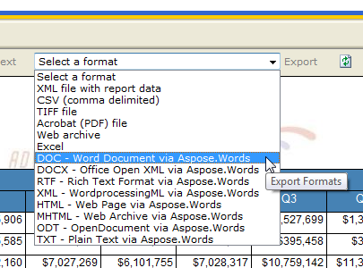

{}

Whenever you are a database administrator or an application developer, with Aspose.Words for Reporting Services you can give your users the ability to export reports to Microsoft Word documents and other popular formats.

Aspose.Words for Reporting Services supports the following technologies:

- Microsoft SQL Server Reporting Services
- Microsoft Report Viewer
- Business Intelligence Development Studio

{}

## Microsoft SQL Server Reporting Services

After the simple installation of Aspose.Words for Reporting Services onto a server running Microsoft SQL Server Reporting Services, your users can get access to the new report formats.

Aspose.Words for Reporting Services supports the following SQL Server versions:

- Microsoft SQL Server 2005 Reporting Services (32-bit and 64-bit)
- Microsoft SQL Server 2008 Reporting Services (32-bit and 64-bit)
- Microsoft SQL Server 2008 R2 Reporting Services (32-bit and 64-bit)
- Microsoft SQL Server 2012 Reporting Services (32-bit and 64-bit)
- Microsoft SQL Server 2014 Reporting Services (32-bit and 64-bit)
- Microsoft SQL Server 2016 Reporting Services (64-bit)
- Microsoft SQL Server 2017 Reporting Services (64-bit)
- Microsoft SQL Server 2019 Reporting Services (64-bit)

## Microsoft Report Viewer

When you are developing a .NET application that uses Microsoft Report Viewer, you can enable the new report formats by referencing Aspose.Words for Reporting Services and deploying it with your application.

Aspose.Words for Reporting Services supports Microsoft Report Viewer 2005/ 2008/ 2010/ 2012/ 2015 versions (local and remote modes).

Microsoft Report Viewer can generate reports independently using a built-in engine (local mode), or it can display reports that are generated on a Microsoft SQL Server Reporting Services Report Server (remote mode).

When you add and deploy Aspose.Words for Reporting Services with your application, the new report formats are available in the local mode. When Aspose.Words for Reporting Services is installed on the server, the new report formats are available only in the remote mode in Microsoft Report Viewer.

## Business Intelligence Development Studio

If you are designing reports in Microsoft Visual Studio Report Designer, the ability to run reports at design time without connecting to a server is a very useful feature. Aspose.Words for Reporting Services integrates with Microsoft Visual Studio and provides you access to the new report formats at design time.

Aspose.Words for Reporting Services supports Microsoft Visual Studio 2005/ 2008/ 2010/ 2012/ 2013/ 2015 Report Designer versions.

**New export formats are available in Microsoft SQL Server Reporting Services.**

**New export formats are available in Microsoft Report Viewer running in the local mode.**

**New export formats are available in the Microsoft Visual Studio Report Designer.**

