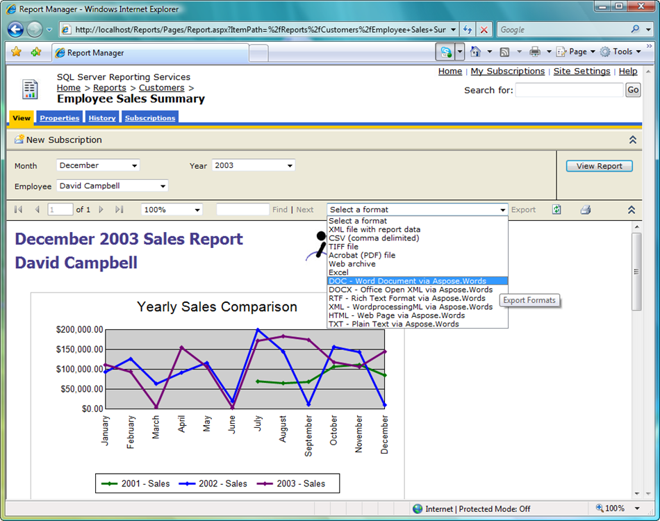

---
title: Installing on the Server Manually
description: "This page describes manual installation of the Aspose.Words for Reporting Services."
type: docs
weight: 30
url: /reportingservices/installing-on-the-server-manually/
---

{}

**You only need to follow this procedure if you want install Aspose.Words for Reporting Services manually without the MSI installer. We recommend you use the MSI installer because it performs all necessary installation and configuration automatically.**

{}

This section describes how to install Aspose.Words for Reporting Services on a server running Microsoft SQL Server Reporting Services.

In the following steps, you will need to copy and modify files in the directory where a Microsoft SQL Server Reporting Services instance is installed.

## Step 1. Locate the Report Server instance directory.

The root directory for Microsoft SQL Server is usually C:\Program Files\Microsoft SQL Server. From there the Report Server directory can be found as follows:

- **Microsoft SQL Server 2005** - There could be several instances of Microsoft SQL Server configured on the machine and they will occupy different MSSQL.x subdirectories such as MSSQL.1, MSSQL.2 and so on. You need to find the correct C:\Program Files\Microsoft SQL Server\MSSQL.x\Reporting Services\ReportServer directory before you proceed with the following steps.
- **Microsoft SQL Server 2008** - Report Server is installed in the C:\Program Files\Microsoft SQL Server\MSRS10.MSSQLSERVER\ Reporting Services\ReportServer directory.
- **Microsoft SQL Server 2008 R2** - Report Server is installed in the C:\Program Files\Microsoft SQL Server\MSRS10_50.MSSQLSERVER\ Reporting Services\ReportServer directory.
- **Microsoft SQL Server 2012** - Report Server is installed in the C:\Program Files\Microsoft SQL Server\MSRS11.MSSQLSERVER\ Reporting Services\ReportServer directory.
- **Microsoft SQL Server 2014** - Report Server is installed in the C:\Program Files\Microsoft SQL Server\MSRS12.MSSQLSERVER\ Reporting Services\ReportServer directory.
- **Microsoft SQL Server 2016** - Report Server is installed in the C:\Program Files\Microsoft SQL Server\MSRS13.MSSQLSERVER\ Reporting Services\ReportServer directory.
- **Microsoft SQL Server 2017** - Report Server is installed in the C:\Program Files\Microsoft SQL Server Reporting Services. directory.
- **Microsoft SQL Server 2019** - Report Server is installed in the C:\Program Files\Microsoft SQL Server Reporting Services. directory.

## Step 2. Copy Aspose.Words.ReportingServices.dll to the Report Server directory.

Aspose.Words.ReportingServices.zip download contains Bin\SSRS2005, Bin\SSRS2008, Bin\SSRS2012, Bin\SSRS2014, Bin\SSRS2016, Bin\SSRS2017 and Bin\SSRS2019 directories with Aspose.Words.ReportingServices.dll for the corresponding Microsoft SQL Server versions.

Select the appropriate Aspose.Words.ReportingServices.dll and copy it to C:\Program Files\Microsoft SQL Server&#92;&lt;Instance&gt;\Reporting Services\ReportServer\bin folder.

Note: In some cases, when you copy the DLL to the ReportServer\bin directory, it might be copied together with explicit NTFS file permissions assigned to it. The NTFS permissions might be such that Microsoft SQL Server Reporting Services will be denied access when loading Aspose.Words.ReportingServices.dll and the new export formats will not be available.

To make sure NTFS permissions are correct, right click on Aspose.Words.ReportingServices.dll, click Properties and select the Security tab. Remove any explicitly assigned NTFS permissions and leave only inherited permissions.

## Step 3. Register Aspose.Words for Reporting Services as a rendering extension.

Open *C:\Program Files\Microsoft SQL Server&#92;&lt;Instance&gt;\Reporting Services\ReportServer\rsreportserver.config* and add the following lines into the *&lt;Render&gt;* element:


<Render>
...
<!--Start here.-->
<Extension Name="AWDOC" Type="Aspose.Words.ReportingServices.DocRenderer,Aspose.Words.ReportingServices"/>
<Extension Name="AWRTF" Type="Aspose.Words.ReportingServices.RtfRenderer,Aspose.Words.ReportingServices"/>
<Extension Name="AWWML" Type="Aspose.Words.ReportingServices.WordMLRenderer,Aspose.Words.ReportingServices"/>
<Extension Name="AWDOCX" Type="Aspose.Words.ReportingServices.DocxRenderer,Aspose.Words.ReportingServices"/>
<Extension Name="AWHTML" Type="Aspose.Words.ReportingServices.HtmlRenderer,Aspose.Words.ReportingServices"/>
<Extension Name="AWMHTML" Type="Aspose.Words.ReportingServices.MhtmlRenderer,Aspose.Words.ReportingServices"/>
<Extension Name="AWTXT" Type="Aspose.Words.ReportingServices.TxtRenderer,Aspose.Words.ReportingServices"/>
<Extension Name="AWXPS" Type="Aspose.Words.ReportingServices.XpsRenderer,Aspose.Words.ReportingServices"/>
<Extension Name="AWEPUB" Type="Aspose.Words.ReportingServices.EpubRenderer,Aspose.Words.ReportingServices"/>
<!--End here.-->
</Render>


## Step 4. Give Aspose.Words for Reporting Services permissions to execute.

Open *C:\Program Files\Microsoft SQL Server&#92;&lt;Instance&gt;\Reporting Services\ReportServer\rssrvpolicy.config* and add the following as the last item in the second to outer *&lt;CodeGroup&gt;* element (which should be *&lt;CodeGroup class="FirstMatchCodeGroup" version="1" PermissionSetName="Execution" Description="This code group grants MyComputer code Execution permission. "&gt;*):


<CodeGroup>
...
<CodeGroup>
...
<!--Start here.-->
<CodeGroup
class="UnionCodeGroup"
version="1"
PermissionSetName="FullTrust"
Name="Aspose.Words_for_Reporting_Services"
Description="This code group grants full trust to the AW4SSRS assembly.">
<IMembershipCondition
class="StrongNameMembershipCondition"
version="1"
PublicKeyBlob="00240000048000009400000006020000002400005253413100040000010001005542e99cecd28842dad186257b2c7b6ae9b5947e51e0b17b4ac6d8cecd3e01c4d20658c5e4ea1b9a6c8f854b2d796c4fde740dac65e834167758cff283eed1be5c9a812022b015a902e0b97d4e95569eb8c0971834744e633d9cb4c4a6d8eda03c12f486e13a1a0cb1aa101ad94943236384cbbf5c679944b994de9546e493bf" />
</CodeGroup>
<!--End here.-->
</CodeGroup>
</CodeGroup>


## Step 5. Verify that Aspose.Words for Reporting Services was installed successfully.

Launch Report Manager by opening your browser (Microsoft Internet Explorer 6.0 or later). Type the Report Manager URL in the address bar (by default it is *http://&lt;ComputerName&gt;/Reports*).

Select one of the reports you have on your server and open the Select Format combo box. You should see the list of export formats provided by Aspose.Words for Reporting Services. Select DOC – Word Document via Aspose.Words. 

Click on the Export link. Report Server will generate the report in the selected format, send it to the client, and open it in an appropriate application, in this case, the report opens in Microsoft Word.

Congratulations, you’ve successfully installed Aspose.Words for Reporting Services and generated a report as a Microsoft Word document!

**Aspose.Words for Reporting Services installed successfully and new export formats are available.**

**A DOC report generated by Aspose.Words for Reporting Services.**

