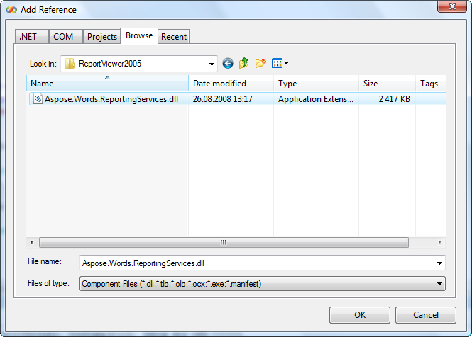

---
title: Integrate with Microsoft Report Viewer in Local Mode
type: docs
weight: 40
url: /reportingservices/integrate-with-microsoft-report-viewer-in-local-mode/
---

{} 

Microsoft Report Viewer is a powerful .NET control allowing the use of RDL and RDLC reports in WinForms and ASP.NET applications. It enables users to view and export reports to different formats. The control is included with Microsoft Visual Studio 2010, 2012, and 2015, and is available as a free download from Microsoft. However, Visual Studio 2017 (and higher) does not have RDLC Reporting Tools installed by default. It can be installed as described at [application integration integrating reporting services using report viewer controls get started](https://docs.microsoft.com/en-us/sql/reporting-services/application-integration/integrating-reporting-services-using-reportviewer-controls-get-started?view=sql-server-2017).

Report Viewer can generate reports independently using a built-in engine (**local mode**), or it can display reports that are generated on a Microsoft SQL Server Reporting Services Report Server (**remote mode**).

When working in the **remote mode**, Report Viewer can export reports to all formats installed on the Report Server to which it is connected. Therefore, to export reports to Microsoft Word formats you only need to install Aspose.Words for Reporting Services on the server.

When working in the **local mode** however, Report Viewer does not connect to a Report Server and the list of export formats is limited to only numerous built-in formats.

By installing Aspose.Words for Reporting Services on a development machine and following the steps below, you will be able to add the ability to export to Microsoft Word formats from Report Viewer working in the **local mode**.

{} 

## Step 1. Add a Reference to Aspose.Words.ReportingServices.dll to your project.

Open your project in Visual Studio, right click on the **References** folder and select **Add Reference**. Click the **Browse** tab and browse to the following assembly:

- If using Microsoft Report Viewer 2010 – browse to `<InstallDir>/Bin/ReportViewer2010/Aspose.Words.ReportingServices.dll`
- If using Microsoft Report Viewer 2012 – browse to `<InstallDir>/Bin/ReportViewer2012/Aspose.Words.ReportingServices.dll`
- If using Microsoft Report Viewer 2015 – browse to `<InstallDir>/Bin/ReportViewer2015/Aspose.Words.ReportingServices.dll`
- If using Microsoft.ReportingServices.ReportViewerControl.Winforms or Microsoft.ReportingServices.ReportViewerControl.WebForms of version 140.X.X – browse to `<InstallDir>/Bin/ReportViewer2017/Aspose.Words.ReportingServices.dll`
- If using Microsoft.ReportingServices.ReportViewerControl.Winforms or Microsoft.ReportingServices.ReportViewerControl.WebForms of version 150.X.X – browse to `<InstallDir>/Bin/ReportViewer2019/Aspose.Words.ReportingServices.dll`

where `<InstallDir>` is the directory, where you installed or unpacked Aspose.Words for Reporting Services.

Please note that Aspose.Words.ReportingServices.dll for ReportViewer 2015 should be used in Visual Studio 2017 (and higher). 

**Adding a Reference to Aspose.Words.ReportingServices.dll to your project.**

## Step 2a. Add all Aspose extensions to Report Viewer.

This will add ALL available custom Aspose rendering extensions to the list of supported extensions in Microsoft Report Viewer.

**C#**


using Aspose.Words.ReportingServices;

private void Form1_Load(object sender, EventArgs eventArgs)
{
	ReportViewerHelper.AddAsposeExtensions(reportViewer1);

	// Other form load code
	this.reportViewer1.RefreshReport();
}


**Visual Basic**


Imports Aspose.Words.ReportingServices

Public Class Form1

	Private Sub Form1_Load(ByVal sender As System.Object, ByVal e As System.EventArgs) Handles MyBase.Load
		ReportViewerHelper.AddAsposeExtensions(ReportViewer1)
		
		'Other form load code
		Me.ReportViewer1.RefreshReport()
	End Sub

End Class


## Step 2b. Add specific Aspose extensions to Report Viewer.

This will add only specific custom Aspose rendering extensions to the list of supported extensions in Microsoft Report Viewer.

**C#**


using Aspose.Words.ReportingServices;

private void Form1_Load(object sender, EventArgs eventArgs)
{
	ReportViewerHelper asposeHelper = new ReportViewerHelper(reportViewer1);

	asposeHelper.AddExtension("AWDOCX", "DOCX - Office Open XML via Aspose.Words", typeof(Aspose.Words.ReportingServices.DocxRenderer));
	asposeHelper.AddExtension("AWRTF", "RTF - Rich Text Format via Aspose.Words", typeof(Aspose.Words.ReportingServices.RtfRenderer));
	asposeHelper.AddExtension("AWWML", "XML - WordprocessingML via Aspose.Words", typeof(Aspose.Words.ReportingServices.WordMLRenderer));
	asposeHelper.AddExtension("AWHTML", "HTML - Web Page via Aspose.Words", typeof(Aspose.Words.ReportingServices.HtmlRenderer));
	asposeHelper.AddExtension("AWMHTML", "MHTML - Web Archive via Aspose.Words", typeof(Aspose.Words.ReportingServices.MhtmlRenderer));
	asposeHelper.AddExtension("AWODT", "ODT - OpenDocument via Aspose.Words", typeof(Aspose.Words.ReportingServices.OdtRenderer));
	asposeHelper.AddExtension("AWTXT", "TXT - Plain Text via Aspose.Words", typeof(Aspose.Words.ReportingServices.TxtRenderer));
	asposeHelper.AddExtension("AWXPS", "XPS � XML Paper Specification via Aspose.Words", typeof(Aspose.Words.ReportingServices.XpsRenderer));
	asposeHelper.AddExtension("AWEPUB", "EPUB � Electronic Publications via Aspose.Words", typeof(Aspose.Words.ReportingServices.EpubRenderer));
	asposeHelper.UpdateHandlers();
	
	// Other form load code
	this.reportViewer1.RefreshReport();
}


**Visual Basic**


Imports Aspose.Words.ReportingServices

Public Class Form1

	Private Sub Form1_Load(ByVal sender As System.Object, ByVal e As System.EventArgs) Handles MyBase.Load
		Dim asposeHelper As ReportViewerHelper = New ReportViewerHelper(ReportViewer1)
	
		asposeHelper.AddExtension("AWDOCX", "DOCX - Office Open XML via Aspose.Words", GetType(Aspose.Words.ReportingServices.DocxRenderer))
		asposeHelper.AddExtension("AWRTF", "RTF - Rich Text Format via Aspose.Words", GetType(Aspose.Words.ReportingServices.RtfRenderer))
		asposeHelper.AddExtension("AWWML", "XML - WordprocessingML via Aspose.Words", GetType(Aspose.Words.ReportingServices.WordMLRenderer))
		asposeHelper.AddExtension("AWHTML", "HTML - Web Page via Aspose.Words", GetType(Aspose.Words.ReportingServices.HtmlRenderer))
		asposeHelper.AddExtension("AWMHTML", "MHTML - Web Archive via Aspose.Words", GetType(Aspose.Words.ReportingServices.MhtmlRenderer))
		asposeHelper.AddExtension("AWODT", "ODT - OpenDocument via Aspose.Words", GetType(Aspose.Words.ReportingServices.OdtRenderer))
		asposeHelper.AddExtension("AWTXT", "TXT - Plain Text via Aspose.Words", GetType(Aspose.Words.ReportingServices.TxtRenderer))
		asposeHelper.AddExtension("AWXPS", "XPS - XML Paper Specification via Aspose.Words", GetType(Aspose.Words.ReportingServices.XpsRenderer))
		asposeHelper.AddExtension("AWEPUB", "EPUB - Electronic Publications via Aspose.Words", GetType(Aspose.Words.ReportingServices.EpubRenderer))
		asposeHelper.UpdateHandlers()
	
		' Other form load code
		Me.ReportViewer1.RefreshReport()
	End Sub

End Class


## Step 3. Test the new export formats.

Run your application and you should notice a number of new export formats available in the Export dropdown list in Report Viewer. Select one of the formats and run export. Verify the document is created the way you expected.

**New export formats appear in Report Viewer running in local mode.**

