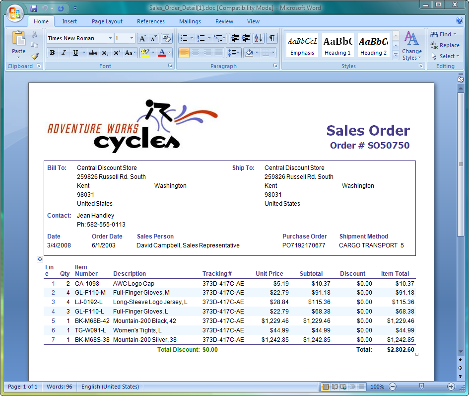
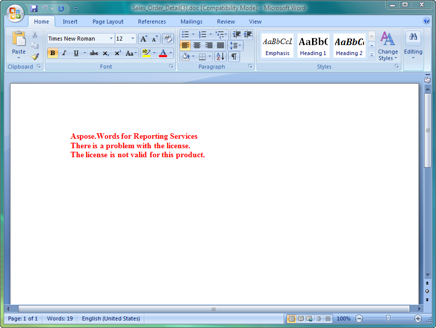

---
title: License Aspose.Words for Reporting Services
articleTitle: License Aspose.Words for Reporting Services
linktitle: License Aspose.Words for Reporting Services
description: "This page describes licensing details of the Aspose.Words for Reporting Services."
type: docs
weight: 50
url: /reportingservices/license-aspose-words-for-reporting-services/
---

{}

Once you are happy with the evaluation, [buy a license](https://www.aspose.com/purchase/default.aspx). Before purchasing make sure you understand and agree to the license subscription terms.

The license emailed to you when the order has been paid. The license is a clear text, digitally signed XML file and contains information such as the client name, the purchased product and the type of the license. Do not modify the content of the license file as it will invalidate the license.

{}

## Licensing a Server

Download the license file and copy it to the C:\Program Files\Microsoft SQL Server&#92;&lt;Instance&gt;\Reporting Services\ReportServer\bin folder on the server.
Where &lt;Instance&gt; is the subdirectory name that corresponds to the Microsoft SQL Server instance you want to license:

- The default instance directory for Microsoft SQL Server 2000 is MSSQL.
- The default instance directory for Microsoft SQL Server 2005 is MSSQL.x, where “x” is the instance identifier.
- The default instance directory for Microsoft SQL Server 2008 is MSRS10.MSSQLSERVER.
- The default instance directory for Microsoft SQL Server 2008 R2 is MSRS10_50.MSSQLSERVER.
- The default instance directory for Microsoft SQL Server 2012 is MSRS11.MSSQLSERVER.
- The default instance directory for Microsoft SQL Server 2014 is MSRS12.MSSQLSERVER.
- The default instance directory for Microsoft SQL Server 2016 is MSRS13.MSSQLSERVER.
- The default instance directory for Microsoft SQL Server 2017 is MSRS14.MSSQLSERVER
- The default instance directory for Microsoft SQL Server 2019 is MSRS14.MSSQLSERVER

## Licensing Application Development

Add a reference to Aspose.Words for Reporting Services to your project and Aspose.Words.ReportingServices.dll will be automatically copied to the Bin (binary output) folder of your application.

The license can be loaded from a file, stream or an embedded resource. Aspose.Words for Reporting Services will try to find the license in the following locations:

- Explicit path.
- The folder that contains Aspose.Words.ReportingServices.dll.
- The folder that contains the assembly that called Aspose.Words.ReportingServices.dll.
- The folder that contains the entry assembly (your .exe).
- An embedded resource in the assembly that called Aspose.Words.ReportingServices.dll.

Use the License.SetLicense method to license the component. The easiest way to set a license is to put the license file in the same folder as the Aspose.Words.ReportingServices.dll and specify just the file name without a path as shown in the following example:

**C#**


Aspose.Words.ReportingServices.License license = new Aspose.Words.ReportingServices.License();
license.SetLicense("Aspose.Words.Reporting.Services.lic");


**Visual Basic**


Dim license As Aspose.Words.ReportingServices.License = New Aspose.Words.ReportingServices.License()
license.SetLicense("Aspose.Words.Reporting.Services.lic")


The following example shows how to set a license from a stream:

**C#**


Aspose.Words.ReportingServices.License license = new Aspose.Words.ReportingServices.License();
license.SetLicense(myStream);


**Visual Basic**


Dim license As Aspose.Words.ReportingServices.License = New Aspose.Words.ReportingServices.License()
license.SetLicense(myStream)


### Deploying a License with Your Application

Distribute the license file in the same folder as Aspose.Words.ReportingServices.dll.

### Licensing Generation of Reports at Design Time

Download the license file and copy it to C:\Program Files\Microsoft Visual Studio &lt;Version&gt;\Common7\IDE\PrivateAssemblies, where &lt;Version&gt; is “8” for Visual Studio 2005 or “9.0” for Visual Studio 2008.

### Testing a License

To test that a license has been installed correctly, export any report as a Microsoft Word document. If the document contains no watermark at the top, the license was activated successfully.

**When a valid Aspose.Words.ReportingServices.lic is present in the ReportServer\bin folder, no evaluation watermark is added to the file**

**If there is a problem with the license, the error message will be output into the report**

