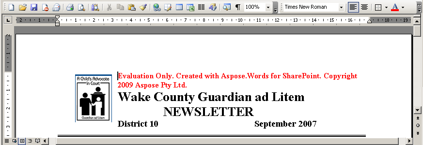

---
title: Evaluate Aspose.Words for SharePoint - Aspose.Words for SharePoint
articleTitle: Evaluate Aspose.Words for SharePoint
linktitle: Evaluate Aspose.Words for SharePoint
description: "Evaluation period details for the Aspose.Words for SharePoint."
type: docs
weight: 50
url: /sharepoint/evaluate-aspose-words-for-sharepoint/
---

Make sure to take advantage of the free Aspose.Words for SharePoint evaluation: it has no time limit, and comes with free technical support. We encourage developers to evaluate our products before buying so you know that you know that the product will do what you want it to do.

The evaluation and the paid versions of Aspose.Words for SharePoint use the same download. Simply [download Aspose.Words for SharePoint](https://downloads.aspose.com/words/sharepoint) from the download page, [install it](/words/sharepoint/install-aspose-words-for-sharepoint/) and it works in evaluation mode. Evaluation mode injects watermarks into any exported reports and limits them to several pages. 

When you have purchased a license, simply install the license solution over the installed evaluation copy of Aspose.Words for SharePoint and it will work in licensed mode.

**Aspose.Words for SharePoint injects a watermark when working in evaluation mode.** 

