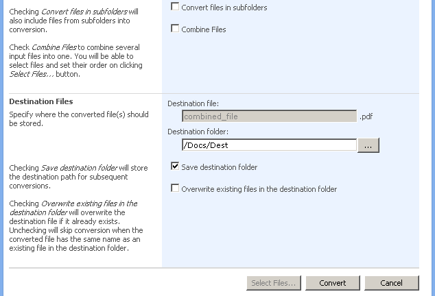

---
title: Conversion Options
articleTitle: Conversion Options
linktitle: Conversion Options
description: "This page describes list of file conversion options of the Aspose.Words for SharePoint."
type: docs
weight: 20
url: /sharepoint/conversion-options/
---

## Different Conversion Options

Aspose.Words for SharePoint offers a number of flexible options for converting documents. The following options are available during conversion setup:

### File concatenation

If you select a folder or multiple files for conversion, you can select the **Combine Files** option to combine files in different formats into a single document. You can set the order in which the source files are placed in the combined document.

### Convert files in SubFolders

This option is available under SharePoint 2007 when a folder is selected for conversion. You can recursively convert all of the selected folder's subfolders with this option. During conversion, the same subfolder structure is created below the destination folder. Under SharePoint 2010/2013/2016, the folders are always processed recursively. To process files without subfolders, just select files in a document library view before converting. Do not select any subfolders.

### Save destination folder option

Once you have selected a destination folder, use this option to save it so that you do not have to go through the same steps again. Your selection is saved and the **Destination** folder field is prepopulated at your next conversion session.

### Overwrite existing files in the destination folder

The destination folder you have selected may already contain some of the files you want to convert. This option allows you to skip conversion for such files and process only files which are not found in the destination folder.

### Browse for destination folder

Corporate sites can consist of dozens of document libraries with complex URLs so manually entering the destination folder URL can be a headache. So, to not have to remember the complete path to a library or subfolder, click **Browse** and select a destination folder visually. 

**Different options will help to adjust the conversion process.** 

