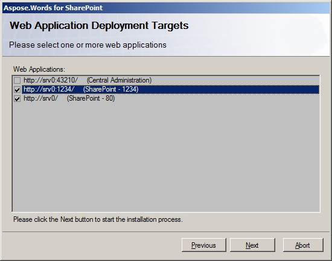

---
title: Installing Aspose.Words for SharePoint
description: "This page describes how to install the Aspose.Words for SharePoint using installer."
type: docs
weight: 20
url: /sharepoint/installing-aspose-words-for-sharepoint/
---

Aspose.Words for SharePoint is downloadable as Aspose.Words.SharePoint.zip archive. This archive contains the following files:

|File|Description|
| :- | :- |
|Aspose.Words.SharePoint.2007.wsp|SharePoint 2007/3.0 solution file. Aspose.Words for SharePoint is packaged as a SharePoint solution to facilitate deployment/retraction and feature activation/deactivation across the server farm.|
|Aspose.Words.SharePoint.2010.wsp|A solution file for SharePoint 2010. The setup program automatically detects the installed SharePoint version and uses an appropriate solution file.|
|Aspose.Words.SharePoint.2013.wsp|A solution file for SharePoint 2013|
|Aspose.Words.SharePoint.2016.wsp|A solution file for SharePoint Server 2016|
|End User License Agreement.html|End user license agreement|
|Aspose.Words for SharePoint API Reference.chm|User documentation and API reference in the hypertext format|
|setup.2007.exe|Setup program for SharePoint 2007/3.0|
|setup.2007.exe.config|Setup configuration file for SharePoint 2007/3.0|
|setup.2010.exe|Setup program for SharePoint 2010|
|setup.2010.exe.config|Setup configuration file for SharePoint 2010|
|setup.2013.exe|Setup program for SharePoint 2013|
|setup.2013.exe.config|Setup configuration file for SharePoint 2013|
|setup.2016.exe|Setup program for SharePoint Server 2016|
|setup.2016.exe.config|Setup configuration file for SharePoint Server 2016|
|Report.xsd|Report definition schema file|
|DataSource.xsd|Data source definition schema file|

## Installation Process

The setup program checks the following conditions before proceeding:

- One of the supported SharePoint versions is installed.
- The user has permission to install SharePoint solutions.
- SharePoint database is online.
- SharePoint Administration service is started.
- SharePoint Timer service is started.

Administration service and Timer service are needed because some setup actions rely on a timer job to propagate to all servers in the server farm. To install Aspose.Words for SharePoint:

1. Unpack Aspose.Words.SharePoint.zip to the local drive on the SharePoint server.
1. Run appropriate version of setup.exe and follow the instructions on the screen.

The setup program performs the following actions:

1. Check installation prerequisites. Setup will not continue if any check fails.
1. Display End User License Agreement. The user must accept the agreement in order to proceed.
1. Display deployment target selection dialog. The user selects web applications where the feature shall be deployed and activated. See the figure below.
1. Deploy the feature to the server farm.
1. Activate the feature for the selected web applications and update their virtual directories.
1. Display a list of web applications where the feature has been deployed and activated.

**Deployment target selection dialog**

****

## Deployment

Aspose.Words for SharePoint performs the following actions during deployment:

- Install Aspose.Words.SharePoint.dll into Global Assembly Cache and add SafeControl entry to the web.config file.
- Install feature manifest and other necessary files to the appropriate directories.
- Register the feature in the SharePoint database and make it available for the activation at the feature scope.

## Activation

Aspose.Words for SharePoint is packaged as a web application level feature and can be activated and deactivated on the web application level. During activation, the feature makes some changes to the virtual directory of web application:

- Add authorized type entry for the workflow activities provided by Aspose.Words for SharePoint
- Add conversion settings page to the sitemap file
- Copy necessary resource files to the App_GlobalResources folder in the virtual directory
