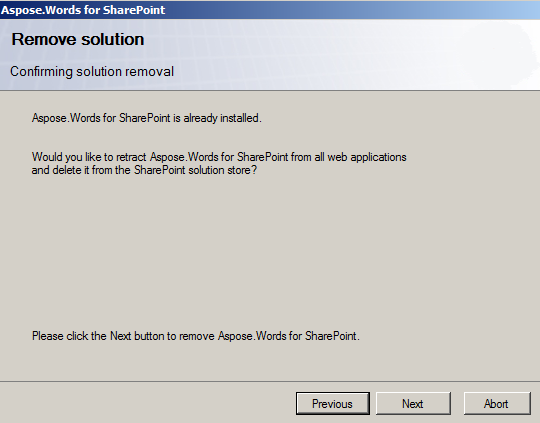

---
title: Uninstalling Aspose.Words for SharePoint using Setup.exe
articleTitle: Uninstalling Aspose.Words for SharePoint using Setup.exe
linktitle: Uninstalling Aspose.Words for SharePoint using Setup.exe
description: "This page describes how to uninstall the Aspose.Words for SharePoint using installer."
type: docs
weight: 80
url: /sharepoint/uninstalling-aspose-words-for-sharepoint-using-setup-exe/
---

To uninstall Aspose.Words for SharePoint, just run the appropriate version of setup program. If Aspose.Words for SharePoint is already installed, the setup program suggests to remove it. Choose “Remove” option to uninstall the feature.

During uninstall, the setup program deactivates Aspose.Words for SharePoint feature for all web applications and retracts the solution from the server farm.
