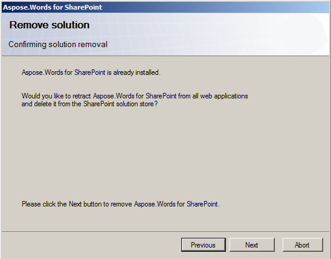

---
title: Uninstalling Aspose.Words for SharePoint
description: "This guide describes how to uninstall the Aspose.Words for SharePoint."
type: docs
weight: 50
url: /sharepoint/uninstalling-aspose-words-for-sharepoint/
---

To uninstall Aspose.Words for SharePoint, just run the appropriate version of setup program. If Aspose.Words for SharePoint is already installed, the setup program suggests to remove it.

**Choose the Remove option to uninstall the feature.** 

During the uninstallation, the setup program deactivates Aspose.Words for SharePoint for all web applications and retracts the solution from the server farm.
