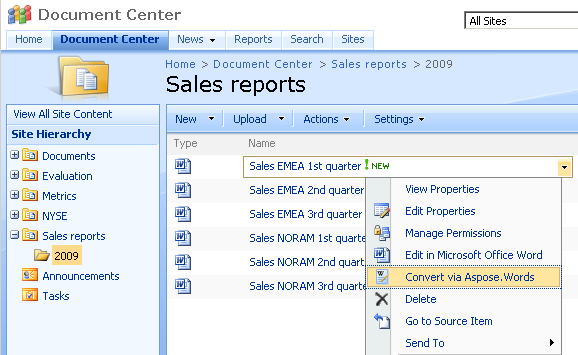
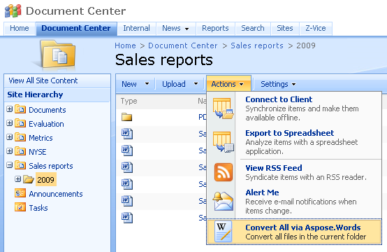
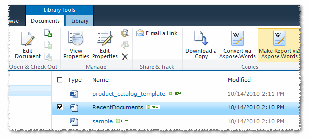
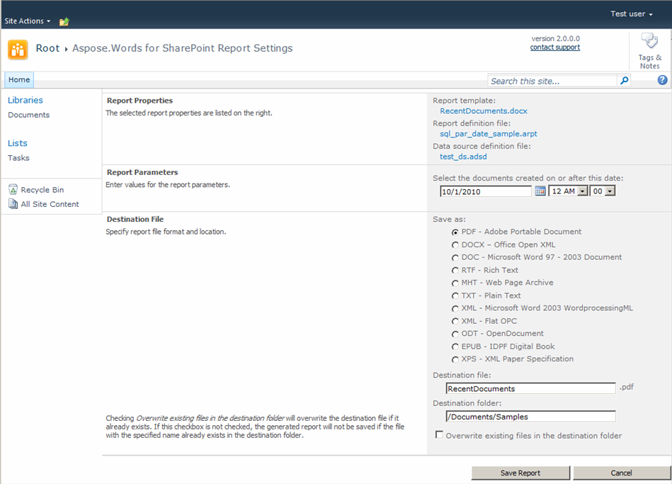

---
title: Introducing Aspose.Words for SharePoint - Aspose.Words for SharePoint
articleTitle: Introducing Aspose.Words for SharePoint
linktitle: Introducing Aspose.Words for SharePoint
description: "This page contains common overview of the Aspose.Words for SharePoint functionality."
type: docs
weight: 10
url: /sharepoint/introducing-aspose-words-for-sharepoint/
---

Welcome to Aspose.Words for SharePoint!

Does your organization have a corporate document repository on Windows SharePoint Services (WSS) or Microsoft Office SharePoint Server’s (MOSS) technologies? Do you have to use multiple document formats in your internal work process or in your interaction with customers and partners? 

## Overview

Aspose.Words for SharePoint will help you distribute corporate knowledge by allowing developers to convert files held within SharePoint into the formats your users need them in. Aspose.Words for SharePoint is a unique solution that enables you to

- Perform high-fidelity document conversion to multiple formats.
- Generate reports based on a Microsoft Word template document and an external data source.

This is useful when:

- your organization base a corporate document depository on Windows SharePoint Services or Microsoft Office SharePoint Server’s technologies.
- you have to use multiple document formats in your internal work process or in interactions with customers and partners.
- you want to see an affordable and fast tool capable of converting documents right in your SharePoint’s document library with high fidelity but without the use of Microsoft Word automation.
- you generate documents based on database data and would you like to do it from a SharePoint document library.

## Supported Products

Use Aspose.Words for SharePoint with the following products:

- Windows SharePoint Services 3.0 (WSS)
- Microsoft Office SharePoint Server 2007 (MOSS)
- Microsoft SharePoint Foundation 2010
- Microsoft SharePoint Server 2010
- Microsoft SharePoint Server 2013
- Microsoft SharePoint Server 2016
- x32 and x64 servers supported.

There are no additional system requirements.

## Features

Use Aspose.Words for SharePoint right from a SharePoint document library to convert a particular document.

**Converting one document**

Or convert all files in the current folder.

**Converting all documents in a library**

Start a report from a report template.

**Making a report**

Aspose.Words for SharePoint lets you enter report parameters and chose destination format and location.

**Report settings** 

