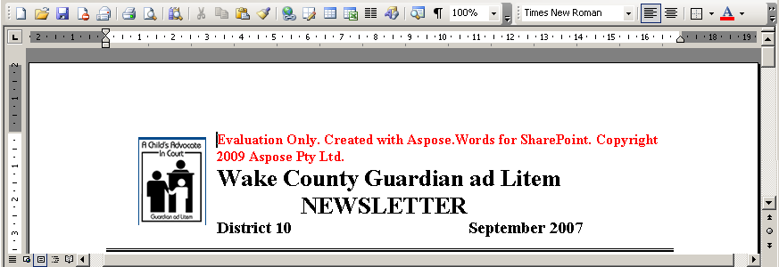

To test that a license has been installed correctly, convert any document into desired format. If the document contains no watermark at the top, the license was activated successfully.

**When a valid Aspose.Words for SharePoint License has been installed correctly there will be no evaluation watermark.**

****

**If there is a problem with the license, Aspose.Words for SharePoint works in evaluation mode and adds watermarks into the document.** 

