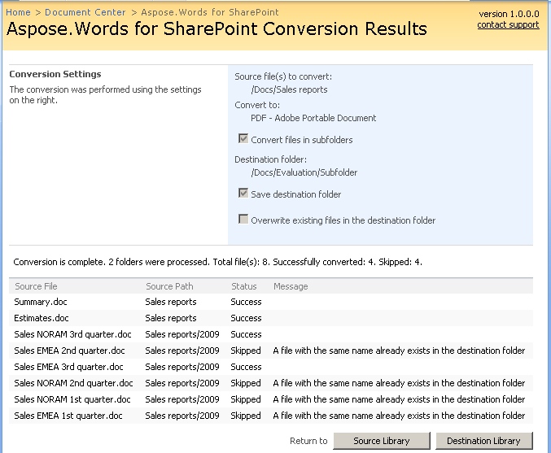

---
title: Conversion Results Screen
articleTitle: Conversion Results Screen
linktitle: Conversion Results Screen
description: "This page describes how to interpret conversion results in the SharePoint UI using the Aspose.Words for SharePoint."
type: docs
weight: 30
url: /sharepoint/conversion-results-screen/
---

After finishing the conversion, Aspose.Words for SharePoint shows the Conversion Results screen. It has three parts:

- The **Conversion Settings** pane shows the parameters used for the conversion.
- The information are shows the totals of the conversion: the overall number of processed files, number of files successfully converted and number of skipped files.
- The results list at the bottom of the page shows individual information for each processed file. The **Source Path** in this list shows the relative path from the folder there the conversion started. You can sort the information in this list by clicking the title of any column.

After getting familiar with the results, return either to the source or to the destination library by clicking the corresponding button at the bottom of the page.

**Conversion Results screen.**

****
