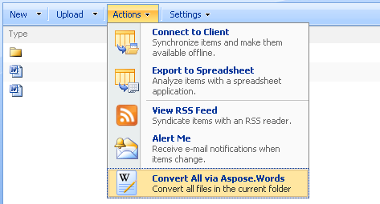
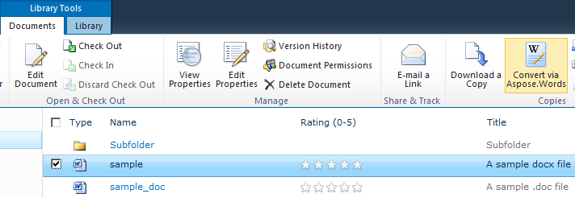
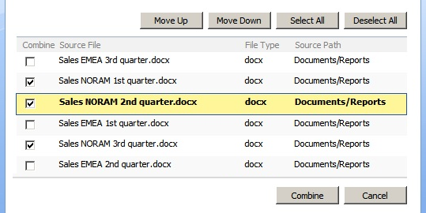

---
title: Convert All Files in a Folder
type: docs
weight: 20
url: /sharepoint/convert-all-files-in-a-folder/
---

If you want to convert all files in a folder, you can do so either by selecting **Convert via Aspose.Words** in the ECB of the desired folder while staying in the parent folder, or by selecting **Convert All via Aspose.Words** from the **Action** menu while in the folder itself or in the root of the document library. Whichever way you use, Aspose.Words for SharePoint will try to convert every document in the selected folder or library.

**Convert all files in the subfolder.** 

**Convert all files in the current folder.** 

## Using Server Ribbon Button under SharePoint 2010/2013/2016

Under SharePoint 2010/2013/2016, the server ribbon button is available instead of the custom action menu item used with SharePoint 2007 / WSS 3.

**The server ribbon button converts a single file when a single file is selected.**

## 

When you select a single file or folder in a document library view, the **Convert via Aspose.Words** button displays the conversion settings page for this item. It works the same way as the ECB option.

**Multiple items selection is supported.** 

When you select multiple items in a document library view, you can convert or combine selected the items only.

**The list of files to combine is populated with the files selected in the document library.** 

If you select no items in a document library view, the **Convert via Aspose.Words** option is disabled.

**Conversion Settings screen for multiple files conversion.** 

- The **Convert files in subfolders** option lets you include all subfolders in the conversion. During conversion, Aspose.Words for SharePoint creates the same subfolders tree in the destination folder. This option is for SharePoint 2007 only. Under SharePoint 2010/2013/2016, the subfolders are always processed recursively. To process folder contents without subfolders, just select the desired files in a document library view.

## Selecting files.

- The Combine files option lets you combine files into one document. Input files can be in different formats. Setting this check box makes accessible “Select Files…” button that will lead to sequence adjustment screen.
- The Select Files button lets you adjust the combination order.

**Setting the order of combined files** 

