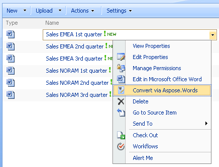
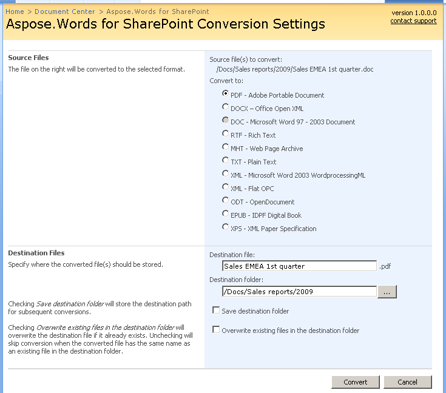
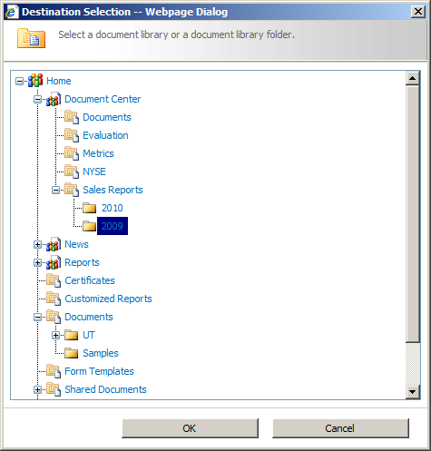

---
title: Convert One File - Aspose.Words for SharePoint
articleTitle: Convert One File
linktitle: Convert One File
description: "This page describes how to convert a file from SharePoint UI using the Aspose.Words for SharePoint."
type: docs
weight: 10
url: /sharepoint/convert-one-file/
---

To convert a particular document in a document library please choose **Convert via Aspose.Words** in the document’s Edit Control Block (ECB).

**Selecting Convert via Aspose.Words in the document's ECB.** 

This opens the conversion settings screen where with the following options:

- **Convert to** - select the desired destination file format from the list.
- **Destination file** - enter the destination file name. By default, Aspose.Words for SharePoint pre-populates this field with the name of the source file. But you can change it if needed. The extension is added automatically depending on the selected format.
- **Destination folder** - enter the URL of the document library or folder where you would like to place the converted file. It can be a folder in the current document library, another library within the current site collection or even a library or folder in a different site collection. You can always type a path to the destination folder directly in the edit box, but it may be more convenient to select the destination folder using a graphical view of the sites and lists hierarchy provided by the **Browse** button (“**...**”) next to the edit box. Only document libraries and folders where the current user can add and edit items are selectable in the Browse dialog.
- **Save destination folder** - select to save your selection and pre-populate the **Destination folder** field upon the next conversion session. This option saves URLs independently for different users. Moreover, as the destination folder is stored at the site collection level you will have different destination folders pre-populated when starting conversion from, for example, a personal site and from a corporate site.
- **Overwrite existing files in the destination folder** - use to define what should be done in case the destination file already exits. By default, conflicting files are skipped during conversion. Selecting **Overwrite existing files** changes the default behavior:
  - If destination library has versioning enabled, a new file version is added for a conflicting file.
  - If versioning is not enabled for the destination library, an existing file with a conflicting name is overwritten.
- **Convert** - click to start the conversion process.
- **Cancel** - gets you back to the library and dismisses all changes to settings.

**Conversion Settings screen for one file conversion.** 

**Selecting destination folder using graphical view via Browse button** 

